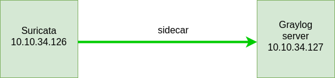
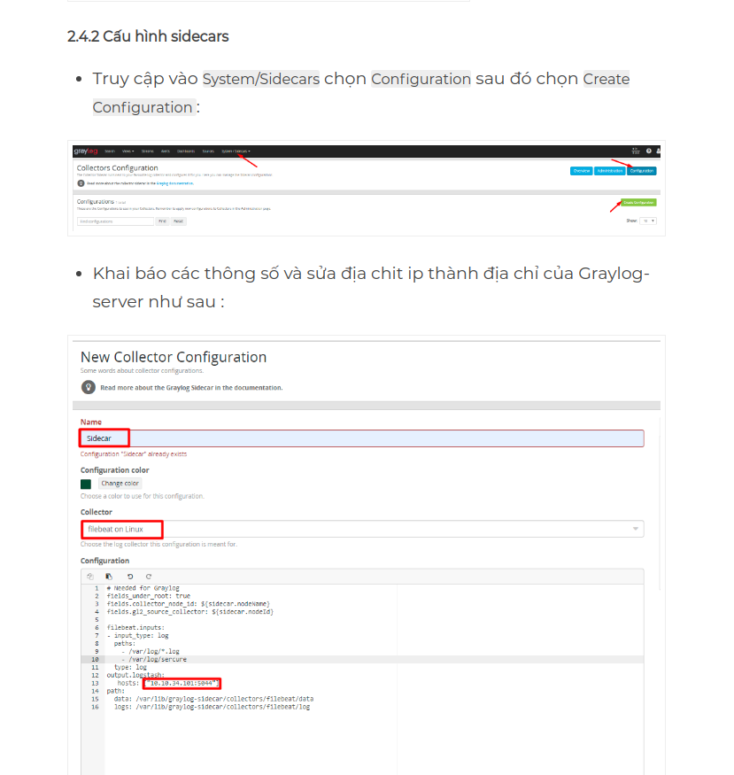
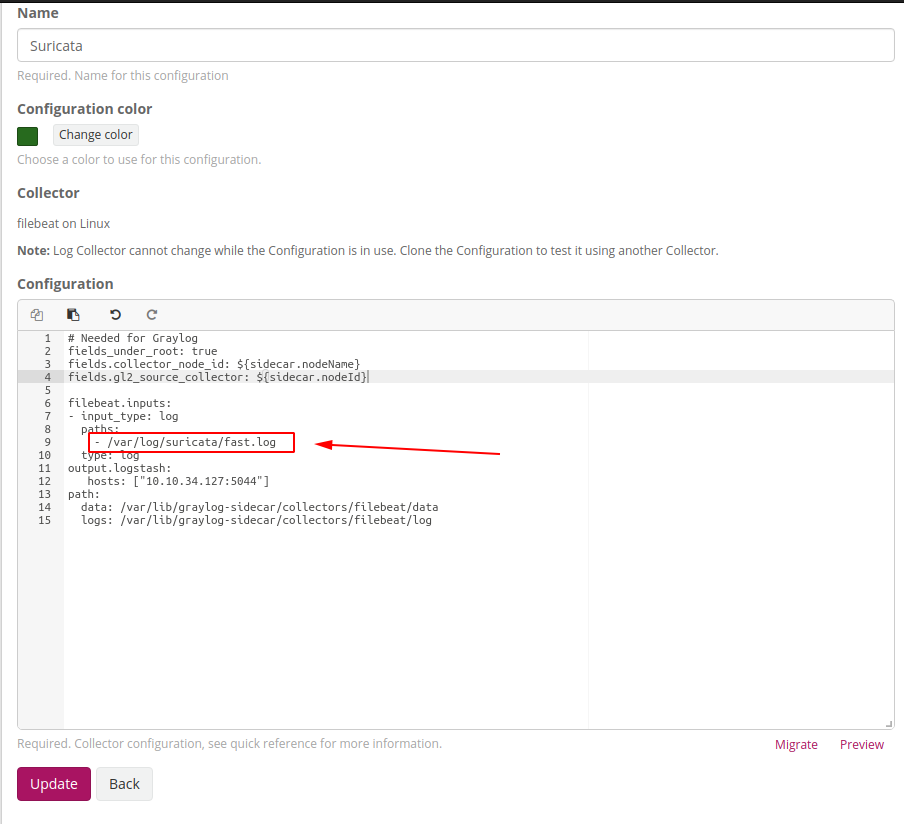

# Hướng dẫn đẩy log từ suricata lên graylog

Mô hình

## Bước 1: Cài đặt graylog server

Trước tiên cần 1 máy làm graylog server. Nếu đã có graylog server thì bỏ qua bước này. Nếu chưa có thì tham khảo [tại đây](https://news.cloud365.vn/graylog-lab-phan1-huong-dan-cai-dat-graylog-3-1-tren-centos-7/) để cài đặt.

## Cấu hình sidecar trên máy suricata

Để cài đặt graylog sidecar tham khảo [tại đây](https://news.cloud365.vn/graylog-lab-phan-2-thu-thap-log-cua-linux-thong-qua-graylog-sidecar/)

Lưu ý ở bước này 

ta khai báo đường dẫn file log của suricata

