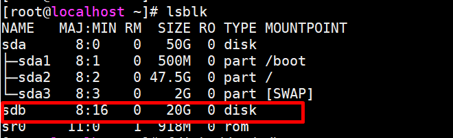
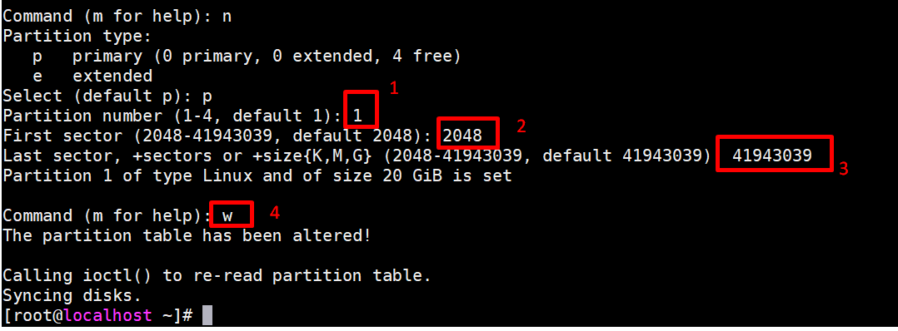
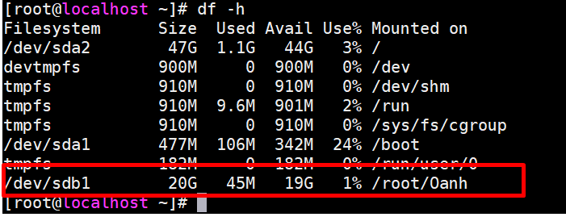

<a name ="Lab quản lý đĩa"></a>

# 1. Tạo phân vùng và định dạng ổ đĩa 

- Trước hết ta phải add thêm một ổ đĩa cho máy.Vào `VM` -> `Setting` ->` Hard disk ` -> `Add`
- Khi thêm một ổ cứng với vào hệ thống, cần dùng lệnh fdisk -l để kiểm tra xem Linux gán cho ổ cứng mới device nào.



- Ta có thể thấy một harddisk sdb mới được tạo có size 20G và harddisk này chưa được định dạng.
- Với /dev/sda mới chưa được định dạng nói trên, trước hết ta dùng lệnh fdisk.

```
fdisk /dev/sdb
```
- Sau khi dùng lệnh `fdisk /dev/sdb`, sẽ xuất hiện chế độ gõ lệnh của fdisk, ấn `m` để đưa ra các hướng dẫn về lệnh của fdisk. Trong ví dụ này, chọn `n` để thêm một partition mới.


- Sau khi chọn `n`, xuất hiện các lựa chọn: lựa chọn `p` để tạo primary partition – phân vùng có thể boot được, lựa chọn `e` để tạo một phân vùng extended. Bước này chọn `p`. Sau khi chọn `p`, chương trình sẽ hỏi Partition number (1-4), gõ số 1. Chương trình sẽ cho phép bạn thay đổi First cylinder và Last cylinder. Chọn First cylinder = 2048 và Last cylinder = 41943039. Fdisk sẽ quay trở lại chế độ gõ lệnh chính của nó.

- Gõ `w` để lưu lại bản ghi đã thay đổi.



- Gõ lệnh ` fdisk -l` để kiểm tra các thay đổi vừa được tạo.


- Để format partition này, sử dụng lệnh mkfs.Ở ví dụ này ta sử dugnj định dạng `ext3` cho ổ đĩa.


## 2. Mount

- Trong Linux để sử dụng được một thiết bị lưu trữ ta phải `mount` nó vào một thư mục nào đó để có thể sử dụng.Ở đây ta` mount` ổ đĩa sdb1 vào thư mục Oanh ta làm như sau : 
```
[root@localhost ~]# mount /dev/sdb1 /root/Oanh
```
- Sau khi mount xong ta có thể dùng lệnh `lsblk` để thấy được thiết bị đó đã có điểm mount.



- Bây giờ khi ta thao tác với thư mục ` Oanh` thì tất cả các dữ liệu ta ghi lên sẽ ghi lên thiết bị ta gán vào và khi ta tháo đĩa thiết bị đó ra mang đi nơi khác ta vẫn có thể đọc được dữ liệu đó. 


