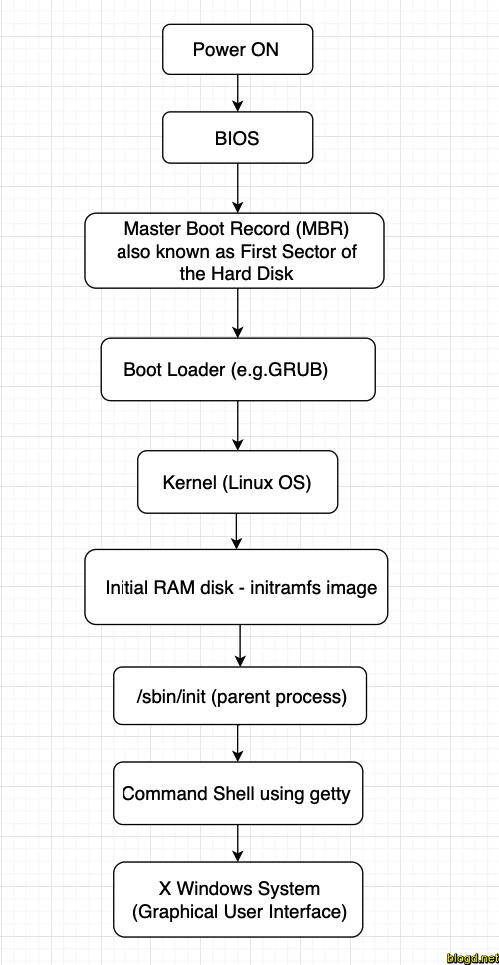

# Khởi động hệ thống 

## 1. Mục tiêu quá trình khởi động hệ thống 

- Khởi động các thành phần phần
cứng
- Kiểm tra trạng thái thiết bị
- Khởi động các phần mềm cho NSD 
- Cụ thể khi khởi động PC
    - Khởi động các thành phần phần cứng
    - Khởi động MBR
    - Thực hiện chương trình quản lý khởi động
    - Khởi động nhân hệ điều hành
    - Khởi động các chương trình phục vụ NSD
    - Phụ thuộc yêu cầu các giai đoạn khởi động này có thể sát nhập

## 2. Quá trình khởi động 

- Chương trình khởi động 
    - Chương tình nhỏ dùng để tải nhân hệ điều hành 
    - Đơn giản không có xác thực,không có bảo vệ
    - Giải pháp : lilo,grub.
### a. Lilo boot loader 

- Trình khởi động mặc định cho các bản phân phối linux 
- Các dữ liệu boot data nằm trong thư mục /boot
### b. Grub boot loader 
 
- Là một chương trình khởi động máy tính được phát triển bởi dự án GNU.
- Cung cấp cho người dùng một lựa chọn cho phép khởi động một trong nhiều hệ điều hành được cài trên một máy tính hoặc lựa chọn một cấu hình hạt nhân cụ thể có sẵn trên các phân vùng của một hệ điều hành cụ thể.
## 3. Run level

|Mức thực hiện |Mô tả |
|---|---|
|0 |Halt(tắt máy)|
|1 |Đơn NSD, không đồ họa, không mạng|
|2 |Đa NSD, không đồ họa, không mạng|
|3 |Đa NSD, không đồ họa, mạng|
|4 |Chưa dùng|
|5 |Đa NSD, đồ họa, mạng|
|6 |Khởi động lại|

- Câu lệnh 
    - runlever : hiển thị mức thực hiện hiện tại 
    - init level : chuyển mức thực hiện 
## 4. Script thực hiện dịch vụ 
- Cung cấp các thao tác 
    - Bật tắt khởi động lại,cấu hình lại chương trình 
    - Kiểm tra các điều kiện cần thiết để thực hiện dịch vụ 
    - Tạo ra các tệp khóa để xác định trạng thái dịch vụ 
## 5. chkconfig

- Cập nhật và truy vấn thông tin runlevel cho các dịch vụ hệ thống

- Options
|Options|Description|
|---|---|
|--list|liệt kê các dịch vụ|
|--add |thêm một dịch vụ mới |
|--del|xóa một dịch vụ|
|--overide|ghi đè lên một dịch vụ đã có sẵn trước đó|

## 6. TCP deamon 
- Theo dõi các yêu cầu thiết lập kết nối 
- Khởi tạo dịch vụ để xử lý yêu cầu 
- Tiết kiệm tài nguyên hệ thống 
- Quản lý danh sách truy cập,login,..
- Có thể sử dụng dịch vụ khác 

