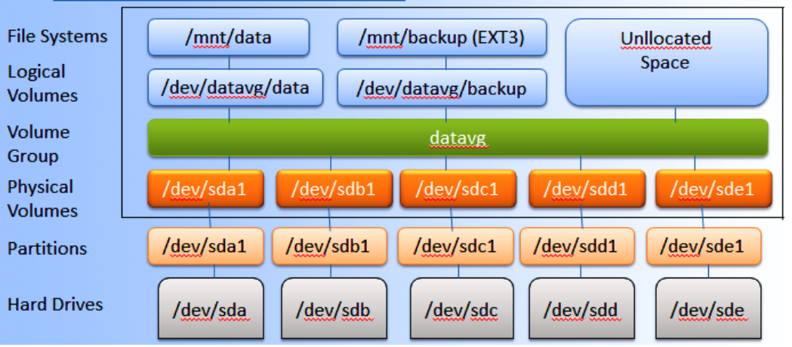
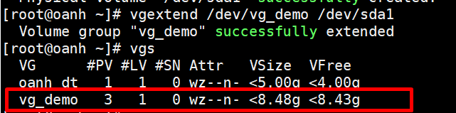
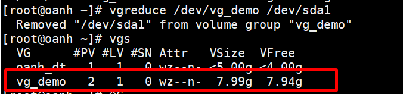
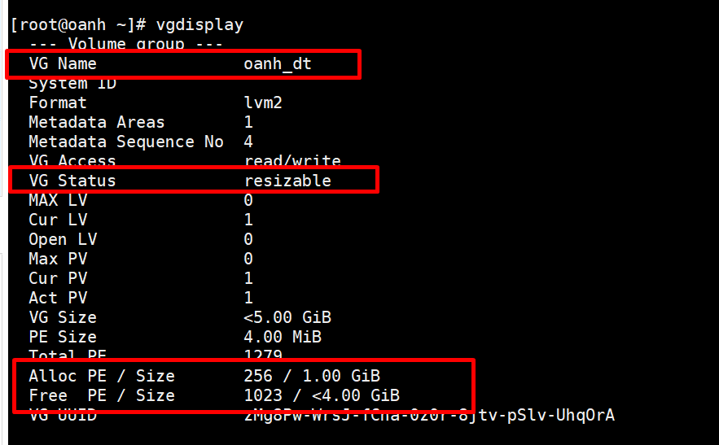
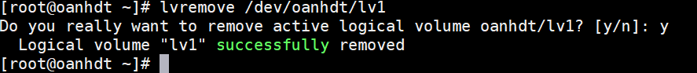
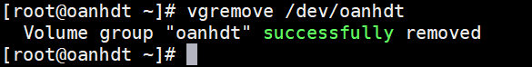
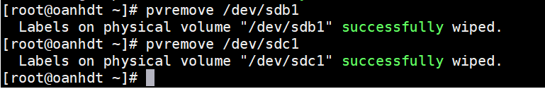

# LVM (Logical Volume Manager)
# Mục lục 
- [I. Những điều cần biết về LVM](#I)
  - [1.Ưu điểm](#1)
  - [2. Nhược điểm](#2)
- [II.Những câu lệnh cần biết](#II)
  - [1. Physical volumes ](#2.1)
  - [2. Volume group](#2.2)
  - [3. Logical volume](#2.3)

<a name ="I"></a>

## I. Những điều cần biết về LVM 



- Là một kỹ thuật cho phép tạo ra các vùng không gian đĩa cứng ảo khiến cho việc thay đổi dung lượng dễ dàng hơn. LVM giúp bạn nới rộng hoặc thu hẹp không gian lưu trữ mà không cần phải chia lại partition trên đĩa cứng.
- Về cơ bản bố trí Trình quản lý khối tin hợp lý LVM trông như thế này:

    - Logical Volume(s): có thể xem như là các “phân vùng ảo” trên “ổ đĩa ảo” bạn có thể thêm vào, gỡ bỏ và thay đổi kích thước một cách nhanh chóng.
    - Volume Group(s): là một nhóm bao gồm các Physical volumes. Bạn có thể xem Volume group như 1 “ổ đĩa ảo”.
    - Physical Volume(s): là những đĩa cứng vật lý hoặc partition trên nó như: /dev/sda hoặc /dev/sdb1.

- Bạn có một hoặc nhiều tập vật lý và trên các tập vật lý này, bạn tạo một hoặc nhiều nhóm âm lượng và trong mỗi nhóm âm lượng, bạn có thể tạo một hoặc nhiều tập hợp lý. Nếu bạn sử dụng nhiều khối lượng vật lý, mỗi khối lượng logic có thể lớn hơn một trong các khối vật lý cơ bản (nhưng tất nhiên tổng khối lượng logic không thể vượt quá tổng không gian được cung cấp bởi các khối vật lý). Đó là một thực hành tốt để không phân bổ toàn bộ không gian cho các khối hợp lý, nhưng để lại một số không gian không được sử dụng. Bằng cách đó, bạn có thể phóng to một hoặc nhiều tập hợp lý sau này nếu bạn cảm thấy cần nó.

<a name ="1"></a>

### 1. Ưu điểm 

- Có thể gom nhiều đĩa cứng vật lý lại thành một đĩa ảo dung lượng lớn.
- Có thể tạo ra các vùng dung lượng lớn nhỏ tuỳ ý.
- Có thể thay đổi các vùng dung lượng dễ dàng linh hoạt.

<a name ="2"></a>

### 2. Nhược điểm 

- Các bước thiết lập phức tạp, khó khăn hơn.
- Càng gắn nhiều đĩa cứng và thiết lập càng nhiều LVM thì hệ thống khởi động càng lâu.
- Khả năng mất dữ liệu khi một trong số các đĩa cứng vật lý bị hỏng.

<a name ="II"></a>

## II. Một số câu lệnh cần biết 

<a name ="2.1"> </a>

###  1. Physical volumes:

|Command|Result |
|---|---|
| pvcreate|Tạo Physical volume |
|pvdisplay|Xem Physical volume |
|pvremove|Xoá Physical volume |

#### a. Tạo một physical volume 

    ```
    [root@oanhdt  ~]# pvcreate /dev/sdb1
    Physical volume "/dev/sdb1" successfully created.
    [root@oanhdt  ~]#
    ```
#### b. Xem physical volume 
```
[root@oanhdt  ~]# pvdisplay /dev/sdb1
  "/dev/sdb1" is a new physical volume of "5.00 GiB"
  --- NEW Physical volume ---
  PV Name               /dev/sdb1
  VG Name
  PV Size               5.00 GiB
  Allocatable           NO
  PE Size               0
  Total PE              0
  Free PE               0
  Allocated PE          0
  PV UUID               Z5083k-qshB-XN0a-jgh4-wmjS-Md30-MJaOJb

[root@oanhdt  ~]#
```


<a name ="2.2"></a>

### 2. Volume groups:

|Command|Result |
|---|---|
|vgcreate |Tạo Volume groups |
|vgdisplay|Xem Volume groups |
|vgremove|Xoá Volume groups|
|vgextend|Tăng dung lượng Volume groups|
|vgreduce|Giảm dung lượng Volume groups |

#### a.Tạo volume group 

```
[root@oanhdt ~]# vgcreate oanh_dt /dev/sdb1 /dev/sda1
  A volume group called oanh_dt already exists.
  ```

- Dùng lệnh `vgs` để kiểm tra

```
[root@oanhdt ~]# vgs
  VG      #PV #LV #SN Attr   VSize  VFree
  oanh_dt   1   0   0 wz--n- <5.00g <5.00g
[root@oanhdt ~]#
```
- Như vậy là đã tạo được group oanh_dt 

#### b. Xem volume group 

```
[root@oanhdt ~]# vgdisplay
  --- Volume group ---
  VG Name               oanh_dt
  System ID
  Format                lvm2
  Metadata Areas        1
  Metadata Sequence No  1
  VG Access             read/write
  VG Status             resizable
  MAX LV                0
  Cur LV                0
  Open LV               0
  Max PV                0
  Cur PV                1
  Act PV                1
  VG Size               <5.00 GiB
  PE Size               4.00 MiB
  Total PE              1279
  Alloc PE / Size       0 / 0
  Free  PE / Size       1279 / <5.00 GiB
  VG UUID               zMg8Pw-WrsJ-fCna-0z0r-8jtv-pSlv-UhqOrA

[root@oanhdt ~]#
```

#### c. Tăng volume group 

```
[root@oanh ~]# vgextend /dev/vg_demo /dev/sda1
Volume group "vg_demo" successfully extended
```


#### d. Giảm volume group 




<a name ="2.3"></a>

### 3. Logical volumes:

|Command|Result |
|---|---|
|lvcreate |Tạo Logical volumes | 
|lvdisplay|Xem Logical volumes|
|lvremove|Xoá Logical volumes |
|lvextend|Tăng dung lượng Logical volumes|
|lvreduce|Giảm dung lượng Logical volumes |

#### a. Tạo logical volume 

```
lvcreate -L 2.5G -n lv1 oanh_dt
```
- Trong đó : 
  - -L là option cú pháp của dung lượng logical cần tạo
  - -n là tên của logical cần tạo 
  - oanh_dt là tên group 


- Dùng lệnh `lvs` để kiểm tra .

#### b. Tiến hành định dạng logical volume 

```
[root@oanh ~]# mkfs -t ext4 /dev/vg_demo/lv2
mke2fs 1.42.9 (28-Dec-2013)
Filesystem label=
OS type: Linux
Block size=4096 (log=2)
Fragment size=4096 (log=2)
Stride=0 blocks, Stripe width=0 blocks
327680 inodes, 1310720 blocks
65536 blocks (5.00%) reserved for the super user
First data block=0
Maximum filesystem blocks=1342177280
40 block groups
32768 blocks per group, 32768 fragments per group
8192 inodes per group
Superblock backups stored on blocks:
        32768, 98304, 163840, 229376, 294912, 819200, 884736

Allocating group tables: done
Writing inode tables: done
Creating journal (32768 blocks): done
Writing superblocks and filesystem accounting information: done

[root@oanh ~]#

```
- Mount nó vào thư mục `lvm` để sử dụng 

```
[root@oanh ~]# mount /dev/vg_demo/lv2 lvm
[root@oanh ~]# cd lvm
[root@oanh lvm]# ll
total 16
drwx------. 2 root root 16384 Jul 18 08:36 lost+found

```

#### c. Tăng dung lượng logical 
- Logical volume thuộc volume group `vg_demo` nên phải kiểm tra trong volume group còn đủ dung luwognj để tăng logical volume lên không . Ta dùng lệnh `vgdisplay` để kiểm tra 




```
[root@oanhdt ~]# lvextend -L +1G /dev/oanh_dt/lv1
  Size of logical volume oanh_dt/lv1 changed from 2.50 GiB (640 extents) to 3.50 GiB (896 extents).
  Logical volume oanh_dt/lv1 successfully resized.
[root@oanhdt ~]#
````
Sau khi tăng kích thước cho Logical Volume thì Logical Volume đã được tăng nhưng file system trên volume này vẫn chưa thay đổi, bạn phải sử dụng lệnh sau để thay đổi : 
 `resixe2fs /dev/vg_demo/lv2` . Chúng ta có thể nhìn thấy sự thay đổi như hình dưới. 


#### e. Giảm dung lượng của logical ta cần phải umount thiết bị cần giảm 

```
umount /dev/oanh_dt/lv1
```
- Sau đó tiến hành giảm dung lượng 

```
[root@oanhdt ~]# lvreduce -L 1G /dev/oanh_dt/lv1
  WARNING: Reducing active logical volume to 1.00 GiB.
  THIS MAY DESTROY YOUR DATA (filesystem etc.)
Do you really want to reduce oanh_dt/lv1? [y/n]: y
  Size of logical volume oanh_dt/lv1 changed from 3.50 GiB (896 extents) to 1.00 GiB (256 extents).
  Logical volume oanh_dt/lv1 successfully resized.
[root@oanhdt ~]#
```
#### d. Xóa Logical volume,Volume group và Physical volume 
- Xóa Logical Volume 
  - Trước tiên để xóa được Logical Volume chúng ta cần umount thiết bị trước.
  - Sau đó dùng lệnh `lvremove` để xóa
```
[root@oanhdt ~]# umount /dev/oanhdt/lv1
```
    


- Xóa Volume Group 
   - Dùng lệnh `vgremove` để xóa 



- Xóa Physical Volume 

   - Dùng lệnh `pvremove` để xóa



Vậy là chúng ta đã hoàn thành một bài lab cơ bản về LVM. Chúc các bạn thành công!


