# iSCSI(Internet Small Computer Systems Interface)

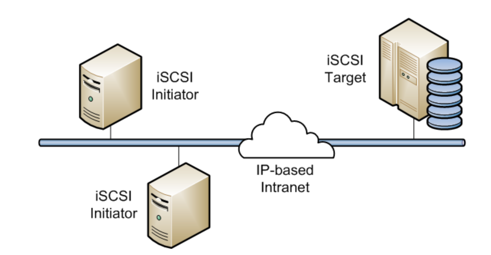

# Mục lục 
- [I. Khái niệm](#I)
- [II. Cách thức hoạt động](#II)
- [III. Một số thuật ngữ](#III)
- [IV. Mô hình triển khai](#IV)
- [V. IP Planning](#V)
- [VI. Cài đặt](#VI)
    - [1.Trên Server](#1)
    - [2.Trên Client](#2)

## I. Khái niệm.
- Cho phép kết nối tới Storage(thiết bị lưu trữ) bằng đường Network
- Giao thức này sử dụng các initiator để gửi các lệnh SCSI đến thiết bị lưu trữ đích (storage target) trên các máy chủ từ xa.

## II. Cách thức hoạt động 

- Khi một người dùng gửi một request yêu cầu truy xuất dữ liệu trong Storage.
- Hệ thống sẽ tạo ra một số lệnh SCSI tương ứng với yêu cầu
- Sau đó đóng gói (Encapsulate) và mã hóa (Encrypt) và gửi đi trên đường Network.
- Khi Server nhận được, nó sẽ tháo (De-Encapsulate) và giải mã (Decrypt) để cuối cùng nhận được các lệnh SCSI.
- Các lệnh SCSI sẽ được đưa vào SCSI Controller để thực thi và xử lý theo yêu cầu.
- Nó hoạt động trên mô hình Client-Server. Ta có thể tưởng tượng thay vì ta đem 1 disk cắm trực tiếp vào 1 máy để chạy và khi cần di chuyển thì ta tháo ra và mang đến máy khác cắm vào. Làm như thế rất bất tiện. Với iSCSI thì ta không cần mất công như vậy mà vẫn có thể đáp ứng được điều đó. Ta vẫn có thể làm việc với disk trên server như các disk đó đang thực sự đang nằm trên máy của mình.

## III. Một số thuật ngữ
* `Initiator`: Là máy client. Nó gửi yêu cầu truy cập đến server để truy cập vào khối dữ liệu.
* `Target`: đóng vai trò server, nơi lưu trữ dữ liệu. Mỗi máy target phải có một tên duy nhất để các `initiator` truy cập vào. Một `target` có một hoặc nhiều hơn 1 khối các thiết bị lưu trữ.
* `ALC` (Access Control List) danh sách điều khiển truy nhập là một hạn chế truy nhập bằng cách sử dụng nút IQN để xác thực quyền truy nhập cho Client.
* `Discovery` nó liên quan đến việc truy vấn server để tìm kiếm mục tiêu được cấu hình.
* `iqn`: là một quy định trong cách đăt tên cho cả `target` và `initiator`. Định dạng đặt tên như sau:
`iqn.năm-tháng.tên_miền:tên_phân_biệt`
Trong đó:
 * `iqn` biểu thị rằng tên này sẽ sử dụng tên miền làm mã định danh cho nó.
 * `năm-tháng` là tháng đầu tiên mà tên miền được tạo.
 * `tên miền` là tên của server. 
 * `tên phân biệt` tên này được thêm vào để ta phân biệt với target khác trên máy này.
* `Login` điều này xác thực target hoặc LUN dể bắt đầu sử dụng để login vào từ máy client.
* `LUN`- Logical Unit Number. Gồm các thiết bị (disk, partition hoặc logical volume) được gắn kết với nhau và thông qua target. Một target có thể gồm nhiều LUN nhưng thông thường một target cung cấp một LUN.
* `node` là một iSCSI initiator hoặc iSCSI target được xác định bởi IQN của nó.
* `portal` là địa chỉ IP và port trên target và initiator để thiết lập kết nối.

## IV. Mô hình triển khai

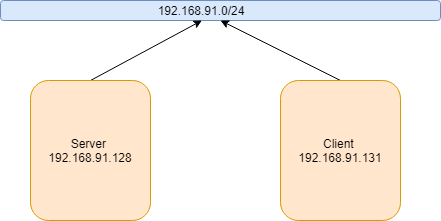

- Một máy đóng vai trò server có ip là 192.168.91.128
- Máy còn lại đóng vai trò Client có ip là 192.168.91.131.

## V. IP Planning 

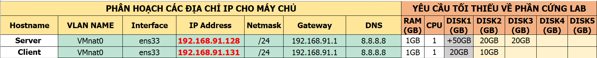

## VI. Cài đặt 

### 1. Trên Server

- Dùng câu lệnh `yum install -y targetcli` để cài đặt target trên server.

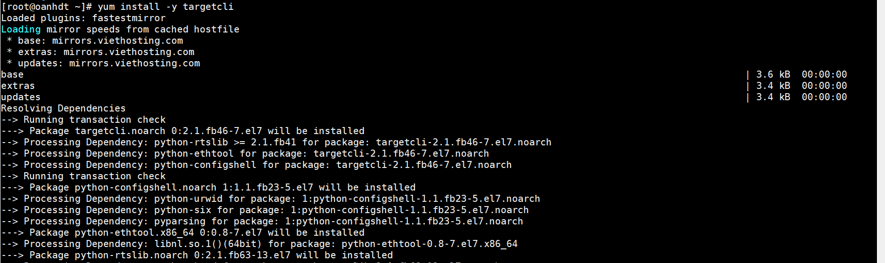

- Để tương tác với iSCSI dùng lệnh `targetcli `

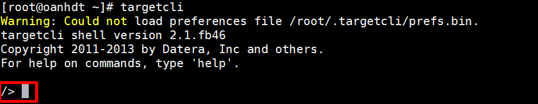

- `cd` vào thư mục backstore và tạo backstore theo kiểu mình muốn.Có thể là block hoặc fileio.

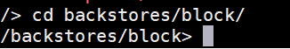

- Tạo một block(có thể là file nếu sử dụng kiểu fileio) và chỉ định cho nó dùng thiết bị lưu trữ nào (có thể là disk, partition hoặc là logical volume). Cú pháp create tên_block thiêt_bị.Ở đây tôi để tên block là scsi_demo còn thiết bị tôi gán cho nó là ổ /dev/sdc. Sau đó dùng lệnh `ls` để kiểm tra.

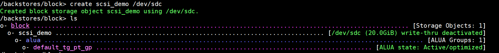

- Tiếp theo chúng ta tạo target. Cú pháp câu lệnh tạo target : `iqn.yyyy-mm.<reversed domain name>[:identifier]`. Trong đó : 
    - yyyy-mm là thời điểm mà `<reversed domain name>` vẫn còn hoạt động. 
    - indentifier : tên xác định duy nhất
    

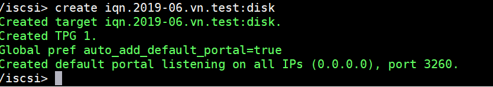

- Tạo LUN dưới target.

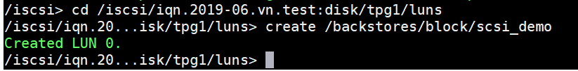

- Tạo ACL để khi client trình bày đúng cái tên này thì nó mới được target chấp nhận kết nối. Khi tạo ACL này thì có 1 phần ko đổi là phần trước dấu hai chấm đây là phần tên máy nó cố định như ta đặt từ trước. Phần sau dấu 2 chấm là một mật khẩu riêng những client nào ta muốn cho truy cập vào thì ta mới cho biết.

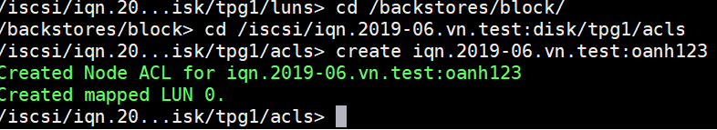

- Ta dùng lệnh `ls` để kiểm tra các thông tin vừa tạo.

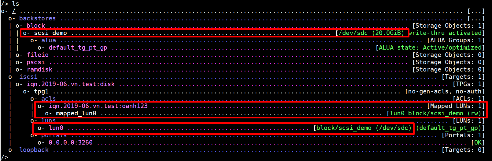

- Nhìn hình trên ta có thể nhận thấy ta đang có :
    - 1 blocks có tên là : scsi_demo được dán vào ổ /dev/sdc.Có dung lượng là 20GB
    - LUN 0 ta vừa tạo bên trên đã được map vào ACL ta vừa tạo.
- Ta lưu nó lại.

- Khởi động lại dịch vụ target :` systemctl restart target.service`
- Tắt firewalld đi để máy client có thể truy cập vào.`systemctl stop firewalld`

Vậy là ta đã cấu hình xong trên server.

### 2. Trên Client.

- Dùng lệnh `yum install iscsi-initiator-utils` để cài đặt `iscsi-initiator`

- Tiến hành sửa file `etc/iscsi/initiatorname.iscsi`  để giống với ACL ta tạo trên server để có thể kết nối đến server.

- Sử dụng tiện ích iscsiadm để tìm kiếm, đăng nhập, đăng xuất các targets iSCSI. Để có được danh sách các target trên server ta thực hiện cú pháp sau: iscsiadm -m discovery -t st -p IP_server Trong ví dụ này server của tôi có địa chỉ IP: 192.168.91.128

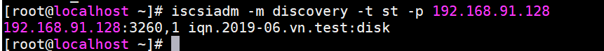

- Dùng lệnh ` iscsiadm -m node -l` để đăng nhập vào target được tìm thấy. Sau khi đã được gán ổ cứng từ target server, ta có thể sử dụng ổ sdb mới kia như một ổ cứng thực sự trên máy mình.

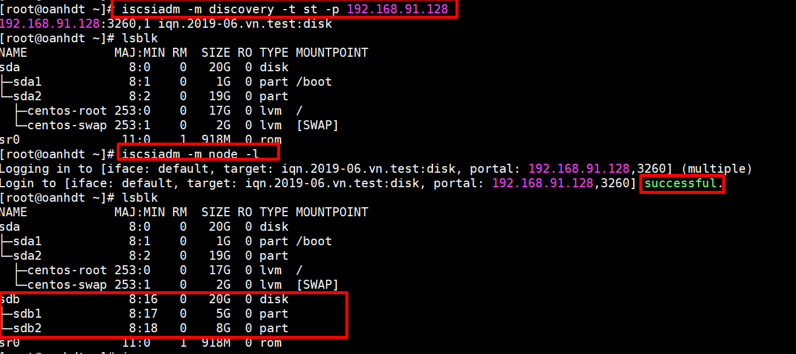

