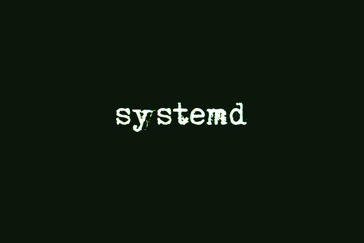
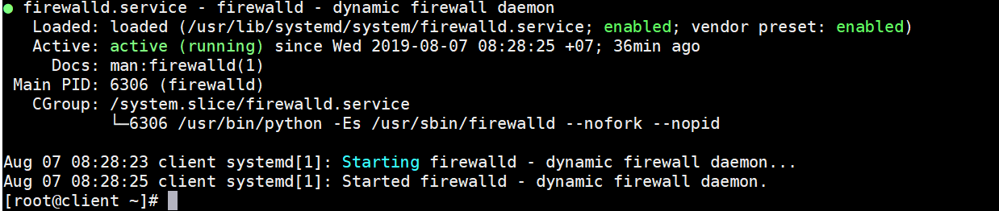

# Systemd

## Mục lục

- [Systemd là gì?](#khainiem)
- [Các thành phần của Systemd](#thanhphan)
- [Service](#service)

### Systemd là gì?

* Ở trong linux nó là một tiến trình chạy dưới nền (background process).
* Systemd thuộc nhóm chương trình: system and service manager - nó quản lý (bật/tắt/khởi động lại...) các dịch vụ chạy trên máy từ lúc bật máy cho đến lúc tắt máy. Nó cũng quản lý luôn cả hệ thống (system) cụ thể là các công việc: set tên máy (hostname), cấu hình loopback interface (lo trong output của lệnh `ip addr`), thiết lập và mount các filesystem như /sys /proc ...

### Các thành phần của systemd.

**Systemctl :** dùng để quản lý trạng thái của hệ thống như bật,tắt hay kiểm tra trạng thái của hệ thống.

**journal :** dùng để quản lý nhật ký của hệ thống hay còn gọi là ghi log.

**login :** dùng để theo dõi việc đăng nhập/đăng xuất của người dùng hệ thống.

**network :** dùng để quản lý các kết nối mạng thông qua các cấu hình mạng.

**timedated :** quản ký thời gian hệ thống hoặc thời gian mạng.

**udev :** quản lý thiết bị.

### Unit file

Systemd quản lý các "unit"

Mỗi unit sẽ được cấu hình trong một unit file, thường nằm trong thư mục :

* `/etc/systemd/system`: các file config do người dùng thêm.

* `/lib/systemd/system`: các unit file do các phần mềm cài vào (VD cài NGINX, nếu package NGINX có chứa file unit thì nó sẽ được cho vào đây).

* `/run/systemd/system`: runtime units.

Có 12 loại unit khác nhau các bạn có thể xem chi tiết [tại đây](https://viblo.asia/p/tim-hieu-va-van-dung-systemd-de-quan-ly-he-thong-linux-phan-co-ban-WAyK8kN65xX)
 nhưng ta sẽ chỉ quan tâm đến loại "service", là unit sẽ quản lý một chương trình khởi động khi bật máy và luôn luôn chạy ở chế độ "nền" (background) và được gọi là daemon.

### Service 

* Là một trong 12 loại unit của systemd loại này sẽ được khởi động khi bật máy và luôn chạy ở chế độ nền (daemon hoặc background).Các service thường sẽ được cấu hình trong các file riêng biệt và được quản lý thông qua câu lệnh systemctl.

    * start: bật service
    * stop: tắt service
    * restart: tắt service rồi bật lại.
    * enable: service sẽ được khởi động cùng hệ thống
    * disable: service sẽ không được khởi động cùng hệ thống

*Ví dụ* để kiểm tra trạng thái của `firewalld` trong  máy centOS7 ta dùng câu lệnh `systemctl status firewalld`

Tương tự muốn tắt firewalld ta dùng câu lệnh sau `systemctl stop firewalld`
hay restart `systemctl restart firewalld`.

