# Samba Windows File Sharing

Samba là một nền tảng mã nguồn mở, và là một gói phần mềm miễn phí cung cấp các dịch vụ file và máy in đến cho cho các máy Clients. Samba cho phép người dùng chia sẻ file, folders và máy in giữa các máy Linux và máy Windows.

Samba bao gồm 2 chương trính chính và một số công cụ hỗ trợ. Hai chương trình chính là.

smbd : dịch vụ tệp và máy in, xác thực phân quyền truy cập tài nguyên.

nmdb : Phân giải tên và thông báo cá dịch vụ ra bên ngoài
## Mục lục 

- [Chuẩn bị](#chuanbi)
- [Mô hình triển khai](#mohinh)
- [Cấu hình](#cauhinh)
    - [Truy cập chế độ công khai](#congkhai)
    - [Truy cập chế độ bảo mật ](#baomat)


<a name ="chuanbi"></a>

## Chuẩn bị 
- Máy 1 : Samba server 

Hệ điều hành : CentOS7 

IP : 192.168.91.134/255.255.255.0
- Máy 2 

Hệ điều hành : windows 10 

Địa chỉ IP : 172.16.2.63/255.255.240.0

Hai máy này ping được đến nhau và ping ra ngoài internet.


<a name = "mohinh"></a>

## Mô hình triển khai.

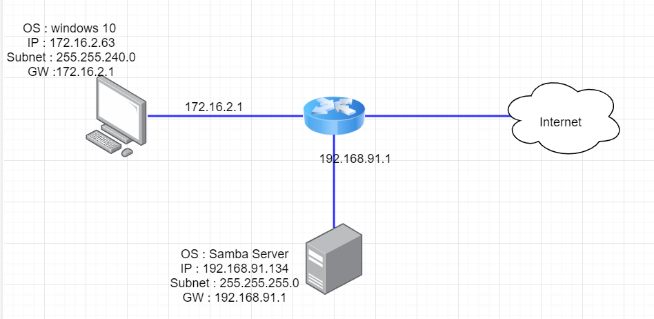

<a name="cauhinh"></a>

## Cấu hình 


**Cài đặt samba** 

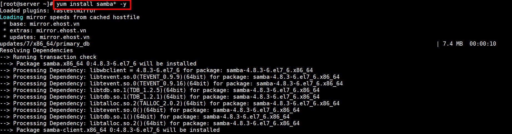

<a name="congkhai"></a>


### 1.Truy cập ở chế độ công khai.


**Cấu hình truy cập cho bất kì tài khoản nào :**  

```
mkdir -p /samba/anonymous
```


**Tiến hành cấp quyền cho thư mục.**

```
[root@samba ~]# chmod -R 0755 /samba/anonymous
[root@samba ~]#

```
**Thay đổi quyền sở hữu của file** 

Ở đây ta thay đổi quyền sở hữu của file 

```
[root@samba samba]# chown -R nobody:nobody anonymous/
[root@samba samba]# ll
total 0
drwxr-xr-x 3 nobody nobody 18 Aug  9 14:58 anonymous
```

**Cho phép truy cập từ SELinux**

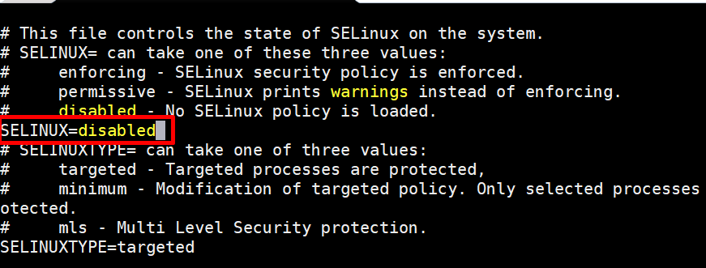

Sau đó reboot lại máy để thay đổi có hiệu lực.

*Lưu ý* bạn có thể dùng câu lệnh sau để cho phép truy cập từ Selinux 

```
chcon –t samba_share_t  /<path-filename>

```
**Edit file cấu hình samba**

`vi /etc/samba/smb.conf` thêm những nội dung sau.

```
[global]
        workgroup = WORKGROUP
        server string = Samba Server %v
        netbios name = centos
        security = user
        map to guest = bad user
        dns proxy = no
[Anonymous]
        path = /samba/anonymous
        browsable = yes
        writable = yes
        guest ok = yes
        read only = no
```

Trong đó : 
- `workgroup = WORKGROUP` Là tham số xác định tên workgroup của Windows mà máy Linux đăng nhập.
- `server string` là tham số gán mô tả về tên máy Linux trên mạng
- `NetBIOS name` là một trong những tên được gán cho máy tính sử dụng hệ thống nhận dạng mạng được tích hợp bên trong máy đang được sử dụng.
- `security ` chế độ bảo mật.
- `map to guest = bad user` Nếu được đặt thành`bad user `, cho phép người dùng không có tài khoản trên hệ thống Samba đăng nhập và được chỉ định tài khoản khách.
-  `path` xác định đường dẫn đến thư mục cần được chia sẻ trên server.
- `browseable=yes` nên thư mục này sẽ được nhìn thấy khi người dùng mở Windows Explorer.
-  `read only` sẽ cho phép người dùng trên máy trạm có thể thay đổi nội dung file hay không.

**Sau đó khởi động SAMBA SERVER lên**

```
[root@samba ~]# systemctl start nmb.service
[root@samba ~]# systemctl start smb.service
[root@samba ~]# systemctl enable smb.service
Created symlink from /etc/systemd/system/multi-user.target.wants/smb.service to /usr/lib/systemd/system/smb.service.
[root@samba ~]# systemctl enable nmb.service
Created symlink from /etc/systemd/system/multi-user.target.wants/nmb.service to /usr/lib/systemd/system/nmb.service.

```

- Tắt firewalld để cho phép truy cập.

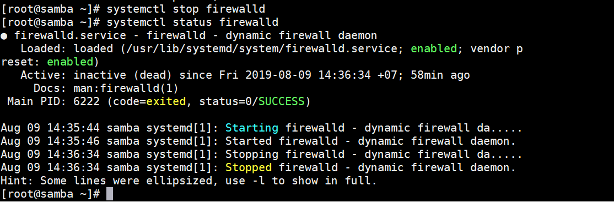

<a name="kiemtra"></a>

### Kiểm tra.

Trên máy hệ điều hành windown nhấn tổ hợp phím `Ctrl R ` và nhập địa chỉ ip của samba server vào như hình dưới và nhấn `OK`.

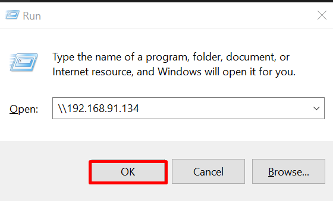

Ta sẽ thấy thư mục share .

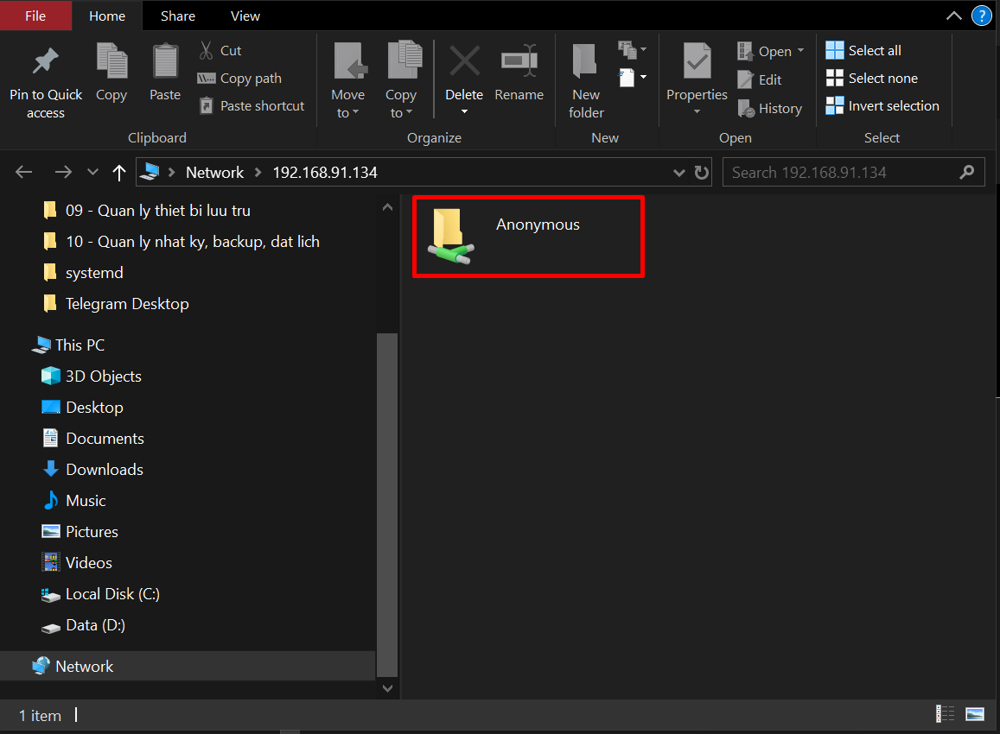

Bây giờ tôi sẽ thử tạo một folder `test` ở trong folder Anonymous

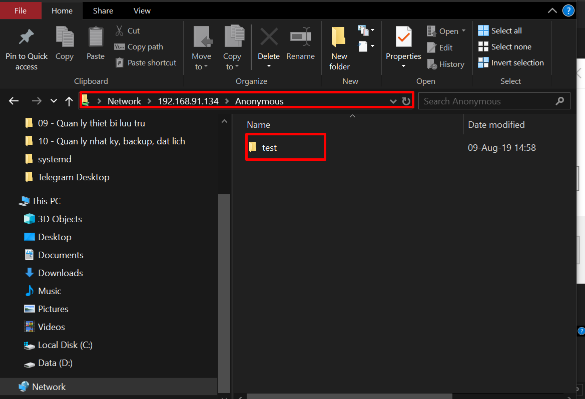

 Kiểm tra xem ở trên samba server có xuất hiện folder vừa tạo hay không.
 
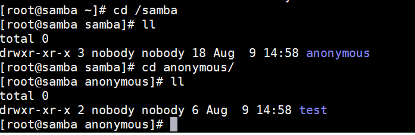


<a name="baomat"></a>

### 2. Truy cập chế độ bảo mật.

**Tạo user,group**

Trước tiên các bạn phải tạo 1 group và user để cho phép các user trong group đó được phép truy cập vào thư mục share.

```
[root@samba ~]# groupadd samba-demo
[root@samba ~]# useradd oanh -G samba-demo
[root@samba ~]#
```

**Tạo password**

Tạo password để truy cập vào thư mục thông qua samba bẳng lệnh sau: 
```
smbpasswd -a <username>

```

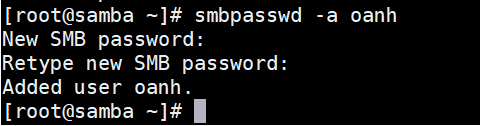

**Tạo thư mục cần share**

```
mkdir -p /samba/secured
```
**Cấp quyền cho thư mục vừa tạo**

```
chmod -R 0777 secured/
```
**Thay đổi quyền sở hữu**

```
[root@samba ~]# chown -R oanh:samba-demo /samba/secured
[root@samba ~]# cd /samba/
[root@samba samba]# ll
total 0
drwxr-xr-x 3 nobody nobody     18 Aug  9 14:58 anonymous
drwxrwxrwx 2 oanh   samba-demo  6 Aug  9 16:03 secured
```

**Cho phép truy cập từ SELinux**


Sau đó reboot lại máy để thay đổi có hiệu lực.

*Lưu ý* bạn có thể dùng câu lệnh sau để cho phép truy cập từ Selinux 

```
chcon –t samba_share_t  /<path-filename>

```
**Chỉnh sửa file cấu hình**

```
vi /etc/samba/smb.conf
```

Thêm nội dung sau vào file config 

```
[secured]
 path = /samba/secured
 valid users = @samba-demo
 guest ok = no
 writable = yes
 browsable = yes
 ```

**Khởi động lại dịch vụ samba**

```
[root@samba ~]# systemctl restart smb.service
[root@samba ~]# systemctl restart nmb.service
```

Bây giờ chúng ta sẽ tiến hành kiểm tra 

Trên máy hệ điều hành windown nhấn tổ hợp phím `Ctrl R ` và nhập địa chỉ ip của samba server vào như hình dưới và nhấn `OK`.


Ta sẽ thấy thư mục share 

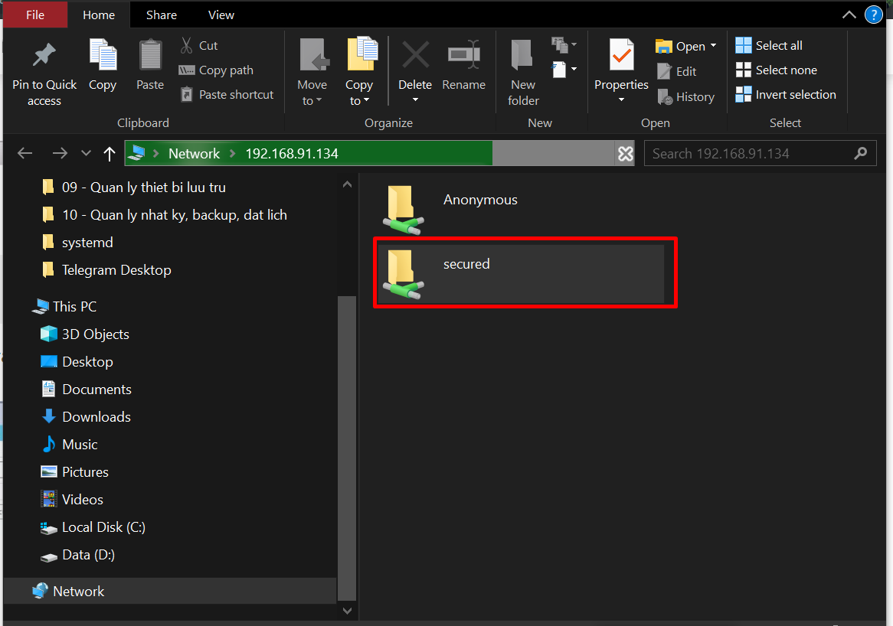

Tiến hành nhập username và password tạo lúc đầu vào như hình dưới 

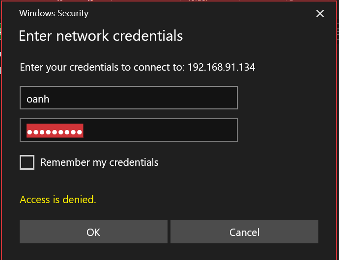

Tiến hành tạo file 

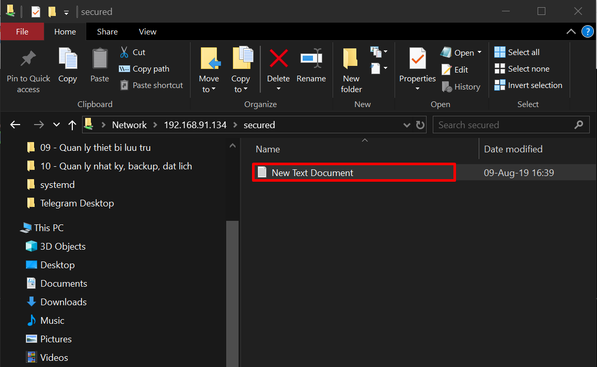

Kiểm tra trên samba server đã xuất hiện file vừa tạo chưa 

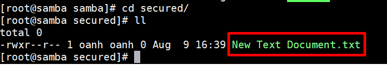

