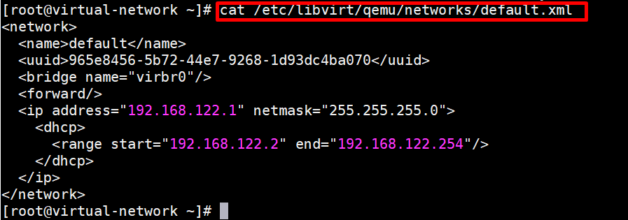

# Linux Virtual Networking

Linux có các khả năng kết nối mạng ảo phong phú được sử dụng làm cơ sở để lưu trữ VM và container, cũng như môi trường đám mây.

Với việc sử dụng libvirt và linux virtual bridge, việc tạo và quản lí mạng ảo trên hệ điều hành Linux đã trở nên dễ dàng hơn rất nhiều.

Cài đặt, khởi động và kích hoạt libvirt:

```
[root@virtual-network ~]# yum install -y libvirt
[root@virtual-network ~]# systemctl start libvirtd
[root@virtual-network ~]# systemctl enable libvirtd
```
Libvirt hỗ trợ những loại mạng ảo dưới đây:

* NAT mode
* Routed mode
* Isolated mode
* Bridged mode

Khi libvirt được cài lên server, nó sẽ có thiết lập mặc định là NAT mode. Switch ảo được thiết lập với chế độ này sẽ được dùng bởi các VM để giao tiếp với mạng bên ngoài thông qua card vật lí của máy chủ. Cấu hình được lưu tại file xml ` /etc/libvirt/qemu/networks/default.xml` . Bridge có tên ` vibr0 ` đồng thời cũng sẽ được tạo ra trên host vật lí.

Ta cat file `/etc/libvirt/qemu/networks/default.xml` để xem các thông số cần lưu ý bên trong nó.



* `name` nội dung của phần tử tên cung cấp một tên ngắn cho mạng ảo.
* `uuid` nội dung của phần tử uuid cung cấp một định danh duy nhất toàn cầu cho mạng ảo.

