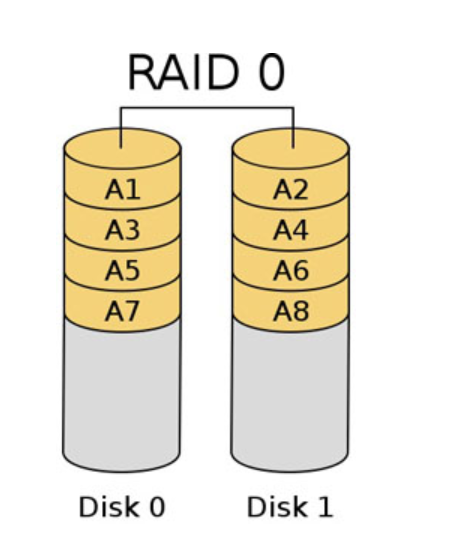
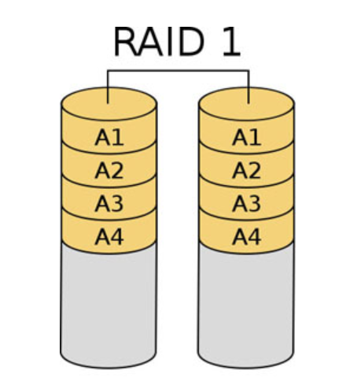
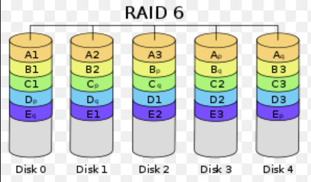
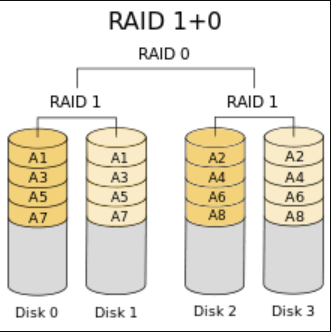

# RAID 

RAID là tên viết tắt của `Redundant Arrays of Inexpensive Disks ` là một hình thức ghép nhiều ổ đĩa cứng vật lý thành hệ thống ổ đĩa cứng logic.

RAID là cách đã được dùng để tăng hiệu suất và sửa chữa những lỗi trong quá trình làm việc của ổ cứng . Có nhiều kiểu RAID khác nhau , mỗi kiểu có thể mạnh riêng và hạn chế riêng , không một mức RAID nào được cho là tốt nhất và mỗi mức RAID được sử dụng theo những giải pháp riêng biệt được lựa chọn.

## Một số thuật ngữ của RAID

**Striping** : hầu hết các mức RAID đều dùng Stripping , nó là một kiểu được dùng để mô tả khi những File riêng lẻ được phân chia thành nhiều gói nhỏ và những gói này được ghi trên 02 ổ đĩa cứng trở lên.

**Mirroring :** mirroring là cách đơn giản nhất là sử dụng bằng cách lưu trữ dữ liệu thừa ra . Kỹ thuật này chỉ dùng 02 ổ cứng kết hợp lại với nhau không như Stripping.

**Parity :** parity được dùng bên cạnh với Stripping nhưng đó là cách mà không mất 50% dung lượng ghi những dữ liệu thừa như trong Mirroring . Trong mảng nhiều ổ cứng sử dụng Parity cho dữ liệu thừa , chỉ một phần khoảng trống trên ổ cứng được sử dụng để lưu trữ thông tin cần để khôi phục lại dữ liệu tất cả mảng nhiều ổ cứng trong trường hợp ổ cứng bị hỏng .

## Các loại RAID 

[1. RAID 0](#raid0)

[2. RAID 1](#raid1)

[3. RAID 5](#raid5)

[4. RAID 6](#raid6)

[5. RAID 10](#raid10)

### 1. RAID 0 

RAID 0 đòi hỏi có tói thiểu hai đĩa cứng.

RAID 0 cho phép máy tính ghi dữ liệu lên chúng theo một phương thức đặc biệt được gọi là Striping.

Bạn có thể hình dung mình có 100MB dữ liệu và thay vì dồn 100MB vào một đĩa cứng duy nhất, RAID 0 sẽ giúp dồn 50MB vào mỗi đĩa cứng riêng giúp giảm một nửa thời gian làm việc theo lý thuyết. Tuy nhiên khi có sự cố ở trên một trong hai ổ đĩa thì dữ liệu sẽ mất đi một nửa.

RAID 0 sử dụng nhiều ổ cứng thể rắn để có thể tăng hiệu năng băng thông của bạn lên gấp bốn lần. Bạn sẽ nhận thấy thời gian khởi động nhanh hơn, thời gian tải ứng dụng nhanh hơn.

Có thể thấy RAID 0 thực sự thích hợp cho những người dùng cần truy cập nhanh khối lượng dữ liệu lớn, ví dụ các game thủ hoặc những người chuyên làm đồ hoạ, video số.

### 2. RAID 1

Đây là dạng RAID cơ bản nhất có khả năng đảm bảo an toàn dữ liệu. RAID 1 đòi hỏi ít nhất hai đĩa cứng để làm việc. Dữ liệu được ghi vào 2 ổ giống hệt nhau (Mirroring). Tức là nó sẽ ghi cùng một nội dung lên hai ổ cứng. 

Trong trường hợp một ổ bị trục trặc, ổ còn lại sẽ tiếp tục hoạt động bình thường. Bạn có thể thay thế ổ đĩa bị hỏng mà không phải lo lắng đến vấn đề thông tin thất lạc.

Raid 1 là chuẩn RAID không thể thiếu đối với người quản trị mạng hoặc những ai phải quản lý nhiều thông tin quan trọng.

Tuy nhiên RAID1 chỉ bảo vệ dữ liệu với những lỗi vật lí trên ổ cứng , nó sẽ không bảo vệ chống lại việc mất dữ liệu liên quan tới phần mềm . Ví dụ Virus sẽ xoá dữ liệu trên ổ cứng thì cũng tương tự như với việc xoá dữ liệu trên cả 02 ổ cứng.Nó không gia tăng dung lượng lưu trữ và tốc độ sẽ chậm hơn.

### 3. RAID 5

RAID 5 yêu cầu có tối thiểu 3 ổ cứng vật lý riêng biệt.

Trong số những loại Raid phổ biến thì Raid 5 được xem là mạnh mẽ nhất và an toàn nhất cho người dùng. Khi sử dụng Raid 5, dữ liệu sẽ được “backup” – sao lưu đều trên các ổ đĩa cứng.

Trong Raid 5 dữ liệu và bản sao dữ liệu (dữ liệu dự phòng) được chia đều trên tất cả các ổ cứng, do vậy mà các dữ liệu sẽ không bị mất nếu trong hệ thống raid bị lỗi 1 ổ cứng.Tuy nhiên nêu hỏng từ 2 ổ cứng thì dữ liệu sẽ bị mất và rất khó để khôi phục lại dữ liệu.

RAID5 là mức RAID được sử dụng trong hầu hết mọi nơi . Không có một tính năng nào của RAID5 được cho là tốt nhất , nhưng nó làm mọi điều trở nên tối ưu hơn , mức hiệu suất lưu trữ là hợp lí.

### 4. RAID 6 

Ở RAID 5 nếu như chết từ 2 ổ cứng thì dữ liệu sẽ bị mất còn ở  RAID  6  yêu cầu tối thiểu 4 ổ cứng, với 4 ổ cứng thì chúng cho phép hư hỏng đồng thời đến 2 ổ cứng mà hệ thống vẫn làm việc bình thường, điều này tạo ra một xác xuất an toàn rất lớn.
Tức là ở RAID 6 thì mỗi dữ liệu lại được lưu trữ ở ít nhất ba vị trí (trở lên).

### 5. RAID 10

Nó tổng hợp tất cả những ưu điểm của 2 Raid 0 và Raid 1
 
* Raid 0 có phương thức ghi dữ liệu là “Chia nhỏ – Striping” để ghi lên cả 2 ổ đĩa theo thứ thự luân đổi.
* Raid 1 có phương thức ghi là “Mirror” – nghĩa là các dữ liệu được ghi vào cả 2 ổ cứng là y như nhau, nên khi một ổ đĩa hỏng thì vẫn có thể lấy dữ liệu từ ổ còn lại, do vậy Raid 1 được đánh giá là an toàn.

Khi kết hợp cả 2 với nhau vừa giúp tăng hiệu suất ghi vừa tăng tính bảo mật.Tuy nhiều nếu như hong rnhieeuf hơn 1 ổ cứng thì dữ liệu sẽ bị mất.

### 6. JBOD(Just a Bunch Of Disks)

Thực tế không phải là một dạng RAID chính thống, nhưng lại có một số đặc điểm liên quan tới RAID và được đa số các thiết bị điều khiển RAID hỗ trợ. JBOD cho phép bạn gắn bao nhiêu ổ đĩa tùy thích vào bộ điều khiển RAID của mình (dĩ nhiên là trong giới hạn cổng cho phép). Sau đó chúng sẽ được “tổng hợp” lại thành một đĩa cứng lớn hơn cho hệ thống sử dụng.

