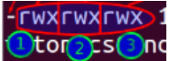

<a name ="Tài khoản NSD và phân quyền truy cập tệp"></a>


## I. Khái niệm NSD và nhóm NSD
- NSD :Tên, Mật khẩu, home của người sử dụng (/home/tên)
- Nhóm NSD : tập hợp nhiều người sử dụng tạo thành một nhóm,một người sử dụng có thể thuộc một hoặc nhiều nhóm.

## II. Quản lý user và group.

### 1. Tạo user

```
useradd <options> <username>
```

- Options 

|Options|Result|
|---|---|
|-c |Thông tin người dùng|
|-d|Thư mục cá nhân|
|-m|tạo thư mục cá nhân nếu chưa tồn tại|
|-g|nhóm của người dùng|

- Ví dụ : tạo user có tên là *hung* thông tin của user là *Hoang Minh Hung* và add user và group *new*

```
[root@localhost ~]# useradd -c "Hoang Minh Hung" -g new hung
useradd: warning: the home directory already exists.
Not copying any file from skel directory into it.
Creating mailbox file: File exists
[root@localhost ~]# groups hung
hung : new
[root@localhost ~]#
```
### 2. Xóa user

```
userdel <option> <username>
```
|Options|Result|
|---|---|
|-c |Thông tin người dùng|
|-d|Thư mục cá nhân|
|-m|tạo thư mục cá nhân nếu chưa tồn tại|
|-g|nhóm của người dùng|

### 3. Tạo group 
 ```
 groupadd <groupname>
 ```

 - Xóa group 
 ```
 groupdel <groupname>
 ```

 - Xem thông tin người dùng thuộc group nào 
 ```
 groups <username>
 ```
 ### 4. Nhũng file liên quan đến user và group

 - #/etc/passwd : tệp lưu trữ thông tin cần thiết, được yêu cầu trong quá trình đăng nhập tức là thông tin tài khoản người dùng.
 - #/etc/shadow: lưu mật khẩu đã được mã hóa và chỉ có user root mới được quyền đọc.
 - #/etc/group: đây là một tệp văn bản đơn giản chứa danh sách các nhóm và các thành viên thuộc mỗi nhóm

 ### 5. Kiểm tra id của user trong group 

 ```
 id <option> <username>
```

- Options

|Options|Result|
|---|---|
|-g|in ra id của group|
|-u|in ra id của người dùng|
|-n|in ra tên thay vì số|

## III. Quyền truy cập 

### 1. Quyền
- Có 3 dạng đối tượng :
    - Owner (người sở hữu).
    - Group owner (nhóm sở hữu).
    - Other users (những người khác)
- Các quyền truy cập :



- Nhóm 1 ở đây là quyền của người sở hữu,nhóm 2 là quyền nhóm sở hữu, nhóm 3 là quyền của những user còn lại.

    - Read – r – 4  : cho phép đọc nội dung.
    - Write – w – 2  : dùng để tạo, thay đổi hay xóa.
    - Execute – x – 1  : thực thi chương trình.

### 2. Các lệnh liên quan đến quyền truy cập

#### a. Cấp quyền 

- Chmod dưới dạng ký tự.

|Phép toán phân quyền|	Mô tả|
|--|---|
|+	|Thêm quyền cho file/thư mục|
|-|	Bớt quyền với file/thư mục |
|=	|Gán quyền cho file/thư mục|

- Ví dụ câp thêm quyền sửa và thực thi cho groupuser trong file d.txt
```
[root@localhost ~]# ll -s d.txt
0 -rw-r--r--. 1 root root 0 Jun 25 12:18 d.txt
[root@localhost ~]# chmod g+wx d.txt
[root@localhost ~]# ll -s d.txt
0 -rw-rwxr--. 1 root root 0 Jun 25 12:18 d.txt
[root@localhost ~]#
```
- Bớt quyền đọc sửa của groupuser trong file d.txt
```
[root@localhost ~]# ll -s d.txt
0 -rw-rwxr--. 1 root root 0 Jun 25 12:18 d.txt
[root@localhost ~]# ^C
[root@localhost ~]# chmod g-w d.txt
[root@localhost ~]# ll -s d.txt
0 -rw-r-xr--. 1 root root 0 Jun 25 12:18 d.txt
[root@localhost ~]#
```
- Cấp quyền dưới dạng số 

|Số|Quyền|Tham chiếu|
|---|---|---|
|0|Không có quyền nào cả|---|
|1|Quyền thực thi|--x|
|2|Quyền ghi|-w-|
|3|Quyền ghi + thực thi|-wx|
|4|Quyền đọc|r--|
|5|Quyền đọc và thực thi|r-x|
|6|Quyền đọc và ghi|rw-|
|7|full quyền|rwx|

- Ví dụ muốn cấp full quyền cho user,groupuser và chỉ cấp quyền đọc cho otheruser cho folder NEW ta có: 
```
[root@oanhdt ~]# ll
total 4
-rw-------. 1 root root 1652 Jun  4 17:25 anaconda-ks.cfg
drwxr-xr-x. 2 root root    6 Jun 26 15:22 NEW
[root@oanhdt ~]# chmod 774 NEW
[root@oanhdt ~]# ll
total 4
-rw-------. 1 root root 1652 Jun  4 17:25 anaconda-ks.cfg
drwxrwxr--. 2 root root    6 Jun 26 15:22 NEW
[root@oanhdt ~]#
```
#### b. Thay đổi chủ sở hữu
```
chown <user> <filename>
```
- Ví dụ muốn thay đổi chủ sở hữu của folder NEW từ *root* sang *oanh*

```
[root@oanhdt ~]# chown oanh NEW
[root@oanhdt ~]# ll
total 4
-rw-------. 1 root root 1652 Jun  4 17:25 anaconda-ks.cfg
drwxrwxr--. 2 oanh root    6 Jun 26 15:22 NEW
[root@oanhdt ~]#
```
#### c. Thay đổi nhóm sở hữu 
```
Chgrp <group> <filename>
```
- Ví dụ thay đổi nhóm sở hữu của folder NEW từ root sang DT 

```
[root@oanhdt ~]# chgrp DT NEW
[root@oanhdt ~]# ls -l
total 4
-rw-------. 1 root root 1652 Jun  4 17:25 anaconda-ks.cfg
drwxrwxr--. 2 oanh DT      6 Jun 26 15:22 NEW
[root@oanhdt ~]#
```
### IV. Các quyền đặc biệt 

|Mode|Mô tả |
|---|---|
|Sticky bit|Ngăn chặn việc người dùng này xóa file của người dùng kia.Chỉ duy nhất owner file (và root) mới có quyền rename hay xóa các file, thư mục khi nó đã được set sticky bit. sticky bit được môt tả bằng chữ cái “t” ở dòng cuối cùng của hiển thị permission|
|Suid bit|được sử dụng trên các file thực thi (executable files) để cho phép việc thực thi được thực hiện dưới owner của file thay vì thực hiện như user đang loggin trong hệ thống|
|Sgid bit| để cho phép việc thực thi được thực hiện dưới owner group của file thay vì thực hiện như group đang loggin trong hệ thống|