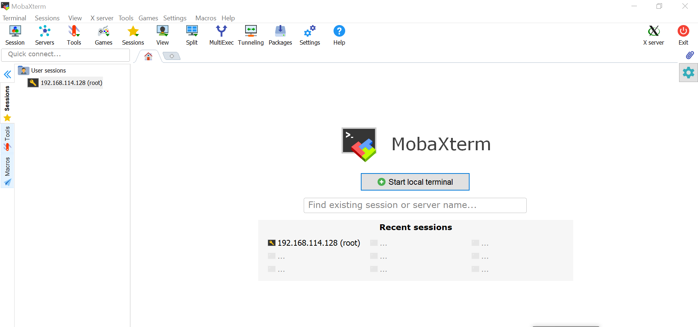
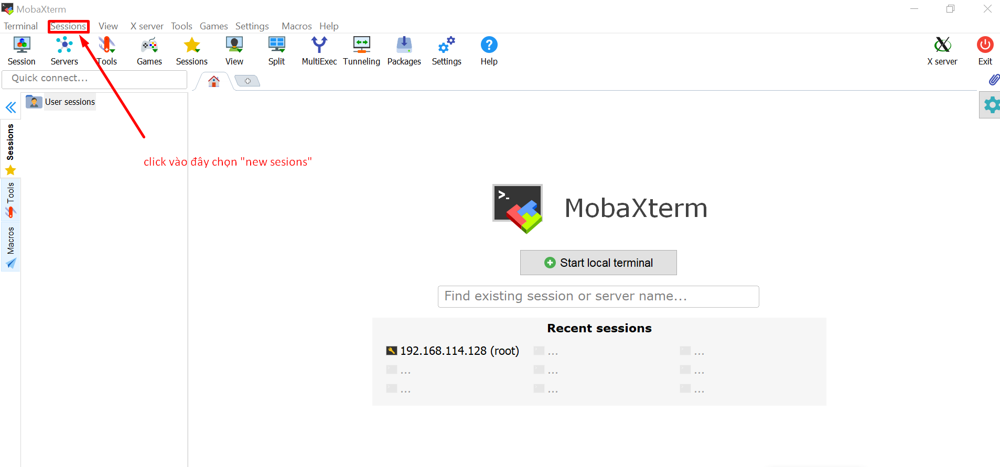
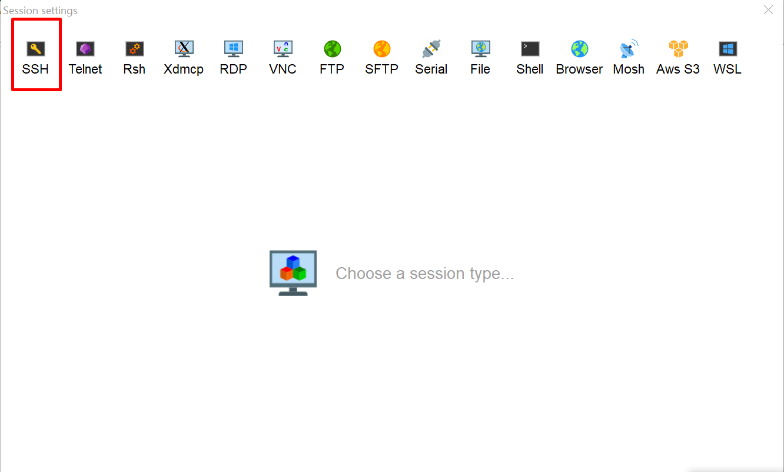
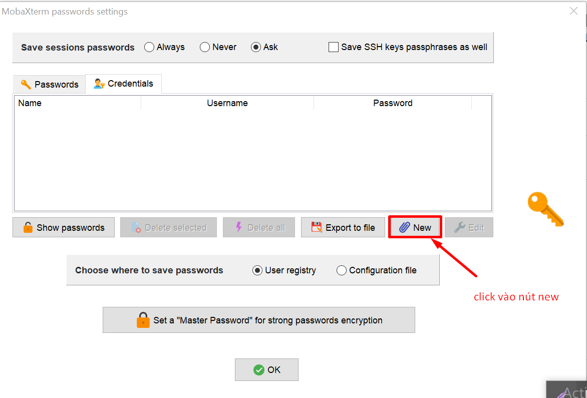
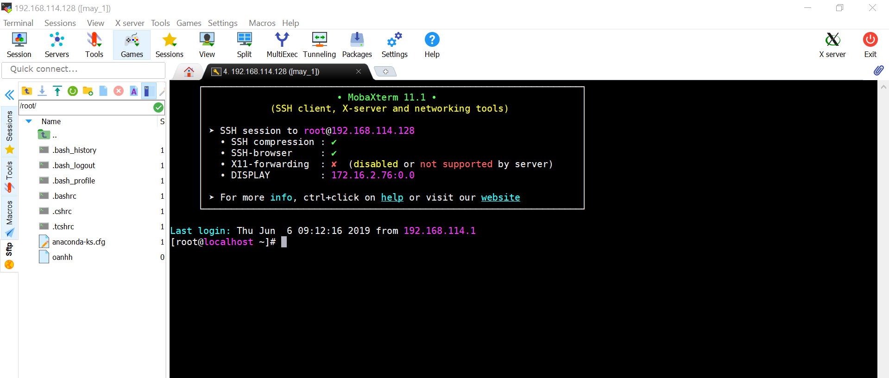

# Mobaxterm
## Cài đặt mobaxterm
- Click [vào đây](https://mobaxterm.mobatek.net/download-home-edition.html) để download mobaxterm.
- Sau khi thực hiện các bước cài đặt cho mọt phần mềm trên windown thì sẽ có giao diện như sau 

## Kết nối server Linux sử dụng MobaXTerm
- Click vào `Sessions` chọn `new sessions`

- Ở màn hình tiếp theo click vòa `SSH`

- Điền thông tin server

- Nhấp vào biểu tượng hình người để nhập thông tin.

- Nhấn `new` để điền thông tin như hình dưới 

 sau đó nhấn `OK` để tiếp tục.
 
 - Session vừa tạo

 

- Như vậy là chúng ta đã kết nối thành công với Server Linux sử dụng MobaXTerm. 
