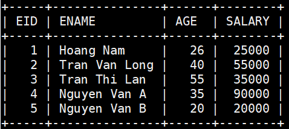
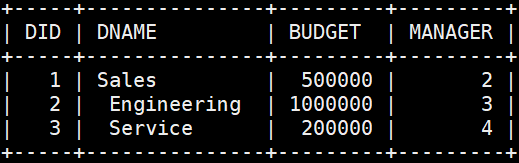
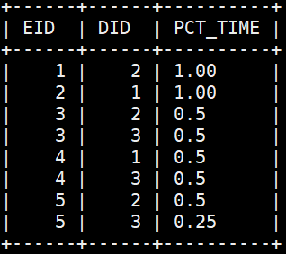
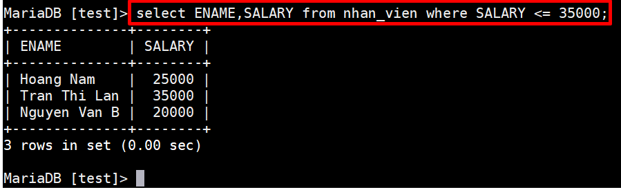
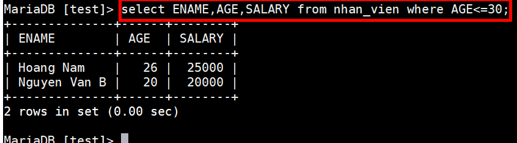
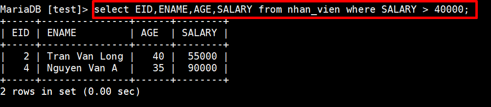
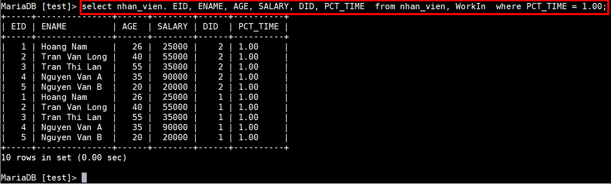
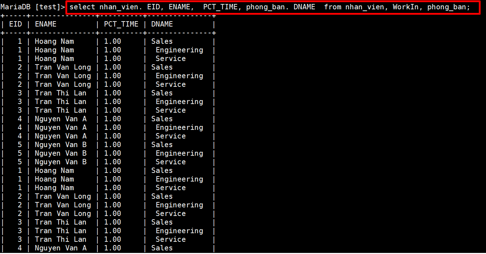
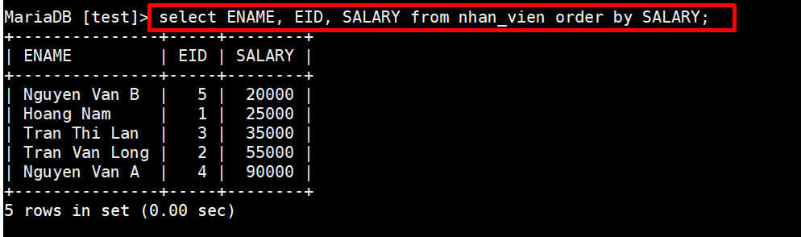
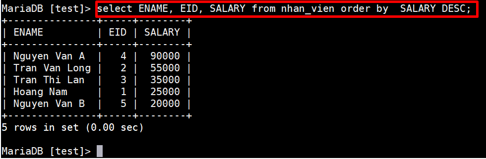

# Bài tập MYSQL 

`Employees` gồm các nhân viên có mã nhân viên là eid (kiểu integer), tên là ename
(kiểu string), tuổi la age (kiểu integer) và lương là salary (kiểu integer)
`Departments `gồm các phòng ban với did là mã phòng ban (kiểu integer), dname là
tên phòng ban (kiểu string), budget là ngân sách (kiểu integer), manager là mã số
nhân viên của trưởng phòng (kiểu integer).
`WorksIn` gồm phân công thời gian làm việc của các nhân viên với eid va did là mã số của
nhân viên và phòng ban mà nhân viên đó làm việc. pct_time có giá trị nằm trong khoảng
(0,1] cho biết tỉ lệ thời gian làm việc của nhân viên đó tại các phòng ban khác nhau. Ví du:
pct_time = 1 cho biết nhân viên đó làm việc hoàn toàn tại phòng ban tương ứng,
pc_time = 0.5 cho biết nhân viên đó làm việc bán thời gian tại phòng ban đó. 

*Bảng Nhân viên:* 

*Bảng phòng ban:*

*Bảng công việc:*

- Viết câu lệnh đưa ra danh sách các nhân viên có lương <=35000 

- Đưa ra danh sách gồm các thông tin về tên, tuổi và lương của các nhân viên <=30 tuổi.

- Viết câu lệnh đưa ra danh sách các nhân viên có mức lương không dưới 40000.Các thông tin đưa ra bao gồm mã nhân viên, tên, tuổi, mức lương. 

- Viết câu lệnh đưa ra danh sách các nhân viên làm việc hoàn toàn tại một phòng ban. Các thông tin đưa ra bao gồm mã nhân viên, tên, tuổi, mức lương và mã
phòng ban.

- Đưa ra danh sách nhân viên và phân bố thời gian làm việc của nhân viên đó tại các phòng ban. 

- In ra thông tin nhân viên có lương tăng dần.

- In ra thông tin nhân viên có lương giảm dần.

