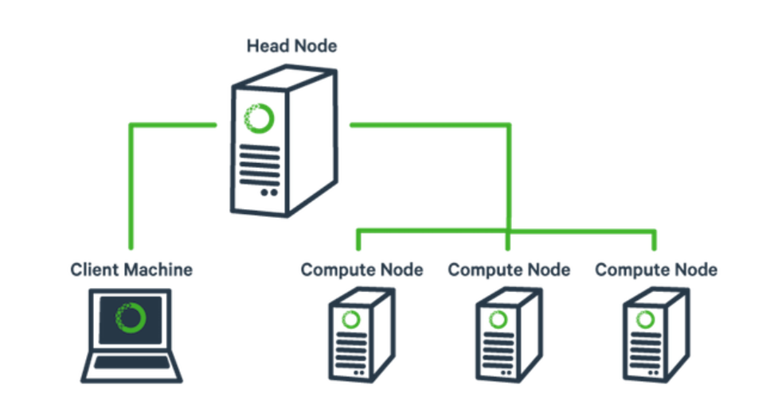

# Tìm hiểu về Clutes trong MySQL 

I. Khái niệm.

`Clutering ` là một kiến trúc nhằm đảm bảo nâng cao khả năng sẵn sàng cho các hệ thống mạng. Clustering bao gồm nhiều server riêng lẻ được liên kết và hoạt động cùng với nhau trong một hệ thống. Các server này giao tiếp với nhau để trao đổi thông tin và giao tiếp với mạng bên ngoài để thực hiện các yêu cầu. Khi có lỗi xảy ra các dịch vụ trong cluster hoạt động tương tác với nhau để duy trì tính ổn định và độ sẵn sàng cao cho hệ thống.

II. Server Cluster.

Server Cluster là một mô hình được đưa ra nhằm đáp ứng được các nhu cầu ngày càng gia tăng trong việc truy xuất các ứng dụng có tính chất quan trọng như thương mại điện tử, database …

Các ứng dụng này phải có khả năng chịu được lỗi cao, luôn đáp ứng được tính sẵn sàng và khả năng có thể mở rộng hệ thống khi cần thiết.

## Ưu điểm:

- Cung cấp tính sẵn sàng cao 
- Cung cấp khả năng dễ mở rộng
- Cung cấp sự dễ dàng trong quản lý 
 
## Các thuật ngữ 

- **Node**: là một server thuộc một Cluster mà trên đó các ứng dụng và CLuster service được cài đặt.
- **Failover**: quá trình failover có thể xảy ra một cách tự động.Khi một node trong cluster bị hỏng các resource group có nó sẽ được chuyển một mộ t hay nhiều node còn lại còn hoạt động được.
- **failback**: khi một node trở lại ohujc vụ, cluster trả lại quyền sở hữu tài nguyên cho nó và nó sẵn sàng được thực hiện yêu cầu.
- **Quorum resource**: Trong mỗi Cluster, Quorum resource chứa đựng và duy trì những thông tin cấu hình cần thiết cho việc phục hồi Cluster.
- **Resource group** : Resource group là một tập hợp logic của các resource trong một Cluster. Một resource group tiêu biểu được tạo ra bởi các resource liên kết logic với nhau như là các ứng dụng và các thiết bị ngoại vi và dữ liệu kết hợp với các ứng dụng đó.

## Các thành phần chính trong Cluster Service.

**Resource manager:** cho mỗi ứng dụng chịu trách nhiệm theo dõi và điều khiển ứng dụng đó.

**Checkpoint Manager:** Để đảm bảo cho việc Cluster service có thể phục hồi từ một resource bị lỗi, Checkpoint Manager kiểm tra các khóa registry khi một resource được mang online và ghi dữ liệu checkpoint lên quorum resource khi resource này offline.

**Database Manager:** chạy trên mỗi node và duy trì một bản sao lưu cục bộ của cơ sở dữ liệu cấu hình Cluster – chứa những thông tin về những thực thể vật lý và logic trong một Cluster.

**Event Log Replication Manager:** là một phần của Cluster service làm việc cùng với Event Log Service để sao chép các event log tới tất cả các node trong Cluster. 

**Failover Manager:** quản lý các resource và các resource group. Nó chịu trách nhiệm tắt hay khởi động các resource, quản lý các resource liên quan và chuẩn bị cho một quá trình failover các resource group.

**Global Update Manager:** được dùng bởi các thành phần bên trong cluster như là Failover Manager hay Database Manager để mang những cập nhật thay đổi tới mỗi node trong Cluster.

**Log Manager:** cùng với Checkpoint Manager tương tác với nhau đảm bảo rằng recover log trên quorum resource chứa đựng dữ liệu cấu hình mới nhất và các checkpoint thay đổi.

**Membership Manager:** chịu trách nhiệm duy trì một một cái nhìn nhất quán về các node trong Cluster hiện đang hoạt động hay bị hỏng tại một thời điểm nhất định.

**Node Manager:** chạy trên mỗi node và duy trì một danh sách cục bộ các node, các network, các network interface trong cluster. Qua sự giao tiếp giữa các node, Node Manager đảm bảo cho tất cả các node có cùng một danh sách các node đang hoạt động.

**Resource Monitor:** cung cấp một interface giao tiếp giữa resource DLLs và Cluster service.

