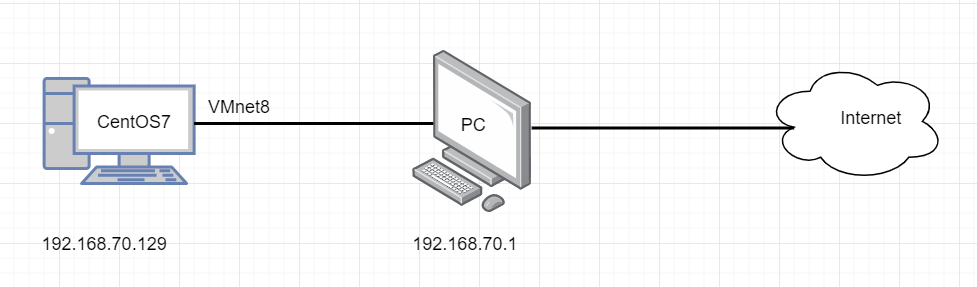
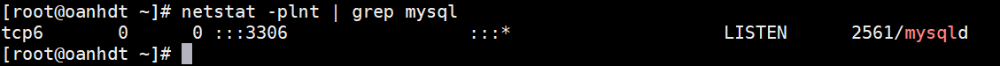
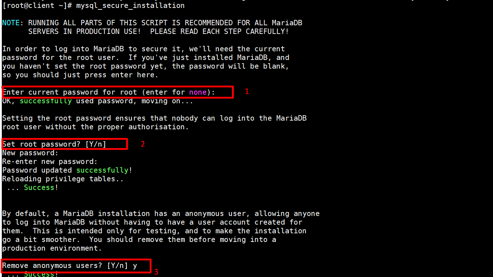
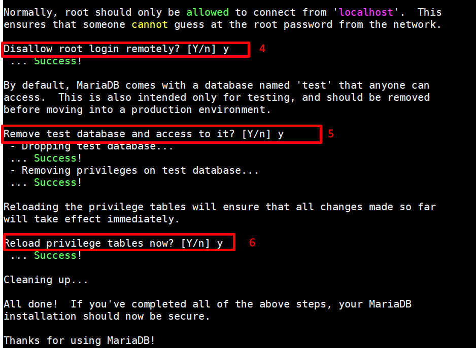
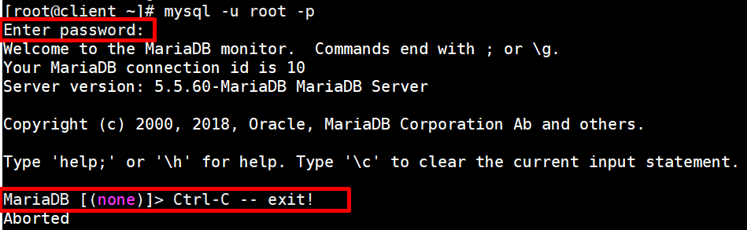
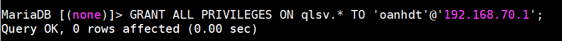

# Cài đặt MariaDB trên CentOS7 

- [Cài đặt](#caidat)
- [File cấu hình](#cauhinh)
- [Thiết lập mật khẩu cho user root](#pass)
- [Đăng nhập vào mariadb ](#login)
- [Tạo user mới ](#taouser)
- [Cấp quyền cho user ](#capquyen)
- [Xóa user ](#xoa)


## Mô hình : 



## Chuẩn bị :

- Một máy hệ điều hành centOS7 có ip 192.168.70.129
- OS ping được ra ngoài internet và ping được với PC 

<a name="caidat"></a>

## Cài đặt MariaDB 


Sử dụng `yum install` để cài đặt `mariadb-server` để cài đặt MariaDB 

```
yum install mariadb-server
```

Sau khi hoàn tất cài đặt chúng ta khởi động dịch vụ MariaDB 

```
systemctl start mysqld 
```

Kiểm tra cổng mà MariaDB đang sử dụng 

```
netstat -plnt | grep mysql
```



Như trên hình tra thấy dịch vụ MariaDB đang chạy ở cổng `3306`.

<a name="cauhinh"></a>

## File cấu hình 

Tập tin cấu hình gốc 

```
/etc/my.cnf
```

File log 

```
/var/log/mariadb
```


<a name="pass"></a>

## Thiết lập password cho user root

```
mysql_secure_installation
```





Khi gõ lệnh trên thì trên màn hình sẽ hiển thị những thông tin như trên hình cho chúng ta. Trong đó : 

1 : Nếu như ban đầu khi cài mariadb bạn chưa đặt mật khẩu cho user root thì ở đây bạn nhấn Enter.

2 : Máy sẽ hỏi bạn có muốn đặt mật khẩu cho user root không .Ở đây nếu có bặn nhập `y`

3 : Theo mặc định, bản cài đặt MariaDB có người dùng ẩn danh, cho phép mọi người đăng nhập vào MariaDB mà không cần phải tạo tài khoản người dùng cho họ.Bạn nên remove đi.

4 : Thông thường thì user root chỉ nên kết nối trong localhost.Điều này đảm bảo rằng không ai có thể đoán được mật khẩu qua mạng.Ở đây thông tin nêu ra là "Không cho phép điều khiển root từ xa "  

5 : Theo mặc định, MariaDB đi kèm với một cơ sở dữ liệu có tên là 'thử nghiệm' mà bất kỳ ai cũng có thể
truy cập. Điều này cũng chỉ dành cho thử nghiệm, và nên được gỡ bỏ.

6 : Tải lại các bảng đặc quyền sẽ đảm bảo rằng tất cả các thay đổi được thực hiện cho đến nay
sẽ có hiệu lực ngay lập tức.

<a name="login"></a>

## Đăng nhập vào mariadb theo user root

```
mysql -u root -p 
```

Bạn nhập mật khẩu vừa thiết lập ở trên để đăng nhập vào phiên làm việc của mariaDB 



<a name ="taouser"></a>

## Tạo user mới 

Trước hết muốn tạo user mới bạn nên đăng nhập vào mariaDB trước .

Bạn tạo user mới bằng lệnh sau:

```
create user 'user-name'@'localhost' identified by 'password';


```

Trong đó : 

- `user` : tên user bạn muốn tạo.
- `localhost` : user chỉ được phép kết nối đến MySQL từ local host. Dùng ký tự % để cho phép user được phép truy cập từ bất kỳ máy nào.
- `password` : mật khẩu đăng nhập của user đó.


*Lưu ý : nếu bạn muốn thay đổi mật khẩu cho user* 

```
SET PASSWORD FOR "$username"@"$hostname" = PASSWORD("$password");
```

<a name ="capquyen"></a>

## Cấp quyền cho user 

Cú pháp lệnh: 

```
GRANT [loại quyền] ON [tên database].[tên table] TO 'username'@'localhost';
```

Các quyền sẽ cấp cho user. Bạn có thể cấp cùng lúc nhiều loại quyền cho user, cách nhau bởi dấu phẩy. Một số quyền phổ biến:

`ALL PRIVILEGES` : cấp tất cả quyền cho user.

`CREATE` : cho phép tạo database và table.

`DROP` : cho phép xóa (drop) database và table.

`DELETE` : cho phép xóa các dòng trong table.

`INSERT` : cho phép thêm dòng vào table.

`SELECT` : cho phép đọc (select) dữ liệu trong database.

`UPDATE ` : cho phép cập nhật dòng trong table.

`GRANT OPTION` : cho phép cấp hoặc thu hồi quyền của user khác.

`Tên database ` tên database sẽ cấp quyền cho user. Có thể dùng dấu `*` để cấp quyền cho tất cả database.

`Tên table` tên table sẽ cấp quyền cho user. Có thể dùng dấu `* ` để cấp quyền cho tất cả database.


**Ví dụ** : Cấp tất cả quyền cho user `oanhdt` trong database `qlsv` và tất cả các `table`.



- Sau khi phần quyền mình cần lưu thông tin vào MySQL 

```
FLUSH PRIVILEGES;
```
<a name="thuhoi"></a>

- Thu hồi quyền user 

```
REVOKE [loại quyền] ON [tên database].[tên table] TO 'username'@'localhost';
```
<a name ="xoa"></a>

- Xóa user 

```
DROP USER 'user'@'localhost';
```


Tài liệu tham khảo : 

https://hocvps.com/cac-cau-lenh-mysql-can-phai-biet/


