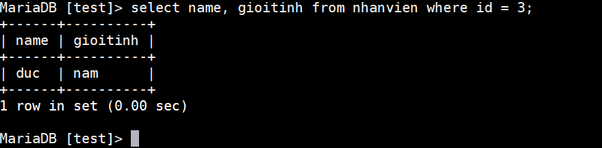
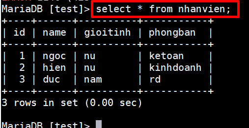
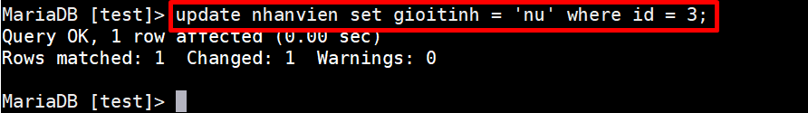
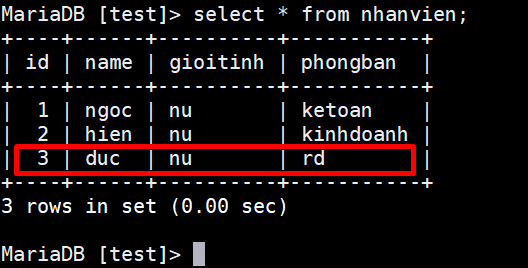
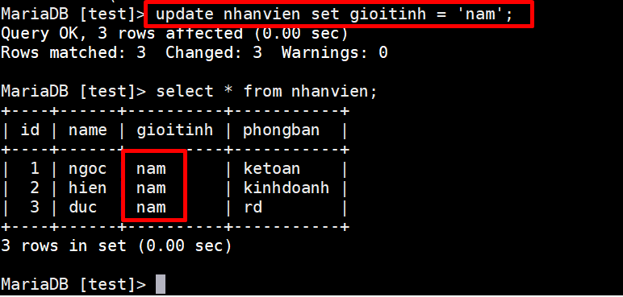
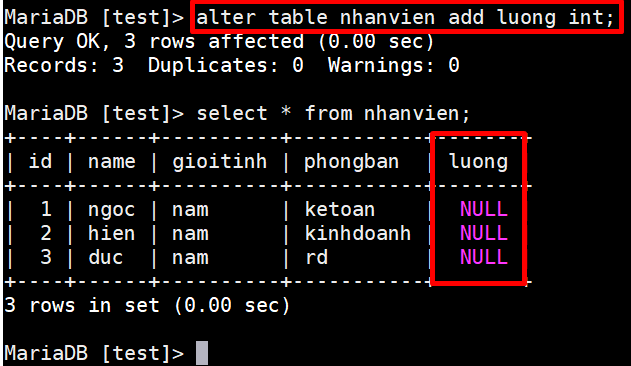
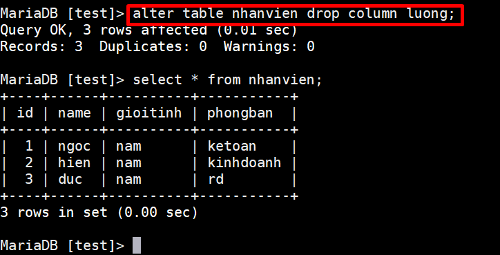
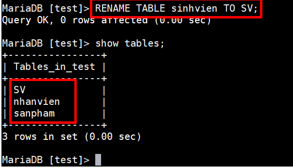

# Những câu lệnh thao tác với MySQl 

**Mục lục** 

[Thao tác với database và table](#basic)

[Ví dụ về các câu lệnh trong mysql](#vidu)

[Thao tác sao lưu và phục hồi dữ liệu trong mysql](#backup)


<a name="basic"></a>

## Thao tác với Database và table 

`CREATE DATABASE` được dùng để tạo cơ sở dữ liệu mới, trống.

`DROP DATABASE` được dùng để hủy hoàn toàn một cơ sở dữ liệu sẵn có.

`USE` được dùng để lựa chọn một cơ sở dữ liệu làm mặc định.

`CREATE TABLE` được dùng để tạo một bảng mới, nơi mà dữ liệu của bạn thực sự được lưu trữ.

`ALTER TABLE` được dùng để sửa một định nghĩa bảng sẵn có.

`DROP TABLE` được sử dụng để hủy hoàn toàn một bảng sẵn có.

`DESCRIBE` hiển thị cấu trúc của một bảng.

## Thao tác với dữ liệu 

`SELECT` được dùng khi bạn muốn đọc (hoặc lựa chọn) dữ liệu của bạn.

`INSERT` được dùng khi bạn muốn thêm (hoặc chèn) dữ liệu mới.

`UPDATE` được sử dụng khi bạn muốn thay đổi (hoặc cập nhật) dữ liệu sẵn có.

`DELETE` được sử dụng khi bạn muốn loại bỏ (hoặc xóa) dữ liệu sẵn có.

`REPLACE `được sử dụng khi bạn muốn thêm hoặc thay đổi (hoặc đổi chỗ) dữ liệu mới hoặc dữ liệu đã có.

`TRUNCATE` được sử dụng khi bạn muốn làm trống (hoặc xóa) tất cả dữ liệu từ mẫu.

<a name="vidu"></a>

## Ví dụ 

**CREATE**

- Tạo database có tên là `test`

```
MariaDB [(none)]> create database test;
Query OK, 1 row affected (0.00 sec)
```
- Dùng database có tên là `test` để tạo table `sinhvien`

```
MariaDB [test]> create table nhanvien (id int primary key, name varchar(20), gioitinh varchar(10), phongban varchar(20));
Query OK, 0 rows affected (0.00 sec)
```
**INSERT**

- Insert thông tin cho bảng `nhanvien`

```
MariaDB [test]> insert into nhanvien values (1, 'ngoc', 'nu', 'ketoan');
Query OK, 1 row affected (0.00 sec)

MariaDB [test]> insert into nhanvien values (2, 'hien', 'nu', 'kinhdoanh');
Query OK, 1 row affected (0.00 sec)

MariaDB [test]> insert into nhanvien values (3, 'duc', 'nam', 'rd');
Query OK, 1 row affected (0.00 sec)

MariaDB [test]>
```

**SELECT**

- In ra một trường bất kì trong bảng.Ở ví dụ này tôi  chỉ in ra tên và với tính của id = 3 trong bảng `nhanvien`.



- In ra tất cả thông tin trong bảng 




**UPDATE**

- Chỉnh sửa gioitinh của nhân viên có id = 3 từ `nam` thành `nu`



In bảng `nhanvien` ra để kiểm tra : 



- Chỉnh sửa tất cả gioitinh cua bảng nhanvien thành `nam` sau đó in ra bảng `nhanvien` để kiểm tra.



**ALTER TABLE**

 Sử dụng lệnh ` ALTER TABLE` để thêm hoặc xóa cột. 

 Cú pháp : 
 ```
 alter table ten-bang add ten-cot kieu-du-lieu;
 ```
- Thêm cột `luong` cho bảng `nhanvien` ta thực hiện như sau : 



- Xoá cột `luong` vừa thêm trong bảng `nhanvien` 

Cú pháp : 
```
alter table ten-bang drop column ten-cot;
```



<a name="backup"></a>

**RENAME TABLE**
Thay đổi tên một table trong database 

Cú pháp : 

```
RENAME TABLE old_table_name TO new_table_name;
```



## Sao lưu và phục hồi 

- Sao lưu toàn bộ database bằng lệnh: 

```
mysqldump -u root -p --all-databases > alldatabases.sql
```

```
[root@client ~]# mysqldump -u root -p test > file.sql
Enter password:
[root@client ~]# ll
total 8
-rw-------. 1 root root 1249 Aug  2 16:52 anaconda-ks.cfg
-rw-r--r--  1 root root 3464 Sep  6 22:05 file.sql
[root@client ~]#
```
- Khôi phục database 

```
mysql -u username -p database-name < alldatabases.sql
```

- Sao lưu một số table trong database 

```
mysqldump --add-drop-table -u username -pmypass databasename table_1 table_2 > databasebackup.sql
```


