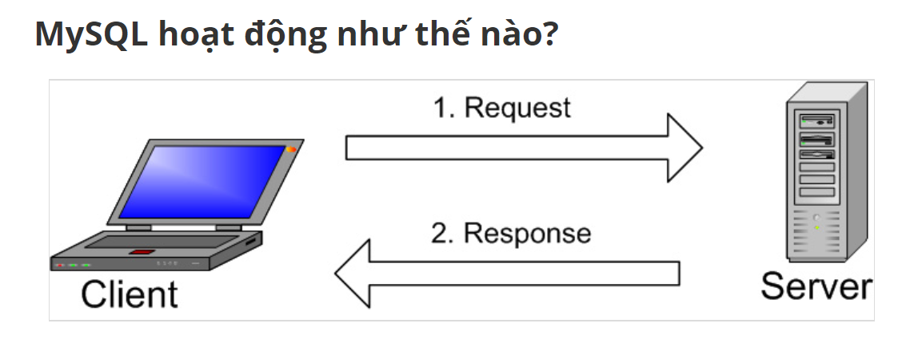

# Tổng quan về My SQL và MariaDB

## Mục lục 
I. MySQL 

[1. MySQL là gì ](#khainiem)

[2. Một số thuật ngữ](#thuatngu)

[3. Hoạt động của mySQL ](#hoatdong)

II. MariaDB 

## I. MySQL 

### 1. MySQL là gì ?

QL(Structed Query Language) Ngôn ngữ truy vấn có cấu trúc: là ngôn ngữ theo chuẩn ANSI để định nghĩa và xử lý dữ liệu trong một cơ sở dữ liệu quan hệ. Các phát biểu SQL dùng để truy tìm và cập nhật dữ liệu trong một cơ sở dữ liệu.

MySQL là một trong những hệ thống quản lý cơ sở dữ liệu(CSDL) mã nguồn mở quan hệ SQL sử dụng trên web phổ biến nhất hiện nay.

### 2. Một số thuật ngữ 

**Database :** là tập hợp dữ liệu theo cùng một cấu trúc.Là nơi chứa và sắp đặt dữ liệu.

**Open source** là mã nguồn mở, có nghĩa là ai cũng có thể dùng và chỉnh sửa nó. Bất kỳ ai cũng có thể cài đặt phần mềmn ày. Bạn cũng có thể học cách tùy chỉnh phần mềm theo nhu cầu của bạn. Tuy nhiên, giấy phép GPL (GNU Public License) quyết định bạn có thể làm gì tùy vào điều kiện nhất định.

**Mô hình Client-server** máy tính cài đặt và chạy phần mềm RDBMS được gọi là client (máy khách). Mỗi khi chúng cần truy cập dữ liệu, chúng kết nối tới máy chủ (server) RDBMS. Cách thức này chính là mô hình “client-server”.

**MySQL Server** là máy tính hay một hệ các máy tính cài đặt phần mềm MySQL dành cho server để giúp bạn lưu trữ dữ liệu trên đó, để máy khách có thể truy cập vào quản lý. Dữ liệu này được đặt trong các bảng, và các bảng có mối liên hệ với nhau. 

**MySQL client** không hẳn phải cài phần mềm MySQL của Oracle mà là nói chung của mọi phần mềm có thể thực hiện truy vấn lên một MySQL server và nhận kết quả trả về.

### 3. Hoạt động của MySQL 

1. MySQL tạo ra bảng để lưu trữ dữ liệu, định nghĩa sự liên quan giữa các bảng đó.

2. Client sẽ gửi yêu cầu SQL bằng một lệnh đặc biệt trên MySQL.

3. Ứng dụng trên server sẽ phản hồi thông tin và trả về kết quả trên máy client.

II. MariaDB

MariaDB là một hệ thống quản lý cơ sở dữ liệu quan hệ mã nguồn mở (DBMS), một sự thay thế tương thích cho công nghệ cơ sở dữ liệu MySQL được sử dụng rộng rãi. Nó được tạo ra như một nhánh phần mềm của MySQL bởi các nhà phát triển, những người có vai trò quan trọng trong việc xây dựng cơ sở dữ liệu gốc.

Tài liệu tham khảo 

https://www.hostinger.vn/huong-dan/mysql-la-gi/ 

