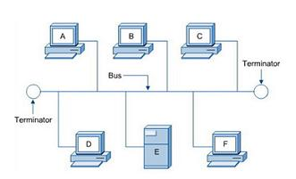
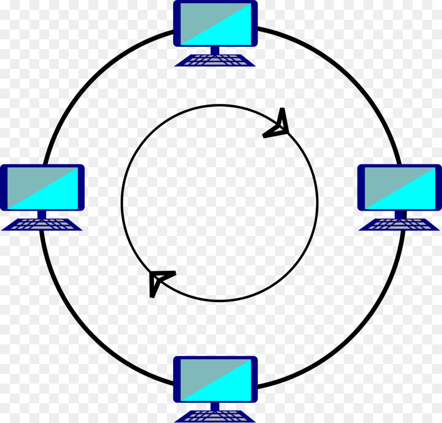

# TÌM HIỂU NETWORK
## MỤC LỤC
### [Chương 1](#1)
- [I. Mạng máy tính](#2)
- [II. Phân loại mạng máy tính](#3)
    - [2.1 Phân loại theo diện hoạt động ](#4)
    - [2.2 Phân loại theo mô hình ghép nối](#5)
    - [2.3 Phân loại theo kiểu chuyển](#6)    
- [III.Mô hình](#7)
    - [3.1 Mô hình OSI](#8)
        - [3.1.1 Mục đích](#9)
        - [3.1.2 Kiến trúc phân tầng và chức năng của các tầng](#0)
            - [a. Tầng vật lý](#a)
            - [b. Tầng liên kết](#b)
            - [c. Tầng mạng](#c)
            - [d. Tầng giao vận](#d)
            - [e. Tầng phiên](#e)
            - [f. Tầng trình diễn](#f)
            - [g. Tầng ứng dụng](#g)
    - [3.2 Mô hình TCP\IP](#32)

### I. Mạng máy tính
- Mạng máy tính bao gồm nhiều thành phần,các thành phần được nối với nhau theo một cách nào đó và cùng nối với nhau bằng một ngôn ngữ:
    - Thiết bị đầu cuối : kết nối với nhau tạo thành mạng máy tính có thể là máy tính 
    - Môi trường truyền : truyền dẫn các tín hiệu vật lý ví dụ như cap,sóng
    - Giao thức : các quy tăc quy định cách thức troa dổi dữ liệu cụ thể 

### II. Phân loại mạng máy tính 

#### 2.1 Phân loại theo diện hoạt động 
- Mạng cục bộ (LAN : local area network)
 Liên kết các tài nguyên máy tính trong một vùng có kích thước hạn chế.Ví dụ như các mạng trong cùng một phòng,nhiều phòng trong một tòa nhà ,...
 - Mạng diện rộng (WAN: Wide Area Network)
 Liên kết các tài nguyên máy tính trong một vùng có kích thước rộng hơn bán kính 100km.Ví dụ thị xã,tỉnh,thành phố,...Nhiều mạng LAN khác nhau
 - Mạng đô thị (MAN Metropolitan Area Network)
 mạng liên kết với nahu trong một thành phố.Ví dụ : Công ty A có 4 trụ sở ở HN cùng dùng chung 1 mạng LAN.Các mạng LAN đó kết nốilại với nahu thì tạo thành một mạng MAN.
 - Mạng toàn cầu (Global Area Network): 
 là mạng của các mạng WAN trải rộng khắp ưphạm vi toàn cầu.
 - Mạng cá nhân (Personal Area Network)
 - Mạng lưu trữ(Storage Area Network)
 
 #### 2.2 Phân loại theo mô hình ghép nối.
 - Mô hình điểm-điểm (point to point)
    - Gồm nhiều nút,mỗi nút chỉ có thể liên lạc với nút liền kề qua đường liên kết trực tiếp.

    

- Star
    - Có một HUB xử lý trung tâm truyền tin cho tất cả các nút.Khi HUB ngừng hoạt động thì thì toàn bộ mạng sụp đổ.

    

- Tree 
    - Mô hình phân cấp,gồm một nút gốc hoặc mộ thub nối đến các nút mức hai hoặc hub mức hai.

     
- Bus
    - Các nút mạng được nối đến cùng một kênh truyền 

    
- Ring 
    - Tất cả các nút dùng chung trên một kênh truyền có thể thuân hoặc ngược chièu kim đồng hồ tùy thuộc vào công nghệ sử dụng
    

#### 2.3 Phân loại theo kiểu chuyển
- 2.3.1 Chuyển mạch ảo 
    - Phân loại theo kiểu chuyển phải thiết lập mạch vật lý giữa nút nguồn và đích trước khi chuyển dữ liệu thực sự.
    - Tăng khả năng chia sẻ đường truyền vì cùng một mạch có thể sử dụng cho nhiều quá trình chuyền khác nhau 
- 2.3.2 Chuyển mạch gói 
    - Dữ liệu cần vận chuyển được chia nhỏ ra thành các gói (hay khung) có kích thước (size) và định dạng (format) - xác định.
    - Mỗi gói như vậy sẽ được chuyển riêng rẽ và có thể đến nơi nhận bằng các đường truyền (route) khác nhau. Như vậy, chúng có thể dịch chuyển trong cùng thời điểm.
    - Khi toàn bộ các gói dữ liệu đã đến nơi nhận thì chúng sẽ được hợp lại thành dữ liệu ban đầu.

### III. Mô hình 

 #### 3.1 Mô hình OSI (Open System Interconnection)
  Là mô hình tham chiếu kết nối các hệ thống mở là một thiết kế dựa vào nguyên lý tầng cấp, lý giải một cách trừu tượng kỹ thuật kết nối truyền thông giữa các máy vi tính và thiết kế giao thức mạng giữa chúng.

- 3.1.1 Mục đích 
    - Mô hình OSI phân chia chức năng của một giao thức ra thành một chuỗi các tầng cấp. Mỗi một tầng cấp có một đặc tính là nó chỉ sử dụng chức năng của tầng dưới nó, đồng thời chỉ cho phép tầng trên sử dụng các chức năng của mình.
    

- 3.1.2 Kiến trúc phân tầng và chức năng của các tầng

- a. Tầng vật lý (Physical layer)
    - Thiết lập hoặc ngắt mạch kết nối điện (electrical connection) với một môi trường truyền dẫn phương tiện truyền thông (transmission medium).
    - Điều chế (modulation), hoặc biến đổi giữa biểu diễn dữ liệu số (digital data) của các thiết bị người dùng và các tín hiệu tương ứng được truyền qua kênh truyền thông (communication channel).

- b. Tầng liên kết dữ liệu (Data link layer)
    - Tầng liên kết dữ liệu cung cấp các phương tiện có tính chức năng và quy trình để truyền dữ liệu giữa các thực thể mạng (truy cập đường truyền, đưa dữ liệu vào mạng), phát hiện và có thể sửa chữa các lỗi trong tầng vật lý nếu có.

- c. Tầng mạng(Network layer)
    - Tầng mạng thực hiện chức năng định tuyến,tìm đường đi tốt nhất cho việc truyền dữ liệu.
    
- d. Tầng giao vận(Transport layer)
    -  Tầng giao vận kiểm soát độ tin cậy của một kết nối được cho trước.

- e. Tầng phiên(Session layer)
    - Thiết lập, quản lý và kết thúc các kết nối giữa trình ứng dụng địa phương và trình ứng dụng ở xa.

- f. Tầng trình diễn (Presentation layer)
    - Dịch dữ liệu được gửi từ tầng Application sang dạng Fomat chung và tại máy tính nhận, lớp này lại chuyển từ Fomat chung sang định dạng của tầng Application.

- g. Tầng ứng dụng (Application layer)
    - Cung cấp phương tiện cho người dùng truy nhập các thông tin và dữ liệu trên mạng thông qua chương trình ứng dụng.

#### 3.2 Mô hình TCP/IP(Transmission Control Protocol/Internet Protocol)

            