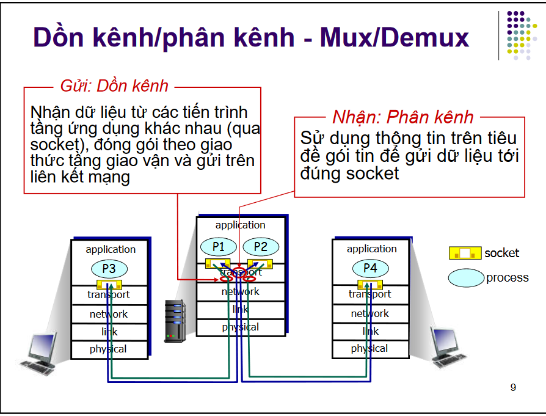
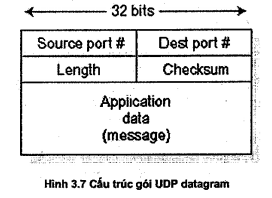
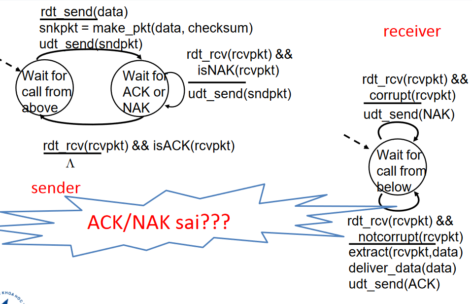
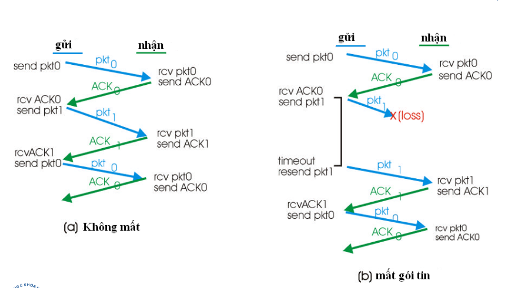
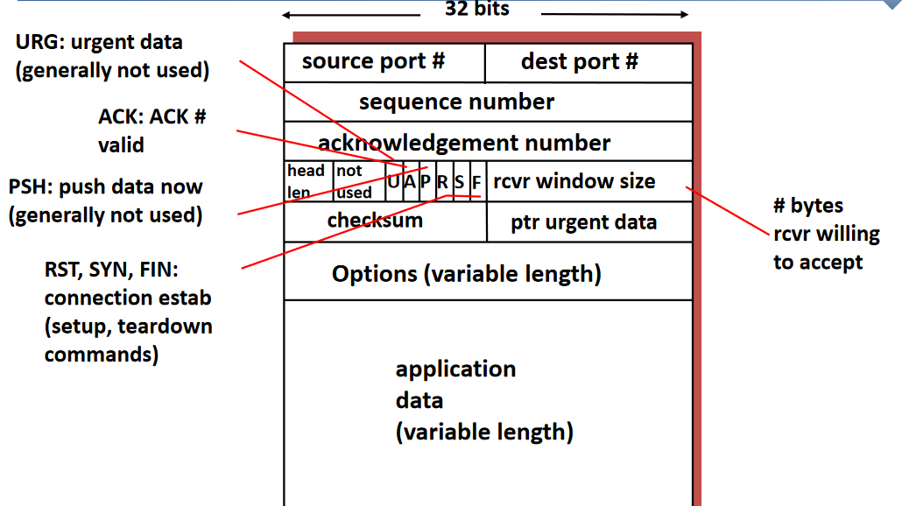
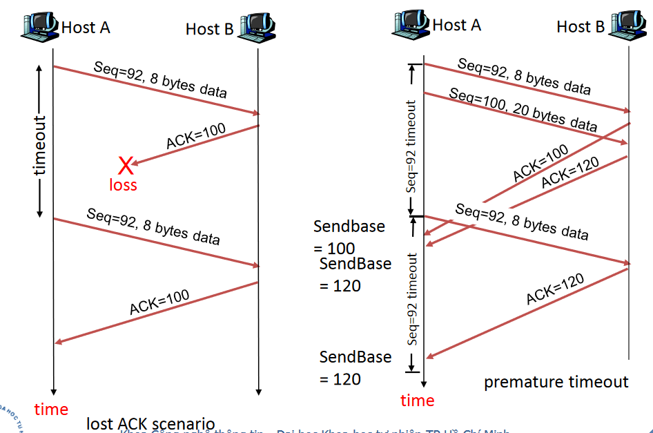

# TRANSPORT LAYER
## MỤC LỤC 
- [I. Nguyên tắc và dịch vụ ](#1)   
    - [1.1 Nguyên tắc](#a)    
    - [1.2 Dich vụ](#b)  
- [II. UDP (User Datagram Protocol)Giao thức không hướng nối](#2)  
    - [2.1 Cấu trúc segment](#aa)     
    - [2.2 Nguyên tắc truyền dữ liệu tin cậy ](#bb)  
    - [2.2.1 Xây dựng dữ liệu tin cậy ](#cc)   
    - [2.2.2 Giao thức truyền dữ liệu tin cậy liên tục (Pipeline)](#dd)   
- [III. TCP (Tranport control protocol) Giao thức giao vận hướng nối ](#3)     
    - [3.1 Cấu trúc gói tin ](#aaa)   
    - [3.2 Truyền dữ liệu đáng tin cậy ](#bbb)  
    - [3.3 Thiết lập kết nối ](#ccc)       
    - [3.3.1 thao tác bắt tay 3 bước ](#3c)   
    - [3.3.2 Kiểm soát tắc nghẽn](#3d)   
- [IV. So sánh giữa TCP và UDP ](#4)

### I. Nguyên tắc và dịch vụ

<a name ="a">

#### 1.1 Nguyên tắc 

- Cung cấp kênh truyền logic (ảo) giữa các tiến trình ứng dụng
- Thực thể giao vận chèn thông điệp mà nó nhận được từ tầng ứng dụng chèn vào 4PDU(Protocol Data Unit) => chia thồn điệp thành nhiều đoạn nhỏ => Chuyển đến tầng mạng => Tầng mạng ghép thành một thông điệp hoàn chỉnh => tiến trình ứng dụng nhận 

#### 1.2 Dịch vụ 

- Dồn kênh(multiplex)
    - Tại thiết bị gửi,tầng giao vận nhận dữ liệu từ nhiều tiến trình ứng dụng khác nhạu,tạo segment chứa các dữ liệu cùng với một số thông tin tiêu đề cùng chuyển segment xuống tầng mạng.Quá trình này được gọi là dồn kênh
- Phân kênh(demoltiplex)
    - Mỗi segment của tầng giao vận có trường xác định tiến trình nhận dữ liệu.Tầng giao vận bên nhận sẽ sử dụng trường này để xác định rõ tiến trình nhận và gửi dữ liệu trong segment tới tiến trình đó.Công việc chuyển giao dữ liệu trong segment tới đúng tiến trình ứng dụng gọi là phân kênh.

### II. UDP (User Datagram Protocol)Giao thức không hướng nối
- Được sử dụng để gửi các gói tin ngắn gọi là datagram, cho phép truyền nhanh hơn.
- Làm việc trực tiếp với tầng mạng.Lấy thông điệp từ tầng ứng dụng sau đó chèn thêm cổng nguồn và đích cho dịch vụ dồn kênh và phân kênh tại segment sau đó chuyển xuống tầng mạng.
- Không đòi hỏi bên gửi và bên nhận phải kết nối trước.
- Ví dụ : Khi bạn livestream nếu bị mất kết nối trong vài giây, video sẽ ngừng một thời điểm.Video hoặc âm thanh có thể bị bóp méo một lúc và sau khi có kết nối thì video tiếp tục chạy mà không có dữ liệu bị mất.
- DNS là một giao thức hoặt động dựa trên nền UDP
    - DNS tạo thông điệp truy vấn DNS sau đo chuyển qua socket => gửi segment xuống tầng mạng => tầng mạng đóng gói UDP trong IP datagram => gửi đến đích. 
- Lý do nhiều ứng dụng sử dụng UDP :
    - Không có giai đoạn thiết lập kết nối (Truyền đi nhanh hơn nhưng không đảm bảo là bên nhận sẽ nhận được tất cả những gì bên gửi gửi đi)
    - Không duy tri trạng thái kết nối (Có thể phục vụ được nhiều client vì server không phải lưu trữ các trạng thái kết nối)
    - Tiêu đề dữ liệu nhỏ (8 bytes)
    - Không kiểm soát tốc độ gửi 
- Một số ứng dụng hoạt động trên nền UDP 
    - Đa số các ứng dụng chạy trên nền UDP thường chấp nhận mất mát hoặc lỗi trên một phần dữ liệu.

#### 2.1 Cấu trúc segment 

- Source port và Dest port : cho phép thiết bị gửi chuyển dữ liệu tới đúng tiến trình chạy trên thiết bị nhận.
- Lenght : độ dài của gói dữ liệu (tính theo byte )
- Checksum : kiểm tra lỗi trong quá trình truyền nhận dữ liệu 
    - UDP checksum phát hiện ra lỗi nhưng nó không fix 
    - Có thể gửi segment cho ứng dụng nhận kèm theo một thông báo lỗi 

#### 2.2 Nguyên tắc truyền dữ liệu tin cậy 
- Thực thể gửi sẽ nhận dữ liệu từ phía trên chuyển xuống qua hàm rdt-send()(reliable data transfer và _sent chỉ rõ đây là phía gửi của giao thức rdt. Bước đầu tiên khi xây dựng một giao thức nào đó là chọn cho nó một cái tên đễ nhớ) Phía nhận sử dụng hàm rdt_rcv() để lấy gói dữ liệu từ đường truyền. Để chuyển dữ liệu lên tầng trên, phía nhận sử dụng hàm deliver_data()

##### 2.2.1 Xây dựng dữ liệu tin cậy 
- Truyền dữ liệu tin cậy trên kênh truyền tin cậy hoàn toàn (rdt 1.0)
    - Nhận dữ liệu từ tầng trên thông qua rdt_send(data)
    - Tất cả dữ liệu đều được truyền từ phía gửi cho phía nhận 
    - Phía nhận không cần phải phản hồi cho phía gửi vì chắc chắn không có chuyện gì xảy ra.

    
- Truyền dữ liệu trên kênh truyền có lỗi bit (rdt 2.0) 
    - Giả sử kênh truyền có thể xảy ra lỗi bit.
        - Sử dụng checksum để kiểm tra lỗi 
        - ACK (Acknowledgement): Bên nhận báo cho bên gửi đã nhận dược dữ liệu 
        - NAK (Nagetive Acknowledgement): Bên nhận báo cho bên gửi báo gói tin bị lỗi 
        - Bên gửi sẽ gửi lại gói tin bị lỗi (Để tránh trùng lặp phía gửi thêm trường STT cho gói dữ liệu sau đó đặt và trường seuquence number.Phía nhận chỉ cần kiểm tra stt xem gói dữ liệu nhận được là gói mới hay gói truyền lại)

    

- Truyền dữ liệu có lỗi và mất (rdt 3.0)
    - Giả sử dữ liệu lỗi bit,mất gói dữ liệu,ACK truyền lại chưa đủ)
        - Bên gửi đợi khoảng tg hợp ly cho ACK 
        - Gửi lại nếu trong khoảng thời gian được yêu cầu mà vẫn không nhận được ACK 
        - Yêu cầu đếm thời gian 

        

##### 2.2.2 Giao thức truyền dữ liệu tin cậy liên tục(Pipeline)
- Cho phép gửi nhiều gói tin khi chưa được báo nhập ACK
    - Gói tin phải được sắp xếp theo thứ tự tăng dần 
    - Dùng bộ đệm ở bên gửi và bên nhận 
- Có hai cách tiếp cận chính 
    - Go-back-N
    - Lặp lại có lựa chọn (Selective Repeat )
##### a. Go-back-N
- Bên gửi :
    - Sử dụng buffer("window") để lưu các gói tin đã gửi nhưng chưa nhận được ACK 
    - Gửi gói tin nếu có thể đưa vào window
    - Thiết lập đồng hồ cho gói tin cũ nhất 
    - Time out: Gửi lại tất cả các gói tin chưa ACK trong window
- Bên nhận : 
    - Chỉ gửi ACK cho gói tin đã nhận được với STT cao nhất 
    - Nhớ STT đang đợi 
    - Nếu như gói tin không theo STT:
        - Loại bỏ : không có bộ đệm
        - Gửi lại ACK với STT lớn nhất 

##### b. Lặp lại có lựa chọn 
- Bên gửi : 
    - Có đồng hồ cho mỗi gói tin chưa nhận được ACK 
    - Chỉ gửi những gói tin không nhận được ACK 
- Bên nhận : 
    - Báo nhận riêng lẻ từng gói tin đã nhận đúng 
    - Dùng bộ đệm lưu các gói tin không đúng thứ tự 
    - Nhập một gói tin không đúng thứ tự 
        - Đưa vào bộ đệm nếu còn chỗ 
        - Hủy gói tin 

### III. TCP (Tranport control protocol) Giao thức giao vận hướng nối

#### 3.1 Cấu trúc gói tin 

- Source & destination port: cổng của nơi gửi và nơi nhận 
- Sequence number: số thứ tự của byte đầu tiên trong phần data của gói tin 
- Acknowledgement number : stt của byte đang mong chờ nhận tiếp theo 
- Window size : thông báo có thể nhận bao nhiêu byte sau byte cuối cùng đã được xác nhận 
- checksum 
- Urgent pointer: chỉ đến dữ liêu khẩn trong trường dữ liệu 

#### 3.2 Truyền dữ liệu đáng tin cậy 

- Bên gửi :
    - Nhận dữ liệu từ tầng ứng dụng
        - Tạo các segment
        - Bật đồng hồ(nếuchưabật)
        - Thiết lập thời gian chờ, timeout
    - Nhận gói tin ACK
    - Hết time out
        - Gửi lại dữ liệu còn trong buffer
        - Reset đồng hồ
- Bên nhận : 
    - Nhận gói tin đúng thứ tự 
        - Chấp nhận 
        - Gửi ACK về cho bên gửi 
    - Nhận gói tin không đúng thứ tự 
        - Phát hiện khoảng trống dữ liệu 
        - Gửi ACK trùng

#### 3.3 Thiết lập kết nối 

##### 3.3.1 Thao tác bắt tay 3 bước 

- Bước 1: Host A gửi cho B một gói tin có đính cờ SYN với số thứ tự được đánh là 100
- Bước 2 : Host B nhận được gói tin gửi lại gói tin có cờ SYN được bật lên và gửi kèm theo ACK để xác nhận.Host  gửi yêu cầu cho Host a mong muốn nhận thêm một gói tin 101 và mong muốn bên A đánh dấu cho gói tin đó với stt là 300.
- Bước 3 : Sau khi được thiết lập thì A gửi gói tin đáp ứng yêu cầu của B 

##### 3.3.2 Kiểm soát tắc nghẽn 

- Khi buffer có giới hạn và gói tin gửi đến ồ ạt một note có thể gửi đến nhiều nguồn => xử lý không kịp => Dẫn đến tình trạng tắc nghẽn 
- Sử dụng đường truyền không hiệu quả 
- Bên gửi :
     - Thiết lập tốc độ gửi dựa trên phản hồi từ bên nhận
        - Nhận ACK
        - Mất gói
        - Độ trễ gói tin
     - Tốc độ gửi : có 2 pha Slow-Start và Congestion Avoidance.Tốc độ gửi không thể tăng mãi.Đến một mức nhất định nào đó sẽ dẫn đến việc mất gói tin ở router.

#### IV. So sánh giữa TCP và UDP 
##### 4.1 Giống nhau 
- Đều là hai giao thức mạng của TCP/IP ,có thể kết nối các máy lại với nhau và có thể gửi dữ liệu cho nhau 
##### 4.2 Khác nhau 
| TCP           | UDP        | 
| ------------- |:--------------------:| 
| 20 byte       | 8byte         | 
| Dùng cho mạng WAN  |  Dùng cho mạng LAN              |   
| Không cho phép mất dữ liệu             | Cho phép mất dữ liệu               |   
| Đảm bảo việc truyền dữ liệu |   Không đảm bảo việ truyền dữ liệu|
| Tốc độ thấp      | Tốc độ cao hơn UDP|

    

