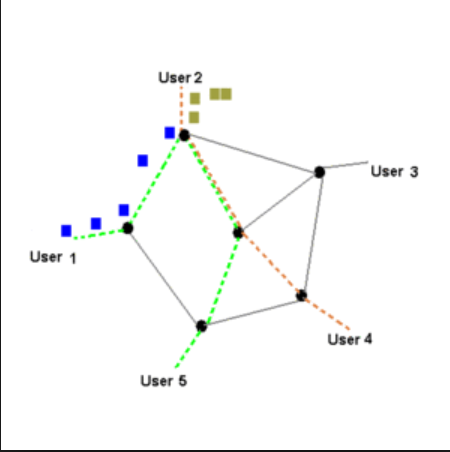
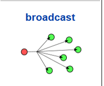
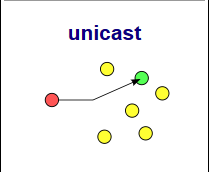
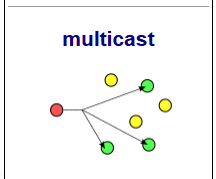

# NETWORK LAYER
## MỤC LỤC 
- [I. Chức năng và dịch vụ của tầng mạng ](#1)
    - [1.1 Chức năng](#a)
    - [1.2 Dịch vụ](#b)
- [II. Địa chỉ IP  ](#2)
    - [2.1 IPv4](#aa)
    - [2.2 Định tuyến ](#bb)
- [III. Cơ chế NAT](#3)

### I. Chức năng và dịch vụ của tầng mạng 

#### 1.1 Chức năng 
- Chuyển gói tin segment từ tầng giao vận đến máy tính đích 
- Gồm nhiều máy tính và router trung gian 
- Chức năng chính
    - Xác định đường đi (Path determination) xác định router trung gian hay tuyến đường mà gói tin truyền từ nơi gửi đến nơi nhận 
    - Chuyển mạch (Switching) : Khi gói tin đến đầu vào router phải các định gói tin đó sẽ được chuyển đến đầu ra thích hợp nào 
    - Thiết lâp đường truyền (Call setup): thông qua quá trình bắt tay ba bước cho phép bên gửi và bên nhận thiết lập thông tin cần thiết 

#### 1.2 Dịch vụ 

##### Dịch vụ chuyển mạch gói và chuyển mạch ảo

- Dịch vụ chuyển mạch gói :
    - Dữ liệu được chia nhỏ thành các gói có size và format xác định 
    - Khi đến nơi nhận thì hợp lại thành dữ liệu ban đầu 
        - Dữ liệu nhận được sẽ không theo thứ tự 
        - Khi có gói tin chưa đến đích hoặc bị mất mát thì thiết bị gửi chỉ cần gửi lại gói tin đó 
- Dịch vụ chuyển mạch ảo :

- Cắt thông tin ra làm nhiều gói,các gói này sẽ được vận chuyển trên cùng một tuyến. Tuyến này được tìm ra xác định bởi lúc khởi động. Tránh được việc lựa chọn đường truyền mới (định tuyến) cho mỗi gói khi di chuyển như trong trường hợp chuyển gói. 
- 3 giai đoạn trong chuyển mạch gói :
    - Thiết lập mạch ảo : Khi gói tin chuyển thông tin nhận từ phía gửi sẽ yêu cầu tạng mạng thiết lập các mạch ảo 
    - Truyền dữ liệu  : Dữ liệu được truyền trong VC 
    - Giải phóng mạch ảo : Sau khi dữ liệu truyền xong phía gửi sec yêu cầng tầng mạng đóng các VC để giải phóng tài nguyên
=> Tiết kiệm tài nguyên,các gói tin được chuyển đến sẽ đúng thứ tự vì được truyền trên cùng một đường truyền,tốc độ truyền cũng nhanh hơn

### II.Địa chỉ IP 

- Địa chỉ IP: là một dãy số duy nhất xác định một thiết bị được kết nối với internet hay nói cách khác là để các máy truyền thông liên mạng.
- Địa chỉ MAC(Media Access Control): địa chỉ vật lý được gán cho từng phần cứng mạng (card Wifi).
    - Broadcast: là địa chỉ được sử dụng làm đích đến của một gói tin khi một host muốn gửi gói tin đó đến tất cả các host còn lại trong mạng LAN.

    

    - unicast: thuật ngữ mô tả cách thức truyền tin từ 1 điểm này đến 1 điểm khác.Có một nguồn gửi và một nguồn nhận.Mỗi nguồn được xác định bởi một địa chỉ mạng 

    

    - Multicast: thuật ngữ mô tả cách thức gruyền tin từ một điểm đến 1 tập hợp điểm khác.

    

    - Anycast: xác định đường đi ngắn nhất cho gói tin.

    

- Subnet mask: dùng để xác định ip có bao nhiêu bit dành cho host và có bao nhiêu bit dành cho net.
    - Network ID (Net ID) là địa chỉ mạng, địa chỉ mạng là địa chỉ được cấp cho từng mạng riêng.
    - Host ID (hay Host Address) là địa chỉ của máy trong mạng.
- Default Gateway: là Cổng mặc định, là địa chỉ IP của Modem, Router khi bạn set IP tĩnh thì cần phải xem thông số này.
- IP động : ip không cố định được cấp phát từ DHCP(Dynamic Host Configuration Protocol (DHCP - giao thức cấu hình động máy chủ( cho phép cấp phát địa chỉ IP một cách tự động cùng với các cấu hình liên quan khác như subnet mask và gateway mặc định))
- IP tĩnh : ip cố định được người dùng cài đặt.
- MTU (Maximum Tranmission Unit ): là kích thước gói dữ liệu lớn nhất được đo bằng byte. Kích thước thay đổi tùy thuộc vào hình thức mạng và giao thức 

#### 2.1 IPv4
- 32 bit.Chia làm 4 octet mỗi octet có 8 bit 
- Có hai cách biểu diễn : dưới dạng thập phân và nhị phân 
- IP được chia thành 2 phần : Network và host
##### 2.1.1 Các lớp địa chỉ IPv4 
- Lớp A 
    - Đ/c mạng: 1-126
    - 8 bit cho phần net id và 24 bit cho phần host 
    - Bit đầu = 0
- Lớp B 
    - D/c mạng : 128-191
    - 16 bit cho phần netid và 16bit cho phần host 
    - bit đầu = 10
- Lớp C 
    - Đ/c mạng : 192-223
    - 24 bit cho phần net và 8 bit cho phần host 
    - bit đầu = 110 
- Lớp D 
    - Đ/c mạng : 224-239 : multicast kết nối đa điểm 
    - Được dùng cho một vài ứng dụng truyền thông đa phương tiện 
-Lớp E 
    - Đ/c mạng : 240-256 : dùng để nghiên cứu 

#### 2.2 Định tuyến(routing)
##### 2.2.1 Định tuyến
-  Lựa chọn đường đi trên mạng máy tính để gửi dữ liệu qua đó.
- Routing chỉ ra hướng, sự di chuyển của các gói (dữ liệu) được đánh địa chỉ từ mạng nguồn của chúng, hướng đến đích cuối thông qua các node trung gian; thiết bị phần cứng chuyên dùng được gọi là router (bộ định tuyến). Tiến trình định tuyến thường chỉ hướng đi dựa vào bảng định tuyến, đó là bảng chứa những lộ trình tốt nhất đến các đích khác nhau trên mạng.
- Định tuyến tĩnh(Static route) :kỹ thuật mà người quản trị phải tự tay khai báo các route trên các router.Đơn giản,dễ thực hiện không hao tốn tài nguyên trên mạng.Nhưng không phù hợp với những mạng có quy mô lớn.
- Định tuyến động (dynamic route):  các router sẽ trao đổi thông tin định tuyến với nhau. Từ thông tin nhận được, mỗi router sẽ thực hiện tính toán định tuyến từ đó xây dựng bảng định tuyến gồm các đường đi tối ưu nhất đến mọi điểm trong hệ thống mạng. 
    - Định tuyến trong : 
        - RIP : định tuyến vector khoảng cách 
        - OSPF: định tuyến link- state điển hình.Mỗi router khi chạy thì OSPF gửi trạng thái đường link cho tất cả router trong vùng(area)
        - EIGRP : gửi thông tin cập nhật mỗi phần giới hạn chứ không phải toàn bộ 
    - Định tuyến ngoài : chạy giữa các router thuộc các AS khác nhau dùng cho mạng toàn cầu.
##### 2.2.2 Thiết bị định tuyến 
- Router : 
    - Cấu tạo : CPU – MAIN –  RAM – FLASH – CỔNG KẾT NỐI
        - CPU : bộ vi xử lý thực hiện các câu lệnh khởi động,kết nối,...
        - MAIN : là mạch điện tử, kết nối và truyền dẫn tính hiệu cho các chip RAM – FLASH ..và chứa các cổng kết nối
        - RAM : là một bộ nhớ dữ liệu của ROUTER, được dùng để lưu các bảng định tuyến, cung cấp bộ nhớ cho chuyển mạch nhanh, chạy tập tin cấu hình và cung cấp hàng đợi cho các gói dữ liệu đang sẵn sàng.
        - FLASH : là bộ nhớ dữ liệu của router nhưng tốc độ truyền nhanh hơn.
        - Cổng kết nối : USB, LAN,..
    - Nhiệm vụ : kết nối các thiết bị với nhau bằng cách gửi các gói dữ liệu giữa các thiết bị 
    - Hoạt động : mỗi thiết bị mạng được gán cho một địa chỉ ip.Khi muốn truyền đi một gói tin thiết bị gửi đến router địa chỉ ip của thiết bị sẽ giúp router nhận biết được đó là máy nào và sẽ truyền gói tin đấy đi đâu.

### III. Cơ chế NAT 
#### 3.1 Khái niệm 
- NAT (Network Address Translation): biên dịch địa chỉ mạng
    - cho phép một hay nhiều địa chỉ IP nội miền được ánh xạ với một hay nhiều địa chỉ IP ngoại miền.
    - thay đổi thông tin địa chỉ IP trong gói tin đang được truyền qua một thiết bị định tuyến. 
#### 3.2 Tại sao lại phải NAT 
 Ngày nay nhu cầu sử dụng internet ngày càng tăng,IPv4 thì có giới hạn người ta tìm kiếm các giải pháp thiết kế định dạng IP cho phép cung cấp nhiều IP hơn.NAT là một lựa chọn khả thi.Cơ chế NAT chuyển đổi từ một IP private sang IP public và ngược lại.
 #### 3.3 Phân loại
 - NAT tĩnh(Static NAT): là phương thức NAT một đôi một. Một địa chỉ IP Private sẽ được map với một địa chỉ IP Public. 
 - NAT động(Dynamic NAT): Một địa chỉ IP Private sẽ được map với một địa chỉ IP Public trong nhóm địa chỉ IP Public.
 - Overloading NAT : một dạng thức của NAT động (Dynamic Overload). Nhiều địa chỉ IP Private sẽ được map với một địa chỉ IP Public qua các Port (cổng) khác nhau.
 - Overlapping NAT: khi địa chỉ IP trong hệ thống mạng nội bộ là IP Public đang sử dụng trên một hệ thống mạng khác, Router phải duy trì một bảng tìm kiếm các địa chỉ này để ngăn và thay thế bằng một IP Public duy nhất.
 

    

