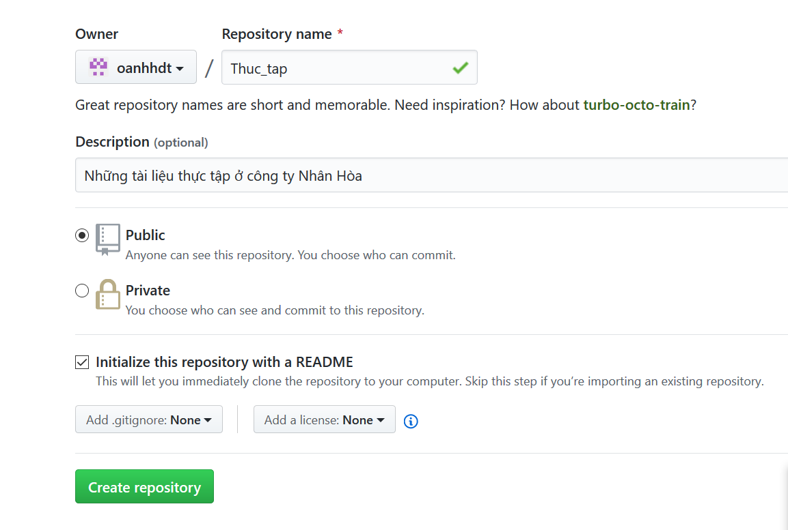
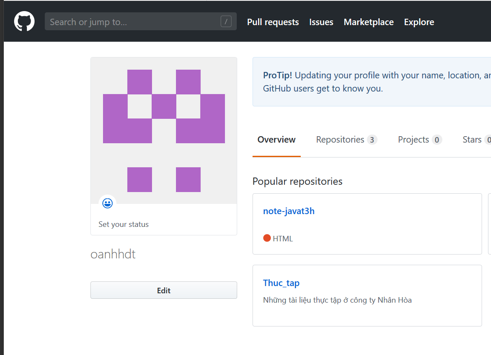
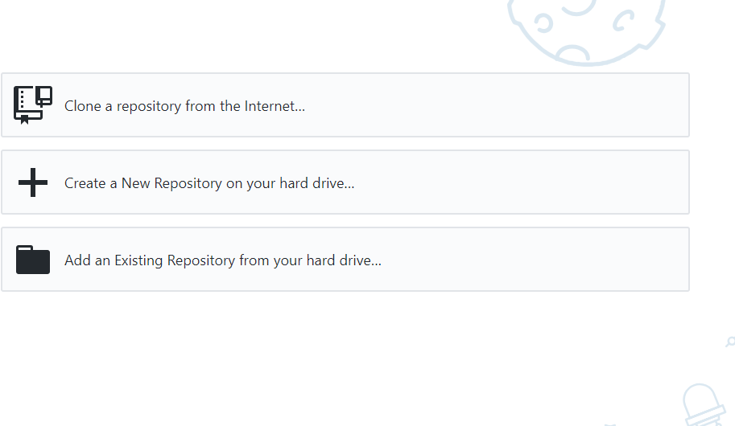
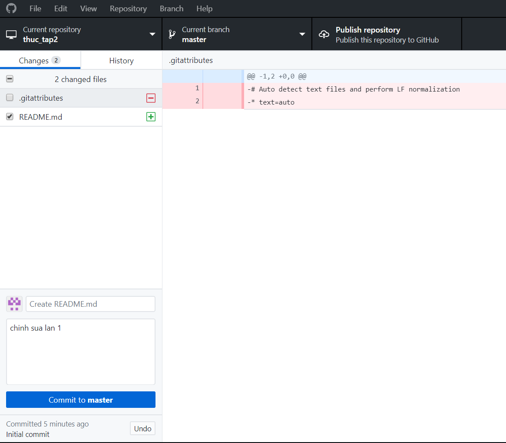
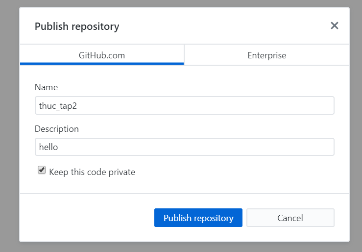

# Tìm hiểu Github
## MỤC LỤC 

- [I. Cách tạo repo trên Github](#1) 

    - [1. Các bước tạo một repo trên trang Github.com](#2)
    - [2. Tạo repo trên phần mềm GitHub và  push lên git](#3)    
- [II. Tài liệu tham khảo](#4)

## I. Cách tạo một repo trên Github

### 1. Các bước tạo một repo trên trang Github.com
- Bước 1 : Đăng nhập Github

- Bước 2 : Tạo repo mới 

- CLick vào dấu cộng ở góc phải màn hình 
- Chọn `NewRepository`

- Bước 3 : Edit 

    - 1. Repository name (Viết liền không 
    dấu )
    - 2. Đặt chế độ public    
    - 3.  Description : Thêm mô tả cho repo  
    - 4. `Create repository`
    

- Repo mới đã được tạo 
    

 
### 2. Tạo repo trên phần mềm GitHub và push lên Git
- B1: Vào phần mềm Gihub sau đó click vào dấu `+` để create một repo mới

 

- B2: 
    - `name` Đặt tên cho repo
    - `Description` thêm mô tả cho phần repo vừa tạo 
    - `local path` chọn đường dẫn để trỏ vào 
Sau đó nhấn `Create repository`

- B3: Tạo các folder mới trong repo vừa tạo và thêm nội dung vào 

- B4: Sau khi tạo file và chỉnh sửa nội dung thì ở trên phần mềm github nó sẽ hiện ra như trong ảnh dưới.Bạn them mô tả cho phần mình vừa chỉnh sửa và sau đó `commit to master`

- B5: Sau khi commit xong nhấn `ctrl + P` để push lên Github

Sau khi push xong bạn vào trang Github.com sẽ hiển thị repo và các thay đổi bạn đã thực hiện.

## II. Tài liệu tham khảo 
- https://github.com/hocchudong/git-github-for-sysadmin#thetieude

 

