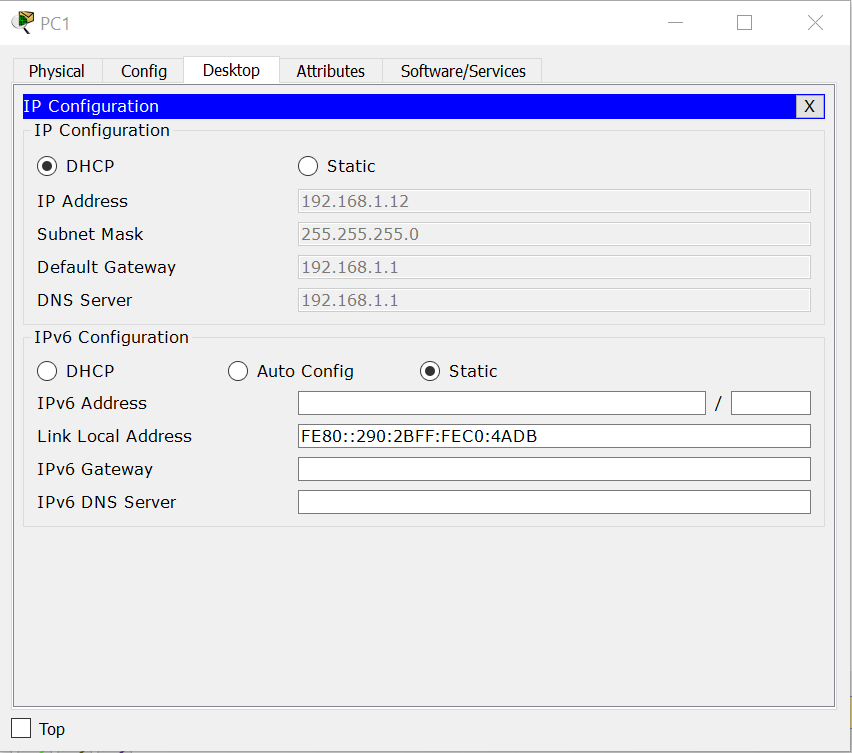

# Cấu Hình DHCP 
- Topo 


- Cấu hình đặt hostname,ip cho router 
```
Router>
Router>en
Router#conf
R1(config)#interface fa0/0 
R1(config-if)#ip add 192.168.1.1 255.255.255.0
R1(config-if)#no shut
R1(config-if)#no shutdown 
R1(config-if)#exit 
R1(config)#ip dh
R1(config)#ip dhcp pool CapDHCP
R1(dhcp-config)#network 192.168.1.0 255.255.255.0
R1(dhcp-config)#default
R1(dhcp-config)#default-router rou
R1(dhcp-config)#default-router 192.168.1.1
R1(dhcp-config)#dns
R1(dhcp-config)#dns-server 192.168.1.1
R1(dhcp-config)#exit 
R1(config)#ip dhcp ex
R1(config)#ip dhcp excluded-address 192.168.1.2 192.168.1.10
R1(config)#end
```
- Kiểm tra những ip đã được cấp cho PC 
    - PC0


    - PC1
    