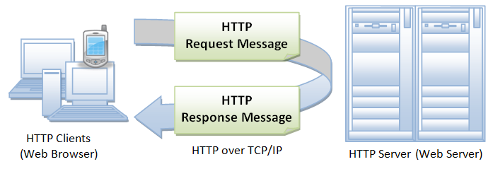

# Tìm hiểu vể HTTP 

HTTP (HyperText Transfer Protocol - Giao thức truyền tải siêu văn bản) là một trong các giao thức chuẩn về mạng Internet, được dùng để liên hệ thông tin giữa Máy cung cấp dịch vụ (Web server) và Máy sử dụng dịch vụ (Web client), là giao thức Client/Server dùng cho World Wide Web – WWW.

- Mô hình hoạt động của HTTP 

## Một số HTTP request thường dùng 

|Method|Mô tả|
|---|---|
|GET|Lấy lại thông tin từ một tài nguyên xác định(Các yêu cầu nhận từ GET chỉ nên nhận dữ liệu mà không có ảnh hưởng gì đến dữ liệu)|
|POST|Yêu cầu máy chủ chấp nhận thực thể được đính kèm trong request được xác định bởi URI|
|PUT|Nếu URI đề cập đến một tài nguyên đã có,nó sẽ bị sửa đổi.Còn nếu URI đề cập đến một tài nguyên chưa có thì máy chủ có thể tạo ra tài nguyên với URI đó|
|DELETE|Xóa bỏ tất cả các đại diện của tài nguyên được chỉ định bởi URI|
|PATCH |ÁP dụng việc sửa đổi một phần của tài nguyên được xác định|
