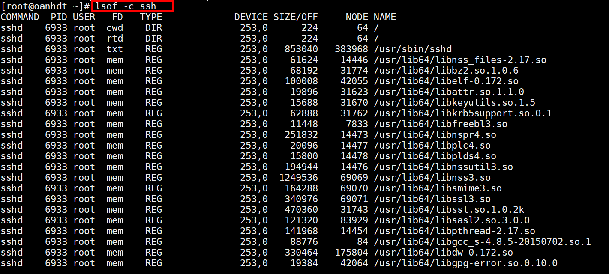
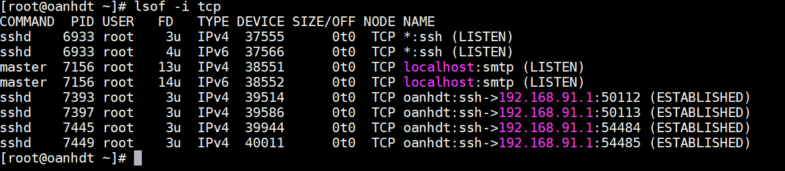
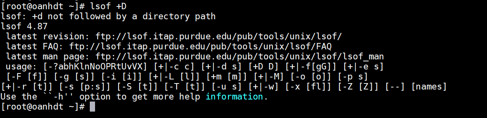

# Tìm hiểu lsof command


`lsof` hay còn gọi là `list open files` là một chương trình lệnh dùng để liệt kê các thông tin về các file trên hệ thống đang hoặc đã được mở bởi các tiến trình.


- Liệt kê các file đã mở theo tên tiến trình

```
lsof -c <tên tiến trình>
```



- Liệt kê các tiến trình dang lắng nghe trên port cụ thể

```
lsof -i :<port>
```


- Liệt kê tất cả các kết nối TCP/UDP

```
lsof -i <tcp or udp>

```



- Liệt kê các file được mở bởi 1 user cụ thể 

```
lsof -u <username>
```

- Liệt kê các file được mở trong một directory 

```
lsof +D 
```



