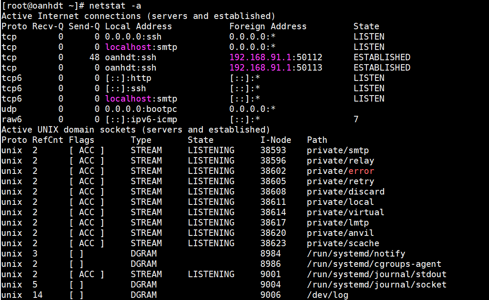
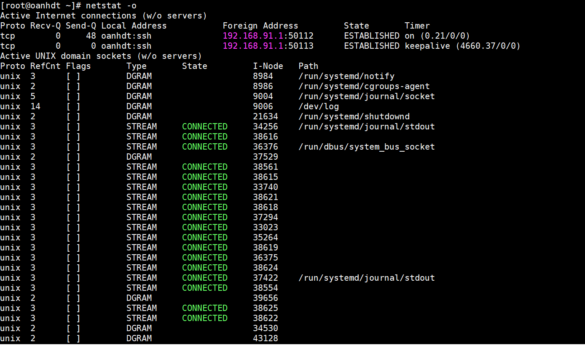

# Cú pháp lệnh Netstat

Thực hiện lệnh netstat một mình để hiển thị một danh sách tương đối đơn giản của tất cả các kết nối TCP đang hoạt động, với mỗi kết nối, sẽ hiển thị địa chỉ IP cục bộ (máy tính của bạn),địa chỉ IP nước ngoài (máy tính hoặc thiết bị mạng khác), cùng với số cổng tương ứng của chúng, cũng như trạng thái TCP.

|Option|Result|
|---|---|
|-a	|hiển thị các kết nối TCP đang hoạt động, kết nối TCP với trạng thái nghe, cũng như các cổng UDP đang được lắng nghe.|
|-b |giống với option -o được liệt kê bên dưới, nhưng thay vì hiển thị PID, sẽ hiển thị tên tệp thực tế của quy trình|
|-e |hiển thị số liệu thống kê về kết nối mạng của bạn. Dữ liệu này bao gồm byte, gói tin unicast,loại bỏ, lỗi và các giao thức không xác định nhận và gửi kể từ khi kết nối được thiết lập|
|-l|lắng nghe chỉ hiển thị ổ cắm nghe. (Chúng được bỏ qua theo mặc định.)|
|-f |hiển thị Tên miền đủ điều kiện (FQDN) cho mỗi địa chỉ IP nước ngoài khi có thể.|
|-n |cố gắng xác định tên máy chủ cho các địa chỉ IP nước ngoài. Tùy thuộc vào các kết nối mạng hiện tại của bạn, sử dụng công tắc này có thể giảm đáng kể thời gian để netstat thực hiện đầy đủ|
|-o |hiển thị mã định danh quy trình (PID) được liên kết với mỗi kết nối được hiển thị.|
|-r | hiển thị bảng định tuyến IP. Điều này giống như sử dụng lệnh tuyến đường để thực hiện in tuyến đường.|
|-s| hiển thị số liệu thống kê chi tiết theo giao thức. Bạn có thể giới hạn số liệu thống kê được hiển thị cho một giao thức cụ thể bằng cách sử dụng -soption và chỉ định giao thức đó,|
|-t| hiển thị trạng thái giảm tải của ống khói TCP hiện tại thay cho trạng thái TCP được hiển thị thông thường.|
|-x|hiển thị tất cả các trình nghe, kết nối và các điểm cuối được chia sẻ của NetworkDirect.|

## Ví dụ 

```
netstat -a 
```


```
netstat -o
```



