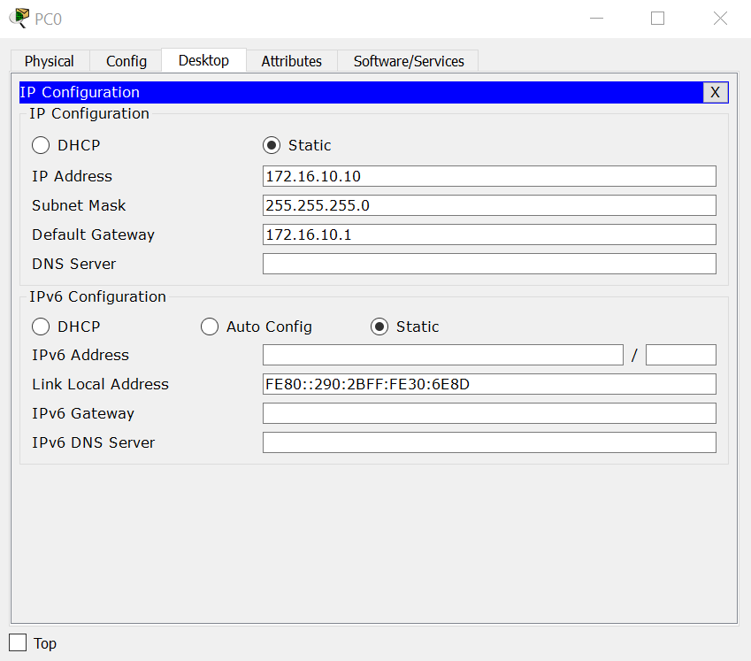
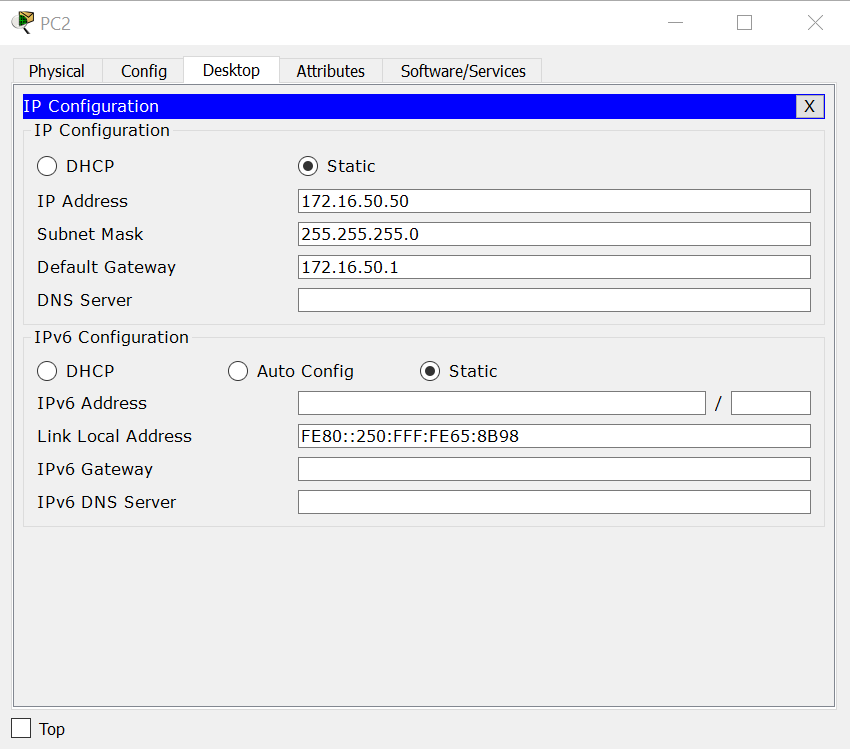

# Static Route 
- Ta có mô hình mạng như sau


- ĐẶt IP và defaulgetWay cho từng PC 
    - PC0 
    

    - PC1
    

    - PC2 
    

- Đặt hostname và ip cho router 0
```
Router(config)#hostname R1
R1(config)#interface fa0/0
R1(config-if)#description "RA connect to vlan"
R1(config-if)#ip add 172.16.10.1 255.255.255.0
R1(config-if)#no shutdown 
R1(config-if)#exit 
R1(config)#interface se0/0/0
R1(config-if)#description "Ket noi voi R2"
R1(config-if)#ip add 172.16.20.1 255.255.255.0
R1(config-if)#no shutdown
R1(config-if)#exit
```
- Đặt hostname và ip cho router 1
```
Router(config)#hostname R2
R2(config)#interface fa0/0
R2(config-if)#description "RB connect to vlan"
R2(config-if)#ip add 172.16.30.1 255.255.255.0 
R2(config-if)#no shutdown 
R2(config-if)#exit 
R2(config)#interface se0/0/0
R2(config-if)#description Ket noi voi R3
R2(config-if)#ip add 172.16.40.1 255.255.255.0
R2(config-if)#no shutdown
R2(config-if)#exit
R2(config)#interface se0/0/1
R2(config-if)#description Ket noi voi R1
R2(config-if)#ip add 172.16.20.2 255.255.255.0
R2(config-if)#no shutdown
R2(config-if)#exit

```
- Đặt hostname và ip cho router 2
```
Router(config)#hostname R3
R3(config)#interface fa0/0
R3(config-if)#description "R3 connect to vlan"
R3(config-if)#ip add 172.16.50.1 255.255.255.0 
R3(config-if)#no shutdown 
R3(config-if)#exit 
R3(config)#interface se0/0/1
R3(config-if)#description "R3 connect to R2"
R3(config-if)#ip add 172.16.40.2 255.255.255.0 
R3(config-if)#no shutdown 
R3(config-if)#exit 
```
- Định tuyến `Router (config) #ip route <Network_dich> <Subnet Mask of Network_dich> <IP nexthop>`
- R1
```
R1(config)# ip route 172.16.30.0 255.255.255.0 172.16.20.0
R1(config)# ip route 172.16.40.0 255.255.255.0 172.16.20.0
R1(config)# ip route 172.16.50.0 255.255.255.0 172.16.40.0
```
- R2

```
R2(config)#ip route 172.16.10.0 255.255.255.0 172.16.20.0
R2(config)#ip route 172.16.50.0 255.255.255.0 172.16.40.0
```
- R3
```
R3(config)#ip route 172.16.30.0 255.255.255.0 172.16.40.0
R3(config)#ip route 172.16.20.0 255.255.255.0 172.16.40.0
R3(config)#ip route 172.16.10.0 255.255.255.0 172.16.20.0
```
- Ping 
Ping từ PC0->PC1,PC2


   


