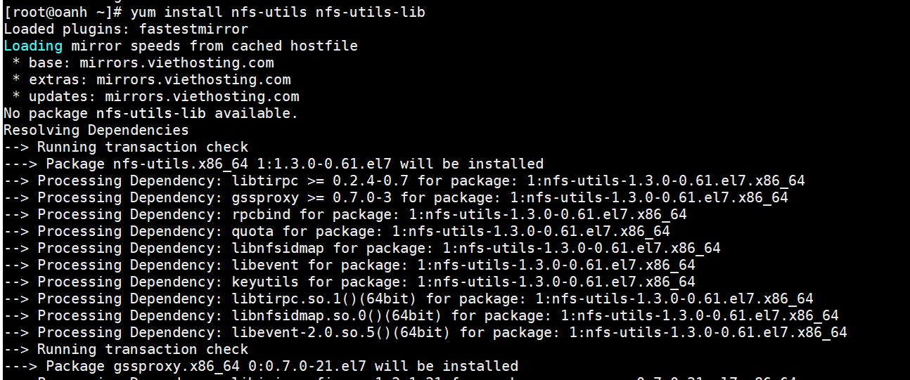
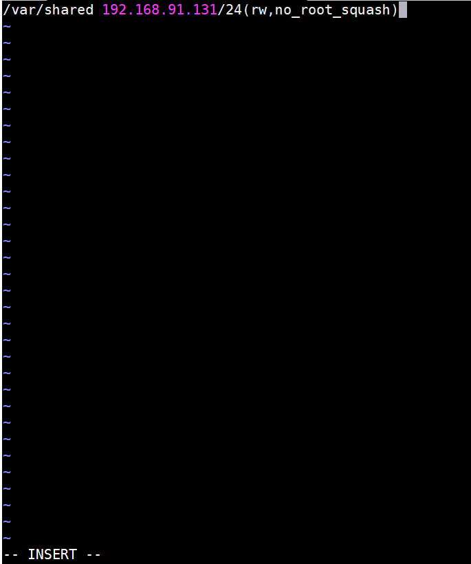
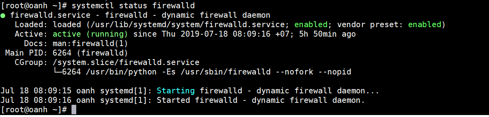
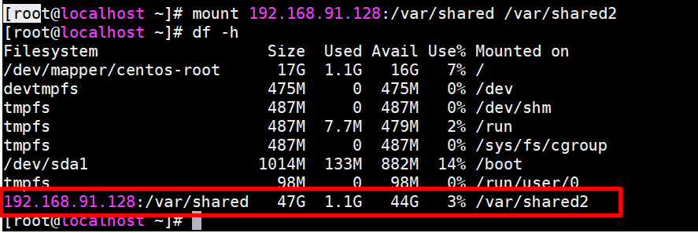
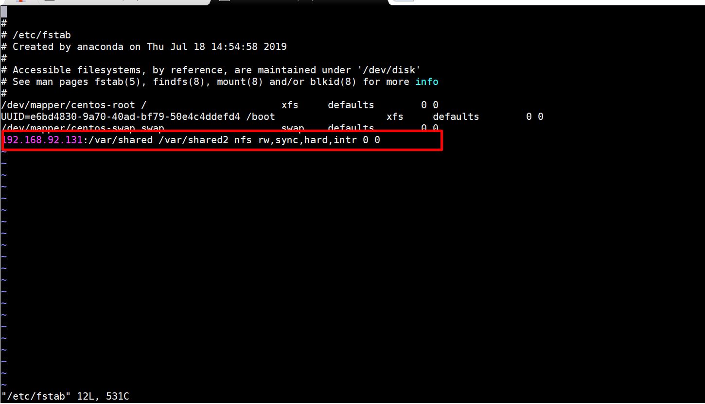
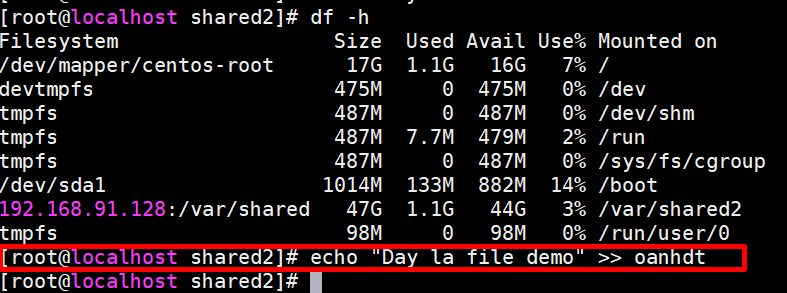

# Network File System 
# Mục lục 
- [I. Giới thiệu về NFS](#I)
- [II.Mô hình triển khai ](#II)
- [III.Ip planning](#III)
- [IV.Các bước cài đặt](#IV)
     - [1. trên server](#1)
     - [2. Trên Client](#2)
     - [3. Kiểm tra](#3)

<a name ="I"></a>

## I.Giới thiệu về NFS 

- Sử dụng NFS (Hệ thống tệp mạng) định cấu hình Máy chủ NFS để chia sẻ các thư mục trên Mạng của bạn.
- Dịch vụ NFS cho phép chia sẻ tài nguyên cho nhiều người tghdùng trên cùng mạng và người dùng có thể thao tác với tập tin như trên chính đĩa cứng của mình. Để thực hiện được việc này ta cần ít nhất 2 máy chạy hệ điều hành Linux trong đó có một máy đóng vai trò Server và máy còn lại là máy Client.

<a name ="II"></a>

## II. Mô hình triển khai.


- **OS** : CentOS7 -64 bit
- **Server** ip : 192.168.91.128
- **Client** ip 192.128.91.131 và 192.168.91.132

<a name="III"></a>

## III. IP planning


<a name ="IV"></a>

## IV.Các bước cài đặt 

<a name ="1"></a>

### 1. Trên Server 

- Cài đặt nfs cho máy và tạo thư mục shared
```
yum install nfs-utils nfs-utils-lib
```


- Tạo thư mục chia sẻ tập tin `shared` 

```
mkdir /var/shared 
```

- NFS sử dụng tập tin /etc/exports để lưu danh sách tập tin hệ thống được chia sẻ và tên máy tính (hoặc địa chỉ IP tương ứng) được cấp quyền sử dụng.

Tập tin /etc/exports có cấu trúc như sau:

<tên_thư_mục_chia_sẻ><Tên_máy_tính_hoặc_địa_chỉ_IP><(quyền hạn)>​
- Trong đó : 
    - Tên thư mục chia sẻ : là thư mục cần chia sẻ cho máy trạm 
    - Tên máy tính hoặc địa chỉ ip : là tên máy hoặc địa chỉ ip được chia sẻ 
    - Quyền hạn có những quyền cơ bản sau : 

|Options |	Description|
|---|---|
|rw | quyền đọc và viết|
|ro |quyền chỉ đọc|
|noaccess|cấm truy cập vào các thư mục cấp con của thư mục được chia sẻ|
|sync | đồng bộ hóa thư mục dùng chung|
|root_squash|ngăn remote root users|
|no_root_squash|cho phép remote root users|
|async |Tùy chọn này cho phép máy chủ NFS vi phạm giao thức NFS và trả lời các yêu cầu trước khi bất kỳ thay đổi nào được thực hiện bởi yêu cầu đó đã được cam kết lưu trữ ổn định|
|secure|Tùy chọn này yêu cầu các yêu cầu bắt nguồn trên một cổng Internet nhỏ hơn IPPORT_RESERVED (1024). (Mặc định)|
|insecure |Tùy chọn này chấp nhận tất cả các cổng|
|wdelay |Trì hoãn cam kết một yêu cầu ghi vào đĩa nếu nó nghi ngờ rằng một yêu cầu ghi liên quan khác có thể đang được tiến hành hoặc có thể đến sớm. (Mặc định)|
|subtree_check|Tùy chọn này kiểm tra cây con|
|all_squash|Ánh xạ tất cả các uids và gids cho người dùng ẩn danh. Hữu ích cho NFS xuất các thư mục FTP công cộng, thư mục bộ đệm tin tức|


- Dùng lệnh vi /etc/exports để mở file. Mỗi lần sửa file này xong ta cần dùng lệnh exportfs -a thì thay đổi mới được cập nhật.



- Sau khi sửa đổi tập tin cấu hình /etc/exports, NFS không thể hiểu ngay sự thay đổi này. Do đó bạn phải khởi động dịch vụ bằng câu lệnh:

```

[root@oanh ~]# service nfs start
Redirecting to /bin/systemctl start nfs.service

```
- Hoặc có thể dùng lệnh `systemctl enable nfs ` để dịch vụ khởi động khi chúng ta khởi động máy tính.
 

- Ta cũng cần kiểm tra trạng thái firewall và tắt nó đi để cho máy client có thể truy cập vào. Ta dùng lệnh:` systemctl status firewalld `để kiểm tra trạng thái



- Để tắt nó đi ta cần sử dụng lệnh 
`systemctl stop firewalld`


- Với hai lệnh trên khi ta reboot ta sẽ phải thiết lập lại. Vậy là đã cấu hình xong trên server


<a name ="2"></a>

### 2. Trên Client 

- Máy client của tôi là máy có địa chỉ IP 192.168.91.131/24. Ta cũng dùng lệnh `yum install nfs-utils nfs-utils-lib `để cài đặt dịch vụ NFS.


- Dùng lệnh `showmount -e IP_server` để kiểm tra những thư mục server đã export cho những máy nào.


- Tạo thư mục trên máy client

```
[root@localhost ~]# cd /var
[root@localhost var]# mkdir shared2
[root@localhost var]#
```
- Bây giờ ta thực hiện lệnh mount để mount nó vào 1 thư mục nào đó trên máy của mình và dùng. Cú pháp mount `IP_server:/Thư_mục_chia_sẻ_trên_server Thư_mục_trên_máy_mình` Ở đây tôi thực hiện mount thư mục /var/shared trên server có địa chỉ 192.168.91.128 vào thư mục /var/shared2 trên máy của mình.Sau đó dùng lệnh `df -h` để kiểm tra. 



- Ta có thể umount nó khi không sử dụng. Lúc này ta coi thư Shared trên máy server như disk trên máy của mình.Để nó tự động mount sau mỗi lần reboot thì ta có thể vào file /etc/fstab để thêm thông tin giống như ổ đĩa.



<a name ="3"></a>

### 3. Kiểm tra.
- Trên máy Client, tạo các file trên NFS shared



- Chuyển sang server để kiểm tra các file vừa tạo 

```
[root@oanhdt ~]# cd /var/shared
[root@oanhdt shared]# ls -l
total 4
-rw-r--r--. 1 root root  0 Jul 24 09:05 oanh.txt
[root@oanhdt shared]#
```


