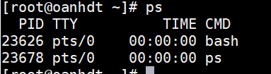

<a name="Quản lý tiến trình"></a>

# Quản lý tiến trình 

## 1. Định nghĩa tiến trình 
- Là một thực thể điều khiển đoạn mã lệnh có riêng một không gian địa chỉ, có ngăn xếp stack riêng rẽ, có bảng chứa các thông số mô tả file được mở cùng tiến trình và đặc biệt có một định danh PID (Process Identify) duy nhất trong toàn bộ hệ thống vào thời điểm tiến trình đang chạy.
- Tiến trình không phải là một chương trình
- Tiến trình được cấp không gian địa chỉ bộ nhớ phẳng là 4G.
- Dữ liệu của tiến trình này không thể đọc và truy xuất bới tiến trình khác.

## 2. Các hoạt động của tiến trình 
- Đang chạy (running) : đây là lúc tiến trình chiếm quyền xử lý CPU dùng tính toán hay thực các công việc
của mình.
- Chờ (waiting) : tiến trình bị Hệ Điều Hành tước quyền xử lý CPU, và chờ đến lược cấp phát khác.
- Tạm dừng (suspend) : Hệ Điều Hành tạm dừng tiến trình. Tiến trình được đưa vào trạng thái ngủ (sleep).
## 3. Các loại tiến trình 
### a. Tiến trình của hệ thống 
- Thường thuộc về quyền root
- Ví dụ :
    - Ipsched : dịch vụ in ấn 
    - inetd : quản lý dịch vụ mạng 
    - cron : thực hiện chương trình vào 1 khoảng tg xác định trước.
### b. Tiến trình của người sử dụng 
- Thực hiện nhiệm vụ của người dùng 
- VÍ dụ : man ,vi,cp,...
## 4. Câu lệnh ps 
- Hiển thị các tiến trình đang chạy 
```
ps <options>..
```
- Các tham số hiển thị khi thực hiện lệnh ps 

 

- PID : định danh 
- TTY : terminal ảo nơi thực hiện tiến trình
- TIME : Thời gian sử dụng CPU của tiến trình 
- CMD : toàn bộ dòng lệnh khi tiến trình được gọi.

### Các options của lệnh ps 


|Options |  Result |
|--------|-------|
|ps aux | Xem mọi tiến trình trong hệ thống |
|ps fu (name) |Để chọn một quy trình người dùng bằng cách sử dụng tên|
|ps | Xem mọi quy trình đang chạy với quyền người dùng root|
|ps -ef|Hiển thị danh sách dưới định dạng đầy đủ |
|ps -fG (group) |liệt kê tất cả các quy trình thuộc sở hữu của một nhóm nhất định|
|ps -fp|Liệt kê các tiến trình bằng PID |
|ps -e --forest | Hiển thị tiến trình đang chạy dưới dạng cây|
| ps -p (PID) -o pid,ppid,fgroup,ni,lstart,etime|Hiển thị thời gian bắt đầu và kết thúc của một tiến trình|
|ps -p (PID) -o comm=| Tìm tên tiến trình sử dụng PID|


## 5 Lệnh kill

|Options|Result |
|---|---|
|-l|Để hiển thị tất cả các tín hiệu có sẵn|
|-s|hiển thị cách gửi tín hiệu đến các tiến trình|

## 6. Lệnh top 
- Hiển thị và cập nhật các thông tin sau của các
tiến trình đang chạy : 
    - Phần trăm sử dụng CPU 
    - Phần trăm sử dụng bộ nhớ
## Các kiểu thực thi 
- Thực thi nhiều lệnh độc lập sử dụng ký tự ";"
- Ví dụ copy folder oanh vào thư mục NEW và xóa folder oanh 
```
[root@oanhdt ~]# cp oanh/* NEW; rm -r oanh
rm: descend into directory ‘oanh’? y
rm: remove regular empty file ‘oanh/a’? y
rm: remove regular empty file ‘oanh/b’? y
rm: remove regular empty file ‘oanh/c’? y
rm: remove directory ‘oanh’? y
[root@oanhdt ~]# cd NEW
[root@oanhdt NEW]# ll
total 0
-rw-r--r--. 1 root root 0 Jun 27 10:38 a
-rw-r--r--. 1 root root 0 Jun 27 10:38 b
-rw-r--r--. 1 root root 0 Jun 27 10:38 c
```
- Thực thi nhiều lệnh phụ thuộc nhau sử dụng ký tự "&&" lệnh sau chỉ thực hiện được khi lệnh trước không gặp lỗi.


   


