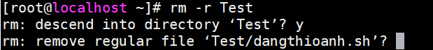

# Các thao tác với file và thư mục 
## 1. Thư mục 

- **Tạo thư mục** : `mkdir tên thư mục`
- **Truy cập vào thư mục**: `cd tên thư mục`
- **Truy cập thư mục con**: `cd folder_mẹ/folder_con`
- **Thoát ra khỏi thư mục** : `cd --`
- **Thoát ra và quay lại thư mục trước** : `cd ..`
- **Quay lại thư mục root** : `cd ~`
- **Xóa thư mục trống** : `rmdir tên_folder `
- **Xóa thư mục có dữ liệu** : `rm -r` hoặc    `rm -rf` 

- *Ví dụ ta muốn xóa thư mục `Test` trong đó có file `dangthioanh.sh`*: 

- Hiển thị thư mục : `ll` hoặc `ls -l` 
- Liệt kê tất cả các tệp bao gồm các tệp và thư mục ẩn : `ls -a`

## 2. File 
- **Tạo file** :  `touch tên_file `

- **Tạo nhiều file rỗng**:  `touch {a,b,c}.txt`
- Ví dụ tạo 3 file a.txt, b.txt, c.txt : 

- **Di chuyển**: `mv tên_file /tên_folder` 
 - *Ví dụ muốn di chuyển file 
`oanh.txt` từ folder `Test` sang folder `DT`* 

- ***Đổi tên***.Ví dụ muốn đổi tên từ  a.txt thành oanh.txt : `mv a.txt oanh.txt`

- **Xóa file** :  `rm niceday.txt`
- *Ví dụ* : muốn xóa file niceday.txt

- **copy file** :` cp (file1) (file2)` 

- **Copy file vào một thư mục khác**: `cp tên_file /Tên_folder` 

