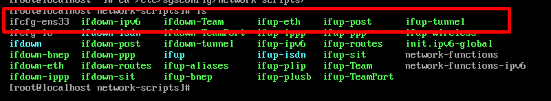
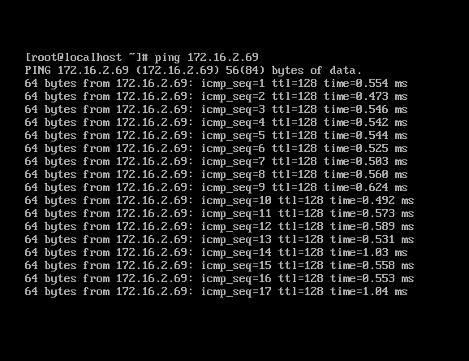
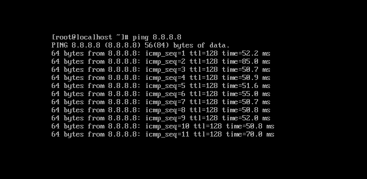

# Bài toán 

- Đặt ip cho máy : 192.168.20.10
- Netmask : 255.255.255.0
- Getway : 192.168.20.1
# Các bước thực hiện

- Khởi động và đăng nhập máy ảo trên VMware 
- Dùng câu lệnh `cd /etc/sysconfig/network-scripts` để truy cập vào thư mục *network-scripts*.

- Dùng lệnh `ls ` để view xem máy đang sử dụng card mạng nào.Chúng ta sẽ sửa file *ifcfg-ens33*.

- Dùng câu lệnh `vi ifcfg-ens33` để chỉnh sửa file . *Lưu ý : địa chỉ ip của máy phải nằm trong cùng một dải mạng với card mạng* 

- Trong đó : 
    - DEVICE: Tên card mạng,phải điền chính xác tên card mạng thì hệ thống mới nhận biết được để cấu hình đúng.
    - BOOTPROTO: Cấu hình IP tĩnh hay DHCP nếu là DHCP thì để là "dhcp"
    - NAME : Nội dung như phần DEVICE 
    - IPADDR: IP tĩnh 
    - GATEWAY : địa chỉ IP cổng gateway 
    - ONBOOT : phải để options `yes` thì khi reboot hệ thống,network mới tự động được bật lên với card mạng tương ứng. 

- Dùng câu lệnh `systemctl restart network` để restart lại file 
- Kiểm tra ip sau khi cài đặt `ip a`.

**Lưu ý :** Trước khi ping chúng ta kiểm tra xem đã bỏ tick vào phần `use local dhcp service to distribute Ip address to VM` hay chưa.Vì phần này sử dụng dịch vụ dhcp cục bộ để phân phối địa chỉ IP cho VM mà chúng ta đang đặt ip nên phải bỏ tick đi thì ip đó mới ping ra ngoài được.
- Click vào `Edit` nhấp tiếp vào `Vitual Network Editor..`

- Click vào `Change Settings` để thay đổi

- Bỏ tick phần này

- Thử ping với máy thật .Vậy là đã ping thành công với máy thật.

- Ping với ip của google 

 

