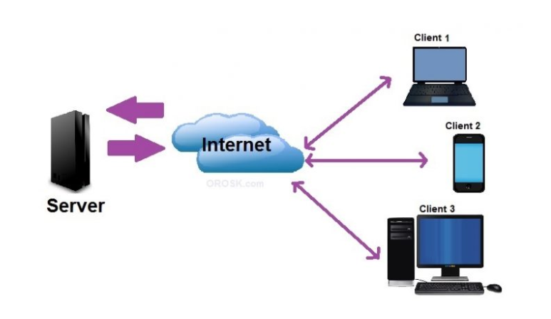

# Mô hình Client-Server 

## Mục lục 

[1. Mô hình client server là gì](#khainiem)

[2. Mục đích sử dụng mô hình client server](#mucdich)

[3. Hoạt động của mô hình client server ](#hoatdong)

### 1. Mô hình client server là gì ?

- Mô hình Client server là một mô hình nổi tiếng trên mạng máy tính, phổ biến và được áp dụng rộng rãi ở trên các trang Web hiện nay.

- Ý tưởng của mô hình này như sau : Client (máy khách) sẽ gửi yêu cầu (request) đến Server (máy chủ, cung ứng các dịch vụ cho các máy khách). Server sẽ xử lý dữ liệu và gửi kết quả về cho Client.

### 2. Mục đích sử dụng mô hình client server 

- Dữ liệu và tài nguyên được tập trung lại và tăng tính toàn vẹn của dữ liệu 

- Sự linh động trong việc mở rộng hệ thống mạng 

- Có thể điều chỉnh quyền truy cập thông tin nên khả năng bảo mật và an toàn thông tin cao.

### 3. Hoạt động của mô hình client server 

Trong mô hình client/server, client được coi như là người sử dụng các dịch vụ trên mạng do một hoặc nhiều máy chủ cung cấp.Client được hiểu như là bề nổi của các dịch vụ trên mạng, nếu có thông tin vào hoặc ra thì chúng sẽ được hiển thị trên máy client.

Server cung cấp và điều khiển các tiến trình truy cập vào tài nguyên của hệ thống.Nhận yêu cầu từ client và trả lại kết quả.

Tài liệu tham khảo 

- https://vi.wikipedia.org/wiki/Client-server

- https://vdodata.vn/tim-hieu-ve-mo-hinh-client-server-va-client-server-la-gi/#Mo_hinh_client_server_hoat_dong_nhu_the_nao
