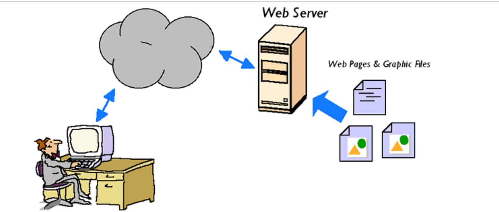

# Tìm hiểu chung về webserver 

## Mục lục

[1. Webserver là gì?](#khainiem)

[2. Các loại web server](#cacloai)

[3. Nguyên tắc hoạt động](#hoatdong)

[4. Mục đích](#mucdich)

### 1. Webserver là gì ?

Web server là máy tính lớn được kết nối với tập hợp mạng máy tính mở rộng. Đây là một dạng máy chủ trên internet mỗi máy chủ là một IP khác nhau và có thể đọc các ngôn ngữ như file *.htm và *.html… Tóm lại máy chủ là kho để chứa toàn bộ dữ liệu hoạt động trên internet mà nó được giao quyền quản lý.
Web server có thể là phần cứng hoặc phần mềm hoặc cả hai 
- Phần cứng: một web server là một máy tính lưu trữ các file thành phần của một website và có thể phân phát chúng tới thiết bị của người dùng cuối.

- Phần mềm : một web server bao gồm một số phần để điều khiển cách người sử dụng web truy cập tới các file được lưu trữ trên một HTTP server(máy chủ HTTP). Một HTTP server là một phần mềm hiểu được các URL (các địa chỉ web) và HTTP (giao thức trình duyệt của bạn sử dụng để xem các trang web).

### 2. Các loại web server

|Tên|Mô tả|
|---|---|
|Web server Apache|Apache là một phần mềm mã nguồn mở, hỗ trợ gần như tất cả các hệ điều hành bao gồm Linux, Unix, Windows, FreeBSD, Mac OS X và các hệ điều hành khác nữa.|
|Web server IIS|Microsoft là nhà phát triển của web server này, do đó nó chạy được trên tất cả các nền tảng của hệ điều hành windows|
|Web server Nginx|hiệu suất cao, tính ổn định, cấu hình đơn giản và sử dụng tài nguyên thấp.Web này hiện đang phổ biến trên toàn thế giới và lưu trữ 7,5% tên miền trên toàn thế giới|
|Web server Lightspeed|là một drop-in replacement Apache hiệu suất cao. LSWS là web server phổ biến thứ 4 trên internet và là một web server thương mại.|

### 3. Nguyên tắc hoạt động 

Trình duyệt web chia địa chỉ website thành 3 phần 

- Tên giao thức 
- Tên miền của web server 
- Tên tệp html 

Trình duyệt sẽ liên hệ với web server để chuyển đổi tên miền thành địa chỉ IP tương ứng. 

Sau đó trình duyệt sẽ gửi tiếp một kết nối tới máy chủ có địa chỉ IP tương ứng qua port 80.

Dựa trên giao thức HTTP trình duyệt gửi yêu cầu GET đến máy chủ và yêu cầu tệp HTML . Sau đó máy chủ sẽ gửi một file văn bản có thẻ html đến trình duyệt web.

Sau đó trình duyệt web đọc các thẻ html để xác lập định dạng trang web và xuất ra màn hình.

### 4. Mục đích 

Mục đích chính của web server là lưu trữ các tệp của website và phát chúng qua internet để khách truy cập web có thể xem được.Khi ai đó truy cập trang trên web của bạn, trình duyệt của họ sẽ giao tiếp với web server của bạn, gửi và nhận các thông tin mà chúng được ra lệnh để xuất hiện trên màn hình máy tính của khách truy cập. Như vậy, vai trò chủ yếu của web server là lưu trữ và chuyển tải dữ liệu website theo yêu cầu từ trình duyệt của khách truy cập.

Tài liệu tham khảo :

- https://github.com/nhanhoadocs/thuctapsinh/blob/master/NgocPT/Webserver/docs/webserver.md
- https://vinahost.vn/web-server-la-gi.html

