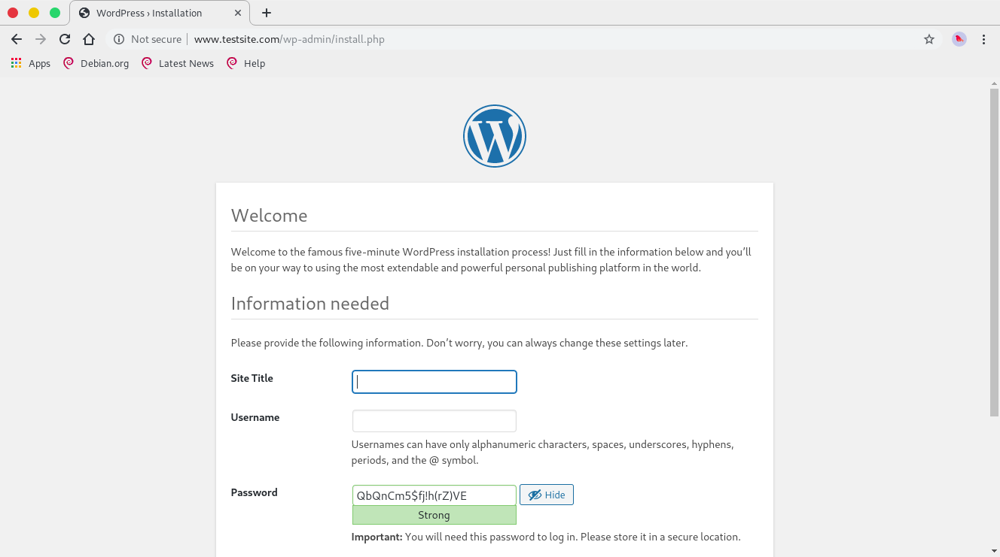

# Bash shell cài đặt wordpress

### Nhận các thông số cần thiết cho việc cài đặt wordpress
Ta cần có các thông tin để cài đặt cấu hình wordpress như database name, database user, database password và địa chỉ database server:

```
echo Domain Name:
read -e domain

echo “Database Name:
read -e dbName

echo “Database User:
read -e userName

echo “Database Pwd: 
read -e password

echo “Database Host: 
read -e dbHost
```

### Tải source code wordpress và giải nén

```
wget http://wordpress.org/latest.tar.gz
tar -zxvf latest.tar.gz
```

### Cập nhật file wp-config
wp-config.php là file chứa các thông tin cấu hình của worpress như các thông tin về cơ sở dữ liệu. mặc định chỉ có file `wp-config-sample.php` ta cần copy file này và đổi tên thành `wp-config.php`:

Ta dùng lệnh sed để tìm kiếm và thay thế các cấu hình:

```
cp wordpress/wp-config-sample.php wordpress/wp-config.php
sed -i "s/database_name_here/$dbName/g" wordpress/wp-config.php
sed -i "s/username_here/$userName/g" wordpress/wp-config.php
sed -i "s/password_here/$password/g" wordpress/wp-config.php
sed -i "s/localhost/$dbHost/g" wordpress/wp-config.php
```

### Di chuyển thư mục wordpress đến thư mục `/var/www/html/`

```
mv wordpress/ /var/www/html/wordpress/
# Đổi tên theo domain
mv /var/www/html/wordpress/ /var/www/html/$domain
```

### Tạo database và user database
Ta cần tọa tài database theo thông tin đã nhận được ở trên và tài khoảng người dùng database để tránh sử dụng tải khoảng `root` sẽ dẫn đến các vấn đề bảo mật không mong muốn.

```
sudo mysql -u root -e "CREATE DATABASE $dbName"
sudo mysql -u root -e "GRANT ALL PRIVILEGES ON $dbName.* TO $userName@localhost IDENTIFIED BY '$password'"

```

### Cấu hình virtualhost

```
echo "
<VirtualHost *:80>
    ServerName ${domain}
    ServerAlias www.${domain}
    ServerAdmin admin@${domain}
    DocumentRoot /var/www/html/${domain}/
    
 
    <Directory /var/www/html/${domain}>
           #Allowoverride all    ###Uncomment if required
    </Directory>

    ErrorLog    /var/www/html/${domain}/error.log
    CustomLog   /var/www/html/${domain}/requests.log combined
</VirtualHost>"  > /etc/apache2/sites-available/${domain}.conf
```

### Enable site ta vừa tạo và reload lại apache

```
a2ensite $domain
systemctl reload apache2
```


### Test

```
toor@ubuntu_18043:~/_Tmp$ sudo ./wp-install.sh 
[sudo] password for toor: 
Domain Name:
testsite.com
“Database Name:
DB_Test
“Database User:
User_Test
“Database Pwd:
Pwd_Test
“Database Host:
127.0.0.1
--2019-11-27 13:23:56--  http://wordpress.org/latest.tar.gz
Resolving wordpress.org (wordpress.org)... 198.143.164.252
Connecting to wordpress.org (wordpress.org)|198.143.164.252|:80... connected.
HTTP request sent, awaiting response... 301 Moved Permanently
Location: https://wordpress.org/latest.tar.gz [following]
--2019-11-27 13:23:56--  https://wordpress.org/latest.tar.gz
Connecting to wordpress.org (wordpress.org)|198.143.164.252|:443... connected.
HTTP request sent, awaiting response... 200 OK
Length: 12372564 (12M) [application/octet-stream]
Saving to: ‘latest.tar.gz’

latest.tar.gz                            100%[==================================================================================>]  11.80M   126KB/s    in 1m 59s  

2019-11-27 13:25:57 (102 KB/s) - ‘latest.tar.gz’ saved [12372564/12372564]

...
Create database: 
Enabling site testsite.com.
To activate the new configuration, you need to run:
  systemctl reload apache2
```

Sau khi chạy xong, ta cần chỉnh sửa file hosts ở máy một máy nào đó để truy cập và cài đặt wordpress, nội dung file hosts như sau:

```
server_ip   www.testsite.com
```

Ta cần thay thế  `server_ip` bằng địa chỉ ip của máy chủ web server và tên trang web như ta đã nhập ở bước đầu. Sau đó ta truy cập bằng trình duyệt và cài đặt wordpress:



[Full code](wp-install.sh)