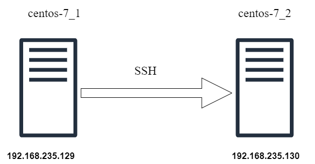
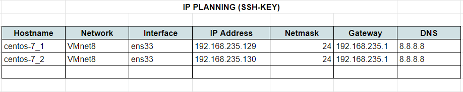

# SSH-Key

1. [Giới Thiệudd](#gioithieu)
2. [Mô hình lab](#mohinhlab)
3. [Ip-planning](#ip-planning)
4. [Tạo SSH-Key](#create-sshkey)
5. [Copy SSH-Key](#copy-sshkey)


<a name="gioithieu"></a>
# Giới Thiệu
SSH-Key là một phương thức xác thực khi ta sử dụng giao thức SSH để truy cập từ xa vào một máy chủ, thay vì sử dụng mật khẩu để xác thực ở đây ta sẽ tạo ra 1 cặp khóa 1 public key và 1 private key, 2 khóa này có sự liên kết với nhau giúp ta có thể xác thực khi ssh vào máy chủ mà không cần đến mật khẩu. 


<a name="mohinhlab"></a>
# Mô hình lab

Ta sẽ có một mô hình lab gồm 2 máy Centos như hình sau:





Và ta sẽ thực hiện triển khai để máy `centos-7_1` có thể kết nối ssh tới máy `centos-7_2`


<a name="ip-planning"></a>
# Ip-planning


<a name="create-sshkey"></a>
# Tạo SSH-Key
Đầu tiên ta truy cập vào máy `centos-7_1` và tạo cặp khóa trên máy này bằng lệnh sau:
```
ssh-keygen -t rsa -b 4096
```
Trong đó:  
- `-t` chỉ định loại mã hóa được sử dụng, ở đây là rsa, bạn cũng có thể chỉ định một loại mã hóa khác được hỗ trợ  
- `-b` chỉ định độ dài khóa, nếu ta không có tùy chọn này khóa được tạo ra mặc định sẽ là 1024 bit

Bạn có thể tham khảo thêm về lệnh `ssh-keygen` [Ở đây](https://www.ssh.com/ssh/keygen/)  
Sau khi thực hiện lệnh bạn sẽ được hỏi một số tùy chọn cho việc tạo cặp khóa như sau:
```
Generating public/private rsa key pair.
Enter file in which to save the key (/home/toor/.ssh/id_rsa):
```
Cho phép chúng ta thay đổi nơi lưu trữ cặp khóa và tên file, nếu ta không chỉ định cặp khóa sẽ được lưu tại thư mục `.ssh` tại thư mục của người dùng hiện tại


Tiếp theo một tùy chọn cho phép chúng ta đặt mật khẩu bảo vệ cho cặp khóa này nhằm bảo vệ khi có ai đó có được private key thì cũng không thể đọc được nội dung của khóa, để bỏ qua ta ấn `Enter`:

```
Enter passphrase (empty for no passphrase):
Enter same passphrase again:
```

Kết quả sẽ như sau:
```
[root@CentOS-7_1 ~]$ ssh-keygen -t rsa -b 4096
Generating public/private rsa key pair.
Enter file in which to save the key (/home/toor/.ssh/id_rsa):
Created directory '/home/toor/.ssh'.
Enter passphrase (empty for no passphrase):
Enter same passphrase again:
Your identification has been saved in /home/toor/.ssh/id_rsa.
Your public key has been saved in /home/toor/.ssh/id_rsa.pub.
The key fingerprint is:
SHA256:tY3UuzbQE/ivYaypKr8CDf5RzfdgfKus+lyZPM7W0fI toor@CentOS-7
The key's randomart image is:
+---[RSA 4096]----+
|                 |
|           o     |
|       o .+ o    |
|  .   . oo=*.o   |
| . o .  So++*o   |
|  o o    . ==+.  |
|   o .   .*oB+.  |
|    +  . ++*.+E  |
|     +===+= .    |
+----[SHA256]-----+
[root@CentOS-7_1 ~]$
```

Sau đó một cặp khóa sẽ được tạo ra tại thư mục được chỉ định ở trên hoặc mặc định là thư mục `.ssh` ở thư mục người dùng hiện tại

<!-- ### Windows
Đối với windows ta có thể tạo ssh-key bằng một số phần mềm như Putty, MobaXterm hoặc có thể cài git và sử dụng git-bash -->

<a name="ssh-copy-id"></a>
# Copy ssh-key
Sau khi tạo xong ssh-key ta cần thực hiện copy public key vào máy chủ để có thể tiến hành xác thực bằng ssh-key thay vì mật khẩu

Để copy ssh-key ta thực hiện lệnh sau và thay đường dẫn thư mục người dùng tên người dùng và ip máy chủ hợp lệ:

```
ssh-copy-id -i /home/root/.ssh/id_rsa.pub root@192.168.235.130
```
Bạn có thể tham khảo thêm về lệnh `ssh-copy-id` [Ở đây](https://www.ssh.com/ssh/copy-id)  

Sau khi thực hiện lệnh một lời nhắc nhập mật khẩu, ta cần nhập mật khẩu của máy `centos-7_1` để hoàn tất quá trình copy ssh-key

Kết quả sẽ như sau:
```
[root@CentOS-7_1 ~]$ ssh-copy-id -i /home/root/.ssh/id_rsa.pub root@192.168.235.130
/bin/ssh-copy-id: INFO: attempting to log in with the new key(s), to filter out any that are already installed
/bin/ssh-copy-id: INFO: 1 key(s) remain to be installed -- if you are prompted now it is to install the new keys
[root@CentOS-7_1 ~]$ password:


Number of key(s) added: 1

Now try logging into the machine, with:   "ssh 'root@192.168.235.130'"
and check to make sure that only the key(s) you wanted were added.
```

Sau khi thực hiện một file `authorized_keys` sẽ được tạo ra trong thư mục `.ssh` trên máy `centos-7_2`, đó chính là public key mà ta vừa thực hiện copy

Cuối cùng ta chỉ cần ssh vào máy chủ và việc xác thực sẽ được thực hiện bằng khóa ssh thay vì mật khẩu.