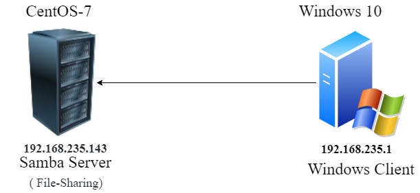
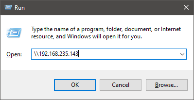
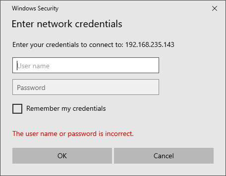
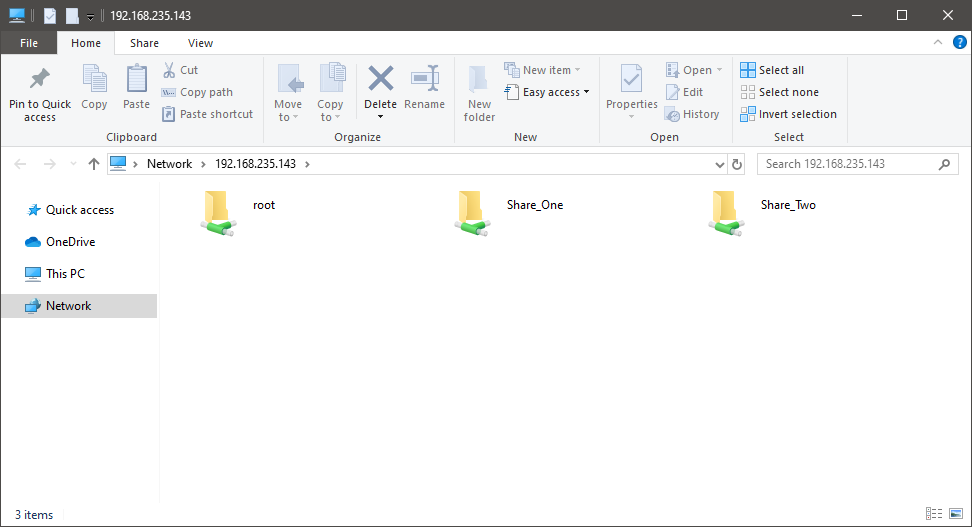

# Samba server


## Introduction
Samba là một hệ thống xử lí mã nguồn mở sử dụng giao thức SMB/CIFS. Nó cho phép các máy chủ Microsoft Windows®, Linux, UNIX, và các hệ điều hành khác kết nối với nhau. Sử dụng Samba, các máy chủ Linux/Unix có thể trở thành Windows server đối với các máy Windows clients.

Với Samba, người quản trị có thể:

- Phục vụ cây thư mục và dịch vụ in cho các máy clients chạy hđh Linux, UNIX, và Windows.
- Hỗ trợ duyệt mạng có hoặc không có NetBIOS
- Xác thực đăng nhập domain Windows
- Cung cấp giải pháp WINS name server.

Samba là sự kết hợp của `smb`, `nmb`, và winbind services.

`smbd` server cung cấp dịch vụ in và chia sẻ dữ liệu cho các máy Windows clients. Nó có trách nhiệm xác thực người dùng, khóa tài nguyên và chia sẻ dữ liệu thông qua giao thức SMB. Port mặc định mà server dùng cho SMB là các cổng TCP 139 và 445.

`nmbd` server có thể hiểu và trả lời các requests từ SMB. Port mặc định của dịch vụ này là UDP 137.

Dịch vụ winbindd sẽ giải quyết thông tin người dùng tới từ những server chạy Windows. Điều này sẽ làm cho thông tin của các Windows clients có thể được "hiểu" bởi các máy chủ chạy Linux và UNIX. Cả winbindd và smbd đều đi kèm trong các bản phân phối của Samba. Tuy vậy chúng được kiểm soát riêng biệt với nhau.


## Samba lab


### Mô hình lab
Mô hình lab như dưới đây, ta sẽ cài đặt và cấu hình samba trên máy CentOS để có thể chia sẽ file, sau đó truy cập file từ máy window.




### IP-Planning
|HostName|Network|Interface|IP Address|Netmask|Gateway|DNS|
|--------|-------|---------|----------|-------|-------|---|
|samba_sv|VMnet8|ens33|192.168.235.143|24|192.168.235.2|8.8.8.8|
|windows_10|VMnet8|ens33|192.168.235.1|24|192.168.235.2|8.8.8.8|


### Cài đặt Samba server
Chúng ta sẽ cài đặt Samba server để biến CentOS-7 trở thành file sharing server đối với Windows clients. Quá trình này bao gồm việc cài đặt Samba package, khởi động dịch vụ `smbd` và `nmbd`.

```
[root@samba_sv ~]# yum install samba
...
Complete!


[root@samba_sv ~]# systemctl enable smb
Created symlink from /etc/systemd/system/multi-user.target.wants/smb.service to /usr/lib/systemd/system/smb.service.
[root@samba_sv ~]# systemctl enable nmb
Created symlink from /etc/systemd/system/multi-user.target.wants/nmb.service to /usr/lib/systemd/system/nmb.service.
[root@samba_sv ~]# systemctl start smb
[root@samba_sv ~]# systemctl start nmb
[root@samba_sv ~]# systemctl status smb && systemctl status nmb
● smb.service - Samba SMB Daemon
   Loaded: loaded (/usr/lib/systemd/system/smb.service; enabled; vendor preset: disabled)
   Active: active (running) since Thu 2019-11-21 02:27:15 EST; 26s ago
     Docs: man:smbd(8)
           man:samba(7)
           man:smb.conf(5)
 Main PID: 9096 (smbd)
   Status: "smbd: ready to serve connections..."
   CGroup: /system.slice/smb.service
           ├─9096 /usr/sbin/smbd --foreground --no-process-group
           ├─9098 /usr/sbin/smbd --foreground --no-process-group
           ├─9099 /usr/sbin/smbd --foreground --no-process-group
           └─9100 /usr/sbin/smbd --foreground --no-process-group

Nov 21 02:27:15 samba_sv systemd[1]: Starting Samba SMB Daemon...
Nov 21 02:27:15 samba_sv smbd[9096]: [2019/11/21 02:27:15.553828,  0] ../lib/util/become_daemon.c:138(daemon_ready)
Nov 21 02:27:15 samba_sv systemd[1]: Started Samba SMB Daemon.
Nov 21 02:27:15 samba_sv smbd[9096]:   daemon_ready: STATUS=daemon 'smbd' finished starting up and ready to serve connections
● nmb.service - Samba NMB Daemon
   Loaded: loaded (/usr/lib/systemd/system/nmb.service; enabled; vendor preset: disabled)
   Active: active (running) since Thu 2019-11-21 02:27:19 EST; 22s ago
     Docs: man:nmbd(8)
           man:samba(7)
           man:smb.conf(5)
 Main PID: 9108 (nmbd)
   Status: "nmbd: ready to serve connections..."
   CGroup: /system.slice/nmb.service
           └─9108 /usr/sbin/nmbd --foreground --no-process-group

Nov 21 02:27:19 samba_sv systemd[1]: Starting Samba NMB Daemon...
Nov 21 02:27:19 samba_sv nmbd[9108]: [2019/11/21 02:27:19.226108,  0] ../lib/util/become_daemon.c:138(daemon_ready)
Nov 21 02:27:19 samba_sv systemd[1]: Started Samba NMB Daemon.
Nov 21 02:27:19 samba_sv nmbd[9108]:   daemon_ready: STATUS=daemon 'nmbd' finished starting up and ready to serve connections
```

### Cấu hình samba server
File cấu hình của samba nằm ở `/etc/samba/smb.conf`, ta cần chỉ sửa file cấu hình để share file.

Trước khi chỉnh sửa ta sẽ copy ra 1 file khác để backup.

`[root@samba_sv ~]# cp /etc/samba/smb.conf /etc/samba/smb.conf.orig`

File cấu hình sẽ tương tự như sau:
```
# See smb.conf.example for a more detailed config file or
# read the smb.conf manpage.
# Run 'testparm' to verify the config is correct after
# you modified it.

[global]
        workgroup = SAMBA
        security = user

        passdb backend = tdbsam

        printing = cups
        printcap name = cups
        load printers = yes
        cups options = raw

...

# Configs
[Share_One]
comment = Public Documents - Share_One
path = /var/Samba-Shared/Share_One/
valid users = root
guest ok = no
writable = yes
browsable = yes

[Share_Two]
comment = Public Documents - Share_Two
path = /var/Samba-Shared/Share_Two
valid users = root
guest ok = no
writable = yes
browsable = yes
```

Sau khi cấu hình xong ta có thể kiểm tra cấu hình bằng lệnh `testparm`:

```
[root@samba_sv ~]# testparm /etc/samba/smb.conf
rlimit_max: increasing rlimit_max (1024) to minimum Windows limit (16384)
Registered MSG_REQ_POOL_USAGE
Registered MSG_REQ_DMALLOC_MARK and LOG_CHANGED
Load smb config files from /etc/samba/smb.conf
rlimit_max: increasing rlimit_max (1024) to minimum Windows limit (16384)
Processing section "[homes]"
Processing section "[printers]"
Processing section "[print$]"
Processing section "[Share_One]"
Processing section "[Share_Two]"
Loaded services file OK.
Server role: ROLE_STANDALONE

Press enter to see a dump of your service definitions
```


Samba sử dụng nhiều hình thức bảo mật khác nhau. Trong trường hợp phía trên, phương thức sử dụng là mặc định (user level). Với phương thức này, mỗi chia sẻ được gán truy cập với những user cụ thể. Khi user gửi yêu cầu kết nối để chia sẻ, Samba sẽ xác thức bằng username đã được khai báo trong file cấu hình và password trong database.

Samba sử dụng nhiều database backends để lưu trữ password người dùng. Các đơn giản nhất đó là lưu trữ password trong file smbpasswd giống như /etc/passwd. Thường thì file này sẽ được lưu tại `/var/lib/samba/private/` hoặc `/usr/bin/smbpasswd`

Để thêm user và set password trong database ta làm như sau:

```
[root@samba_sv ~]# smbpasswd -a root
New SMB password:
Retype new SMB password:
Added user root.
[root@samba_sv ~]#
```


Câu lệnh pdbedit sẽ hiển thị danh sách user trong database
```
[root@samba_sv ~]# pdbedit --list
root:0:root
toor:1000:TOOR
```

Với smbpassword database, Samba user phải là một user trong hệ thống Linux. Để bảo mật máy chủ, bạn nên hủy bỏ quyền đăng nhập từ những user này

```
# useradd -d /samba/share toor
# usermod -s /bin/false toor
# cat /etc/passwd | grep toor
toor:x:1000:1002::/samba/share:/sbin/nologin
#
# ssh toor@192.168.235.143
toor@192.168.235.143's password:
Last login: Thu Nov 21 03:11:40 EST 2019
This account is currently not available.
Connection to localhost closed.
#
# sftp toor@192.168.235.143
toor@192.168.235.143's password:
subsystem request failed on channel 0
Couldn't read packet: Connection reset by peer
```

Ta cũng có thể cần cấu hình firewall để mở port:

```
[root@samba_sv ~]# firewall-cmd --permanent --zone=public --add-service=samba
success
[root@samba_sv ~]# firewall-cmd --reload
success
[root@samba_sv ~]#
````

Tiếp theo ta tạo file trong thư mục share để kiểm tra chia sẻ thành công:

```
[root@samba_sv ~]# echo 'Share' > /var/Samba-Shared/Share_One/Share_File.txt
[root@samba_sv ~]# cat /var/Samba-Shared/Share_One/Share_File.txt
Share
[root@samba_sv ~]#
```

### Quyền truy cập các file và thuộc tính


### Truy cập share

Bây giờ ta truy cập vào máy Window để kiểm tra xem có truy cập được file chia sẻ không, ta ẩn ttor hợp `Ctrl`+`R` để mở hộp thoại Run và truy cập vào địa chỉ IP của samba server như dưới đây:





