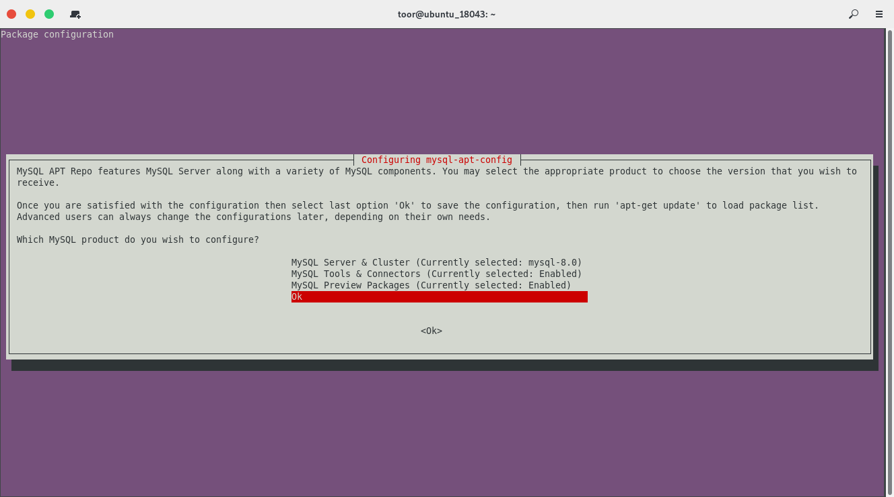
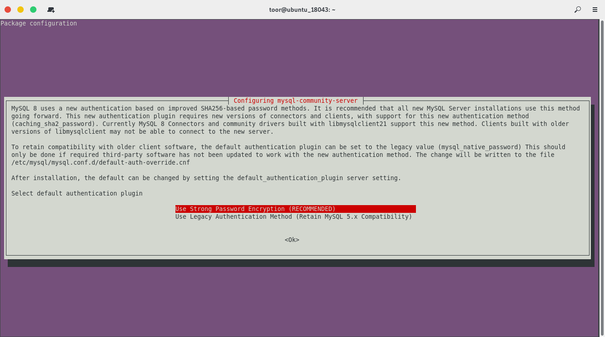
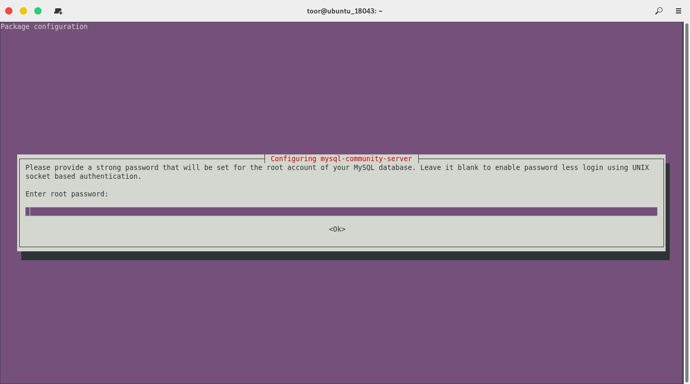
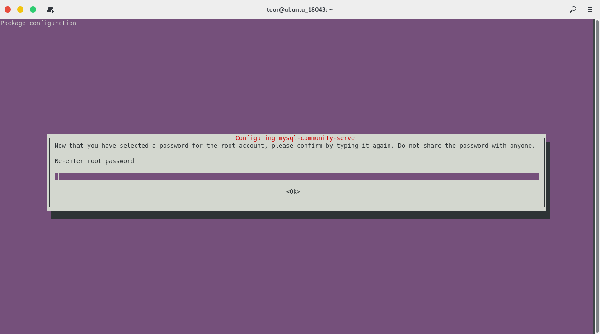

# Install MySQL-8.x on Ubuntu-18.04


### Cập nhật OS, cài đặt repository và các gói bổ trợ

```
$ sudo apt-get update -y
$ sudo apt-get install -y apt-utils wget git byobu
```


### Thêm repository chính thức của MySQL-8.x và cập nhật lại OS
Để thêm repository chính thức của MySQL ta chạy các lệnh sau:

```
$ wget https://dev.mysql.com/get/mysql-apt-config_0.8.14-1_all.deb
$ sudo dpkg -i mysql-apt-config_0.8.14-1_all.deb
```

Sau khi chạy lệnh, một bảng tùy chọn hiện ra cho phép ta lựa chọn repository cho phiên bản mà ta muốn cài và một số tùy chọn khác, mặc định sẽ là phiên bản mới nhất. ta lựa chọn phiên bản 8.x phù hợp và chon `Ok`.



Sau đó một bảng tùy chọn nữa hiện ra cho phép ta lựa chọn phương thức xác thực, Ở đây ta chọn phương thức xác thực được recommended.



Sau đó ta cần cập nhật lại hệ thống

```
$ apt-get update -y
```


### Cài đặt MySQL-8.x
Thực hiện cài đặt MySQL-8.x

```
$ sudo apt-get install -y mysql-community-server
```

Trong quá trình cài đặt MySQL, một bảng tùy chọn hiện ra cho phép ta đặt mật khẩu cho tài khoản `root`, ta sẽ lần lượt nhập mật khẩu và xác nhận lại mật khẩu hoặc có thể ấn `Enter` để bỏ qua vì ta có thể đặt mật khẩu ở các bước sau.






### Khởi động MySQL và bật MySQL khởi động cùng hệ thống
Khởi động MySQL và cho phép MySQL khởi động cùng hệ thống

```
$ sudo systemctl enable mysql
$ sudo systemctl start mysql
```

Kiểm tra trạng thái và phiên bản của MySQL

```
$ sudo systemctl status mysql
$ mysql -V
```

Ta có kết quả như sau:

```
$ sudo systemctl status mysql
● mysql.service - MySQL Community Server
   Loaded: loaded (/lib/systemd/system/mysql.service; enabled; vendor preset: enabled)
   Active: active (running) since Sun 2019-12-01 04:28:08 UTC; 3min 38s ago
     Docs: man:mysqld(8)
           http://dev.mysql.com/doc/refman/en/using-systemd.html
 Main PID: 3448 (mysqld)
   Status: "Server is operational"
    Tasks: 38 (limit: 1081)
   CGroup: /system.slice/mysql.service
           └─3448 /usr/sbin/mysqld

Dec 01 04:28:07 ubuntu_18043 systemd[1]: Starting MySQL Community Server...
Dec 01 04:28:08 ubuntu_18043 systemd[1]: Started MySQL Community Server.
$ mysql -V
mysql  Ver 8.0.18 for Linux on x86_64 (MySQL Community Server - GPL)
```


### Mở firewall cho phép kết nối MySQL từ xa

```
$ sudo ufw allow mysql
$ sudo ufw reload
```


### Thiết lập bảo mật lần đầu cho MySQL

Sau khi cài đặt ta cần thiết lập bảo mật cho MySQL nhằm giúp MySQL an toàn hơn, Để thiệt lập bảo mật cho MySQL ta chạy lệnh `mysql_secure_installation`, một lệnh được tích hợp sẵn để thực hiện các cài đặt bảo mật.

Sau khi thực hiện lệnh kết quả sẽ tương tự như dưới đây:

```
$ sudo mysql_secure_installation
[sudo] password for toor: 

Securing the MySQL server deployment.

Enter password for user root: 

VALIDATE PASSWORD COMPONENT can be used to test passwords
and improve security. It checks the strength of password
and allows the users to set only those passwords which are
secure enough. Would you like to setup VALIDATE PASSWORD component?

Press y|Y for Yes, any other key for No: Y

There are three levels of password validation policy:

LOW    Length >= 8
MEDIUM Length >= 8, numeric, mixed case, and special characters
STRONG Length >= 8, numeric, mixed case, special characters and dictionary                  file

Please enter 0 = LOW, 1 = MEDIUM and 2 = STRONG: 2
Using existing password for root.

Estimated strength of the password: 0 
Change the password for root ? ((Press y|Y for Yes, any other key for No) : Y

New password: 

Re-enter new password: 

Estimated strength of the password: 100 
Do you wish to continue with the password provided?(Press y|Y for Yes, any other key for No) : Y
By default, a MySQL installation has an anonymous user,
allowing anyone to log into MySQL without having to have
a user account created for them. This is intended only for
testing, and to make the installation go a bit smoother.
You should remove them before moving into a production
environment.

Remove anonymous users? (Press y|Y for Yes, any other key for No) : Y
Success.


Normally, root should only be allowed to connect from
'localhost'. This ensures that someone cannot guess at
the root password from the network.

Disallow root login remotely? (Press y|Y for Yes, any other key for No) : Y
Success.

By default, MySQL comes with a database named 'test' that
anyone can access. This is also intended only for testing,
and should be removed before moving into a production
environment.


Remove test database and access to it? (Press y|Y for Yes, any other key for No) : Y
 - Dropping test database...
Success.

 - Removing privileges on test database...
Success.

Reloading the privilege tables will ensure that all changes
made so far will take effect immediately.

Reload privilege tables now? (Press y|Y for Yes, any other key for No) : Y
Success.

All done! 
```

Trong đó:
- Tại dòng `Enter password for user root: ` yêu cầu ta nhập mật khẩu của tài khoản `root` (Tài khoản `root` trong quản trị cơ sở dữ liệu, không phải tài khoản `root` hệ thống), ở đây ta nhập mật khẩu đã đặt khi cài đặt MySQL, nếu bạn không đặt mật khẩu ở bước đó thì ấn `Enter` để bỏ qua.

- 
   ```
   VALIDATE PASSWORD PLUGIN can be used to test passwords
   and improve security. It checks the strength of password
   and allows the users to set only those passwords which are
   secure enough. Would you like to setup VALIDATE PASSWORD plugin?

   Press y|Y for Yes, any other key for No: 
   ```
   Sau khi nhập mật khẩu cho tài khoản `root` một thông báo hiện ra cho ta lữa chọn sử dụng `VALIDATE PASSWORD PLUGIN`, một chức năng tích hợp để kiểm tra mức độ an toàn của mật khẩu, để sử dụng ta ấn `Y` và phím bất kỳ để bỏ qua. Nếu ta chọn `Y` một thông báo khác hiện ta cho ta chọn 3 cấp độ bảo mật của mật khẩu:
   ```
   There are three levels of password validation policy:

   LOW    Length >= 8
   MEDIUM Length >= 8, numeric, mixed case, and special characters
   STRONG Length >= 8, numeric, mixed case, special characters and dictionary                  file

   Please enter 0 = LOW, 1 = MEDIUM and 2 = STRONG: 2
   ```
   Ở đây ta chọn cấp độ phù hợp và ấn `Enter`.

- Tiếp theo do ta vừa bật chức năng kiểm tra mật khẩu ở trên, một thông báo hiện ra cho ta biết độ an toàn của mật khẩu hiện có và cho phép ta thay đổi mật khẩu, để đổi mật khẩu ta ấn `Y` và phím bất kỳ để bỏ qua. Nếu ta ấn `Y` ta cần lần lượt nhập mật khẩu mới và xác nhận mật khẩu tại dòng `New password: ` và `Re-enter new password: `.

- 
   ```
   Estimated strength of the password: 100 
   Do you wish to continue with the password provided?(Press y|Y for Yes, any other key for No) : 
   ```
   Cho ta biết độ an toàn của mật khẩu mà ta vừa đặt và yêu cầu ta xác nhận thay đổi mật khẩu. ta ấn `Y` để xác nhận thay đổi và phím bất kỳ để bỏ qua.

- Tại dòng `Remove anonymous users? (Press y|Y for Yes, any other key for No) : ` cho phép ta xóa tài khoản `anonymous`, `anonymous` là tài khoản mặc định ngay từ khi cài đặt MySQL. Để xóa `anonymous` user ta ấn `Y` và phím bất kỳ để bỏ qua.

- Tại dòng `Disallow root login remotely? (Press y|Y for Yes, any other key for No) : ` cho phép ta vô hiệu hóa tính năng đăng nhập từ xa đối với tài khoản `root`. Để vô hiệu hóa ta ấn `Y` và phím bất kỳ để bỏ qua.

- Tại dòng `Remove test database and access to it? (Press y|Y for Yes, any other key for No) : ` cho phép ta xóa cơ sở dữ liệu `test`, một cơ sở dữ liệu được tạo mặc định ngay từ khi cài đặt MySQL. Để xóa ta ấn `Y` và phím bất kỳ để bỏ qua.

- Tại dòng `Reload privilege tables now? (Press y|Y for Yes, any other key for No) : ` ta ấn `Y` để Reload privilege nhằm áp dụng các cấu hình ta vừa đặt ở trên.

Cuối cùng ta đăng nhập bằng tài khoản `root` và thực hiện thử truy vấn SQL đơn giản để kiểm tra.

Để đăng nhập ta thực hiện lệnh `mysql -u root -p`, khi được hỏi mật khẩu ta cần nhập mật khẩu đã được cấu hình ở bước trên, kết quả sẽ như sau:

```
$ mysql -u root -p
Enter password: 
Welcome to the MySQL monitor.  Commands end with ; or \g.
Your MySQL connection id is 10
Server version: 8.0.18 MySQL Community Server - GPL

Copyright (c) 2000, 2019, Oracle and/or its affiliates. All rights reserved.

Oracle is a registered trademark of Oracle Corporation and/or its
affiliates. Other names may be trademarks of their respective
owners.

Type 'help;' or '\h' for help. Type '\c' to clear the current input statement.

mysql>
```

Tiếp theo ở dấu nhắc lệnh của MySQL ta có thể thực hiện các truy vấn SQL để kiểm tra nó có hoạt động không:

```
mysql> show databases;
+--------------------+
| Database           |
+--------------------+
| information_schema |
| mysql              |
| performance_schema |
| sys                |
+--------------------+
4 rows in set (0.02 sec)

mysql> select host, user from mysql.user;
+-----------+------------------+
| host      | user             |
+-----------+------------------+
| localhost | mysql.infoschema |
| localhost | mysql.session    |
| localhost | mysql.sys        |
| localhost | root             |
+-----------+------------------+
4 rows in set (0.00 sec)

mysql> 
```


### Thiết lập cho phép đăng nhập MySQL từ xa
Khi có nhu cầu đăng nhập và sử dụng MySQL trên các hệ thống khác như các công cụ quản trị database hoặc đăng nhập từ xa, ta cần cấu hình để cấp quyền truy cập cho tài khoản mà ta muốn đăng nhập. Để thực hiện ta cần truy cập vào MySQL và chạy các lệnh sau:

```
mysql> CREATE USER 'root'@'%' IDENTIFIED BY 'P@ssw0rd';

mysql> GRANT ALL PRIVILEGES ON *.* TO 'root'@'%' WITH GRANT OPTION;

mysql> FLUSH PRIVILEGES;
```

Kết quả sẽ như sau:

```
mysql> CREATE USER 'root'@'%' IDENTIFIED BY 'P@ssw0rd';
Query OK, 0 rows affected (0.03 sec)

mysql> GRANT ALL PRIVILEGES ON *.* TO 'root'@'%' WITH GRANT OPTION;
Query OK, 0 rows affected (0.02 sec)

mysql> FLUSH PRIVILEGES;
Query OK, 0 rows affected (0.01 sec)

mysql> 
```