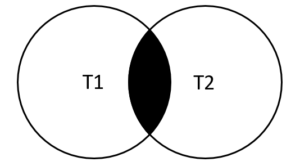
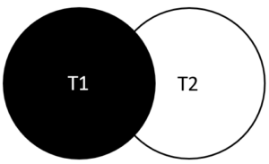

# JOINING TABLES


## COLUMN ALIAS

### Chức năng
Đôi khi các tên cột thực tế có thể dài và bị trùng lặp vì vậy đặt bí danh cho cột sẽ là một ý tưởng tốt.


### Cú pháp

```SQL
SELECT 
   [column_1 | expression] AS descriptive_name
FROM table_name;
```


### Ví dụ

```SQL
SELECT
    CONCAT_WS(', ', lastName, firstname) AS `Full name`
FROM
    employees
ORDER BY
    `Full name`;
```


### Lưu ý
- Có thể sử dụng `column alias` trong mệnh đề `ORDER BY`, `GROUP BY` và `HAVING`
- Không thể sử dụng `column alias` trong mệnh đề `WHERE`
- Khi bí danh có khoảng trắng phải bao chúng trong ngặc


## TABLE ALIAS

### Chức năng
Cũng giống như column alias để đặt một bí danh khác cho bảng


### Cú pháp

```SQL	
table_name AS table_alias
```


### Ví dụ

```SQL
SELECT 
    e.firstName, 
    e.lastName
FROM
    employees e
ORDER BY e.firstName;
```


### Lưu ý
- Thường được sử dụng trong mệnh đề `INNER JOIN`, `LEFT JOIN`, `RIGHT JOIN` và các truy vấn con
- Sử dụng khi hai bảng có cùng tên column, nó làm cho câu truy vấn ngắn gọn hơn


## INNER JOIN

### Chức năng
`INNER JOIN` khớp từng hàng trong bảng này với hàng trong bảng khác và cho phép truy vấn các cột từ cả hai bảng.


### Cú pháp

```SQL
SELECT
    select_list
FROM t1
INNER JOIN t2 ON join_condition1
INNER JOIN t3 ON join_condition2
...;
```

Dưới đây là mô hình minh họa cách INNER JOIN hoạt động:




### Ví dụ

```SQL
SELECT 
    productCode, 
    productName, 
    textDescription
FROM
    products t1
INNER JOIN productlines t2 
    ON t1.productline = t2.productline;
```

Vì hai bảng có cùng tên cột nên ta có thể sử dụng `USING` sẽ ngắn gọn hơn:

```SQL
SELECT 
    productCode, 
    productName, 
    textDescription
FROM
    products
INNER JOIN productlines USING (productline);
```

JOIN nhiều bảng:

```SQL
SELECT 
    orderNumber,
    status,
    SUM(quantityOrdered * priceEach) total
FROM
    orders
INNER JOIN orderdetails USING (orderNumber)
GROUP BY orderNumber;
```

Ngoài toán tử `=` để làm điều kiện kết nối các bảng, ta còn có thể sử dụng các toán tử khác như `<`, `>`, `<>`:

```SQL
SELECT 
    orderNumber, 
    productName, 
    msrp, 
    priceEach
FROM
    products p
INNER JOIN orderdetails o 
   ON p.productcode = o.productcode
      AND p.msrp > o.priceEach
WHERE
    p.productcode = 'S10_1678';
```


### Lưu ý
- Thường JOIN hai bảng có quan hệ khóa ngoại với nhau


## LEFT JOIN

### Chức năng
Tương tự như `INNER JOIN`, nhưng khi kết nối hai bảng, nếu dữ liệu không khớp với bảng `RIGHT` thì các cột đó sẽ có giá trị `NULL`.


### Cú pháp

```SQL
SELECT 
    select_list
FROM
    t1
LEFT JOIN t2 ON 
    join_condition;
```

Dưới đây là mô hình minh họa cách LEFT JOIN hoạt động:




### Ví dụ

```SQL
SELECT 
    customers.customerNumber, 
    customerName, 
    orderNumber, 
    status
FROM
    customers
LEFT JOIN orders ON 
    orders.customerNumber = customers.customerNumber;
```

Ví dụ tìm kiếm các khách hàng không có đơn hàng:

```SQL
SELECT 
    c.customerNumber, 
    c.customerName, 
    o.orderNumber, 
    o.status
FROM
    customers c
LEFT JOIN orders o 
    ON c.customerNumber = o.customerNumber
WHERE
    orderNumber IS NULL;
```

Kết nối ba bảng với nhau:

```SQL
SELECT 
    lastName, 
    firstName, 
    customerName, 
    checkNumber, 
    amount
FROM
    employees
LEFT JOIN customers ON 
    employeeNumber = salesRepEmployeeNumber
LEFT JOIN payments ON 
    payments.customerNumber = customers.customerNumber
ORDER BY 
    customerName, 
    checkNumber;
```

Sử dụng điều kiện trong `ON`:

```SQL
SELECT 
    o.orderNumber, 
    customerNumber, 
    productCode
FROM
    orders o
LEFT JOIN orderDetails d 
    ON o.orderNumber = d.orderNumber AND 
       o.orderNumber = 10123;
```

### Lưu ý
...


## RIGHT JOIN

### Chức năng
Tương tự như `LEFT JOIN`, nhưng khi kết nối hai bảng, nếu dữ liệu không khớp với bảng `LEFT` thì các cột đó sẽ có giá trị `NULL`.


### Cú pháp

```SQL
SELECT 
    select_last
FROM t1
RIGHT JOIN t2 ON 
    join_condition;
```


### Ví dụ

```SQL
SELECT 
    employeeNumber, 
    customerNumber
FROM
    customers
RIGHT JOIN employees 
    ON salesRepEmployeeNumber = employeeNumber
ORDER BY 
    employeeNumber;
```


### Lưu ý
- Thường JOIN hai bảng có quan hệ khóa ngoại với nhau
- `RIGHT OUTER JOIN` là một từ đồng nghĩa cho `RIGHT JOIN`


## CROSS JOIN

### Chức năng
Kết hợp hai bảng lại với nhau, mỗi hàng trong bảng này sẽ lần lượt kết hợp với từng hàng trong bảng kia, dẫn đến nếu bảng 1 có `n` row và bảng 2 có `m` row thì sau khi kết hợp sẽ có `nxm` row.


### Cú pháp

```SQL
SELECT * FROM t1
CROSS JOIN t2;
```


### Ví dụ

```SQL
SELECT 
    store_name, product_name
FROM
    stores AS a
CROSS JOIN
    products AS b;
```


### Lưu ý
- Khác với mệnh đề `INNER JOIN`,  `LEFT JOIN` và `RIGHT JOIN`, mệnh đê `CROSS JOIN` không có mệnh đề `ON` hoặc `USING`.


## SELF JOIN

### Chức năng
Kết nối bảng và với chính nó, nhằm mục đích so sánh dữ liệu giữa các bản ghi hoặc tạo ra cái nhìn tổng quan về quan hệ giữa các bản ghi.


### Cú pháp

`NO`

### Ví dụ

Kết hợp với `INER JOIN` liệt kê quản lý của nhân viên:

```SQL
SELECT 
    CONCAT(m.lastName, ', ', m.firstName) AS Manager,
    CONCAT(e.lastName, ', ', e.firstName) AS 'Direct report'
FROM
    employees e
INNER JOIN employees m ON 
    m.employeeNumber = e.reportsTo
ORDER BY 
    Manager;
```

Kết hợp với `LEFT JOIN`:

```SQL
SELECT 
    IFNULL(CONCAT(m.lastname, ', ', m.firstname),
            'Top Manager') AS 'Manager',
    CONCAT(e.lastname, ', ', e.firstname) AS 'Direct report'
FROM
    employees e
LEFT JOIN employees m ON 
    m.employeeNumber = e.reportsto
ORDER BY 
    manager DESC;
```

Ví dụ khác:

```SQL
SELECT 
    c1.city, 
    c1.customerName, 
    c2.customerName
FROM
    customers c1
INNER JOIN customers c2 ON 
    c1.city = c2.city
    AND c1.customername > c2.customerName
ORDER BY 
    c1.city;
```

### Lưu ý
...