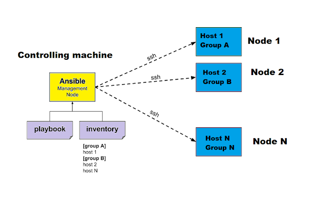

# 2.Kiến trúc và Workflow của Ansible

# 2.1.Kiến trúc Ansible


\- Ansible gồm 2 loại servers:
- Control machine
- Nodes Client

**Control machine** giao tiếp với **Nodes** bằng giao thức SSH, và truyền tất cả các câu lệnh được cung cấp bởi controller machine đến **Nodes Client**.  

## 2.2.Ansible Workflow
### 2.2.1.Workflow tổng quát
\- Bước 1: Ansible sẽ thực hiện kết nối SSH song song tới tất cả các **Nodes Client**.  
\- Bước 2: Sau đó, nó sẽ thực hiện từng công việc trên danh sách công việc đồng thời trên tất cả các **Nodes Client**. 

### 2.2.1.Ví dụ Workflow trong trường hợp cụ thể
\- Mục tiêu: Cấu hình `web server` trên `Centos7` chạy `httpd`.  
\- Chúng ta viết một `playbook` là `webservers.yml`. Một `playbook` mô tả đó là hosts để cấu hình, và một danh sách được công việc được thực hiện trên nhiều hosts. Ví dụ ở đây chúng ta cài đặt `web1`, `web2` và `web3`, và công việc cụ thể là:  
- Cài đặt httpd
- Tạo ra một file cấu hình httpd
- Bắt đầu httpd service

Ví dụ công việc đầu tiên sẽ là cài đặt `httpd`.  
```
name: install httpd
yum: name=httpd
```

\- Ansible sẽ:
- Bước 1: Thực hiện kết nối SSH song song tới `web1`, `web2` và `web3`.
- Bước 2: Tạo ra một script bằng Python dùng để cài đặt package `httpd`.
- Bước 3: Copy script tới web1, web2, web3
- Bước 4: Thực thi script trên web1, web2, web3.
- Bước 5: Chờ cho script thực thi hoàn tất trên tất cả các hosts.
- Bước 6: Ansible sau đó sẽ di chuyển tới công việc tiếp theo trong list, và quay lại **Bước 1**.

\- Những chú ý quan trọng:
- Ansible chạy mỗi công việc song song trên tất cả các hosts.
- Ansible chờ tới khi tới cả hosts đã hoàn tất công việc trước khi chuyển tiếp đến công việc mới trong list.
- Ansible chạy những công việc đã được xác định rõ ràng trong order list.


