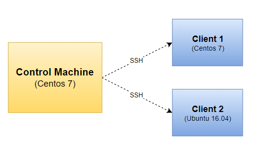

# 3.Cài đặt Ansible trên Centos 7.5.18.04

# MỤC LỤC
  - [3.1.Mô hình](#31mô-hình)
  - [3.2.Yêu cầu](#32yêu-cầu)
    - [3.1.1.Yêu cầu Control Machine](#311yêu-cầu-control-machine)
    - [3.1.2.Yêu cầu Managed Node](#312yêu-cầu-managed-node)
  - [3.3.Cài đặt](#33cài-đặt)
    - [3.3.1.Cài đặt Control Machine trên Centos 7.5.18.04](#331cài-đặt-control-machine-trên-centos-751804)
    - [3.3.2.Cài đặt trên các Managed Node](#332cài-đặt-trên-các-managed-node)
      - [a.Centos 7.5](#acentos-75)
      - [b.Ubuntu 16.04](#bubuntu-1604)


## 3.1.Mô hình


## 3.2.Yêu cầu
### 3.1.1.Yêu cầu Control Machine
\- Hiện nay (16/10/2018), Ansible có thể chạy từ bất kỳ máy với Python 2 (phiển bản 2.7) hoặc Python 3 (phiên bản 3.5 hoặc cao hơn) được cài đặt. Điều này bao gồm Ret Hat, Debian, CentosOS, macOS, bất kỳ BSDs,...  
Windows không được hỗ trợ cho **control machine**.  

### 3.1.2.Yêu cầu Managed Node
\- Trên các **managed nodes**, bạn cần một con đường để giao tiếp, thường là ssh. Theo mặc định, trình này sử dụng `sftp`. Nếu không có sẵn, bạn có thể chuyển sang dùng `scp` trong `ansible.cfg`.  
\- Bạn cần cài đặt Python 2 (phiên bản 2.5 hoặc mới hơn) hoặc Python 3 (phiên bản 3.5 hoặc mới hơn).  

> Chú ý:  
Đối với Centos, bạn cần vô hiệu hóa SELinux.  

## 3.3.Cài đặt
### 3.3.1.Cài đặt Control Machine trên Centos 7.5.18.04
\- Thực hiện cài đặt Python 2.7, thực hiện lệnh:  
```
yum update
yum install python
```

Sau khi cài đặt, thực hiện lệnh để kiểm tra phiên bản python:  
```
[root@ansible ~]# python --version
Python 2.7.5
```

\- Cài Ansible, thực hiện lệnh:  
```
yum install ansible
```

Sau khi cài đặt xong thực hiện lệnh sau để kiểm tra phiên bản của **Ansible**:  
```
[root@ansible ~]# ansible --version
ansible 2.4.2.0
  config file = /etc/ansible/ansible.cfg
  configured module search path = [u'/root/.ansible/plugins/modules', u'/usr/share/ansible/plugins/modules']
  ansible python module location = /usr/lib/python2.7/site-packages/ansible
  executable location = /usr/bin/ansible
  python version = 2.7.5 (default, Jul 13 2018, 13:06:57) [GCC 4.8.5 20150623 (Red Hat 4.8.5-28)]
```

Vậy ở, mình đã cài phiên bản `Ansible 2.4.2.0`.  

### 3.3.2.Cài đặt trên các Managed Node
\- Phía Client không cài đặt ansible, chỉ cần cài đặt:
- Python
- SSH server: cho phép SSH dạng text hoặc sử dụng ssh-key.  

#### a.Centos 7.5
\- Thực hiện cài đặt Python 2.7, thực hiện lệnh:  
```
yum update
yum install python
```

Sau khi cài đặt, thực hiện lệnh để kiểm tra phiên bản python:  
```
[root@centos-test ~]# python --version
Python 2.7.5
```

\- Cài đặt SSH server, thực hiện lệnh:  
```
yum install openssh-server
```

#### b.Ubuntu 16.04
\- Thực hiện cài đặt Python 2.7, thực hiện lệnh:  
```
apt update
apt-get install python-minimal
```

Sau khi cài đặt, thực hiện lệnh để kiểm tra phiên bản python:  
```
root@ubuntu-test:~# python --version
Python 2.7.12
```

\- Cài đặt SSH server, thực hiện lệnh:  
```
apt install openssh-server
```


