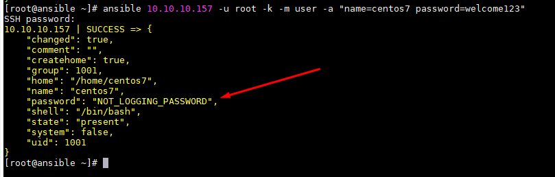
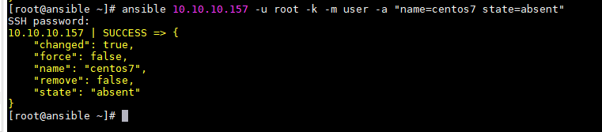
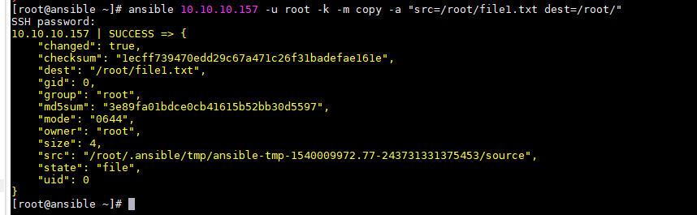
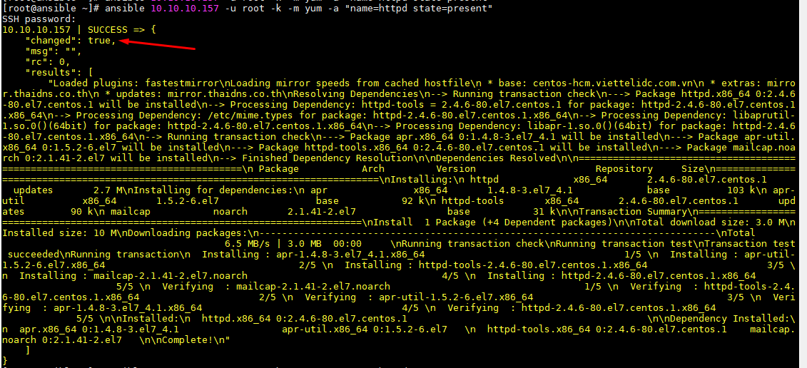
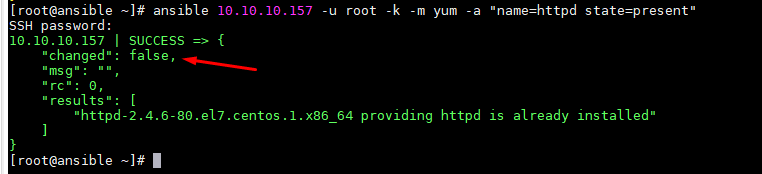
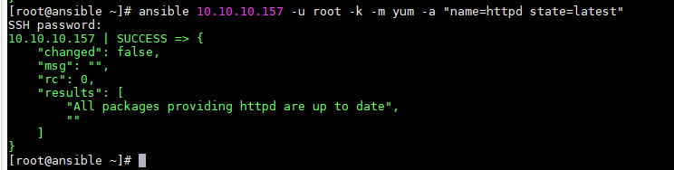
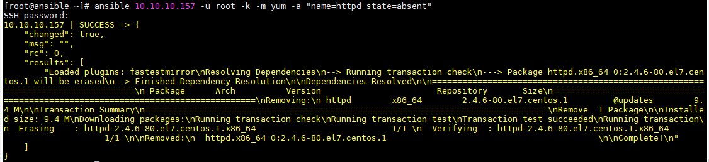

# 5.Lệnh ansible


# MỤC LỤC


## 4.1.Lệnh ansible
\- Tham khảo: https://docs.ansible.com/ansible/2.7/cli/ansible.html  
\- Mô tả: Thực thi lệnh trên remote host.  
### 4.1.1.Cú pháp
```
ansible <host-pattern> [options]
```

### 4.1.2.Tùy chọn
\- Tùy chọn tham khảo:  
https://docs.ansible.com/ansible/2.7/cli/ansible.html  

Một số tùy chọn hay dùng:
- `-i, --inventory`: chỉ định đường dẫn inventory host hoặc comma separated host list. Nếu không chỉ định, mặc định sử dụng file `/etc/ansible/hosts`.  
- `--private-key, --key-file`: sử dụng SSH key để xác thực kết nối. Nếu không chỉ mặc định `-i` hoặc `--private-key` thì mặc định sử dụng `--private-key`
- `-u <REMOTE_USER>, --user <REMOTE_USER>`: kết nối sử dụng người dùng này (`default=None`)
- `-k, --ask-pass`: hỏi mật khẩu khi kết nối. Ansible sử dụng `sshpass`
- `-m <MODULE_NAME>, --module-name <MODULE_NAME>`: tên module để thực thi (`default=command`)
- `-a <MODULE_ARGS>, --args <MODULE_ARGS>`: module arguments


### 4.1.3.Modules
\- Có khoảng 450+ modules được sử dụng trong Ansible.  
\- Tham khảo:  
https://docs.ansible.com/ansible/2.7/modules/modules_by_category.html  

#### 4.1.3.1.Module Commands
\- Thực thi lệnh trên remote host.  
\- Sử dụng `-m command` hoặc `-m shell`.  
\- VD:  
```
ansible all -u root --private-key .ssh/id_rsa -m command -a "ping -c 3 google.com"
```

#### 4.1.3.2.Modules System
##### a.ping
\- Kiểm tra kết nối giữa **Note Ansible Management** và **Node Client**.  
\- Sử dụng `-m ping`.  
\- VD:  
```
ansible all -u root -k -m ping
```

##### b.setup
\- Module này cung cấp cho bạn thông tin về phần cứng server, mạng và một số cài đặt phần mềm liên quan đến ansible.  
\- Sử dụng `-m setup`.  
\- VD1: Hiển thị tất cả các thông tin ở remote host  
```
ansible "10.10.10.157" -u root -m setup
```

Sử dụng tùy chọn filter để lọc ra các thông tin cần thiết, ví dụ dưới lọc ra thông tin về địa chỉ IPv4 của remote host:  
```
[root@ansible ~]# ansible "10.10.10.157" -u root -m setup -a 'filter=ansible_all_ipv4_addresses'
10.10.10.157 | SUCCESS => {
    "ansible_facts": {
        "ansible_all_ipv4_addresses": [
            "10.10.10.157"
        ]
    },
    "changed": false
}
```

\- VD2: Xem thông tin CPU  
```
[root@ansible ~]# ansible "10.10.10.157" -u root -m setup -a 'filter=ansible_processor_vcpus'
10.10.10.157 | SUCCESS => {
    "ansible_facts": {
        "ansible_processor_vcpus": 2
    },
    "changed": false
}
```

\- VD3: Xem thông tin RAM  
```
[root@ansible ~]# ansible "10.10.10.157" -u root -m setup -a 'filter=ansible_memory_mb'
10.10.10.157 | SUCCESS => {
    "ansible_facts": {
        "ansible_memory_mb": {
            "nocache": {
                "free": 1676,
                "used": 162
            },
            "real": {
                "free": 1417,
                "total": 1838,
                "used": 421
            },
            "swap": {
                "cached": 0,
                "free": 2047,
                "total": 2047,
                "used": 0
            }
        }
    },
    "changed": false
}
```

##### c.user - Manage user accounts
\- Tạo, xóa user trên remote host.  
\- Sử dụng `-m user`.  
\- VD`: Tạo user `centos7` với password `welcome123` trên remote host `10.10.10.157`:  
```
ansible 10.10.10.157 -u root -k -m user -a "name=centos7 password=welcome123"
```



Dòng `"password": "NOT_LOGGING_PASSWORD",` ý nói user này không đăng nhập được bằng cách sử dụng mật khẩu.  

Nếu user `centos7` đã tồn tại trên remote host, thì sẽ bỏ qua mọi thay đổi với user `centos7`.  
\- VD2: Xóa user `centos7` trên remote host `10.10.10.157`:  
```
ansible 10.10.10.157 -u root -k -m user -a "name=centos7 state=absent"
```



#### 4.1.3.3.Modules Files
##### a.Module copy
\- Truyển file một cách an toàn đến nhiều remote server cùng một lúc.  
\- Sử dụng `-m copy`.  
\- VD1: Copy file `/root/file1.txt` trên node `ansible` đến thư mục `/root/` trên node `client`:  
```
ansible 10.10.10.157 -u root -k -m copy -a "src=/root/file1.txt dest=/root/"
```



#### b.Module file
\- Tạo xóa file, thư mục; thay đổi permission, người dùng và nhóm sở hữu file.  
\- Sử dụng `-m file`.  
\- VD1: Thay đổi permission, người dùng và nhóm sở hữu file `file1.txt`:  
```
[root@ansible ~]# ansible 10.10.10.157 -u root -k -m file -a "dest=/root/file1.txt mode=600 owner=centos group=centos"
SSH password:
10.10.10.157 | SUCCESS => {
    "changed": true,
    "gid": 1000,
    "group": "centos",
    "mode": "0600",
    "owner": "centos",
    "path": "/root/file1.txt",
    "size": 4,
    "state": "file",
    "uid": 1000
}
```

\- VD2: Thay đổi permission, người dùng và nhóm sở hữu thư mục `test`:  
```
ansible 10.10.10.157 -u root -k -m file -a "dest=/root/test mode=600 owner=centos group=centos"
```

\- VD3: Tạo thư mục `folder1`:  
```
[root@ansible ~]# ansible 10.10.10.157 -u root -k -m file -a "dest=/root/folder1 mode=600 owner=centos group=centos state=directory"
SSH password:
10.10.10.157 | SUCCESS => {
    "changed": true,
    "gid": 1000,
    "group": "centos",
    "mode": "0600",
    "owner": "centos",
    "path": "/root/folder1",
    "size": 6,
    "state": "directory",
    "uid": 1000
}
```

\- VD4: Xóa thư mục `folder1`:  
```
[root@ansible ~]# ansible 10.10.10.157 -u root -k -m file -a "dest=/root/folder1 state=absent"
SSH password:
10.10.10.157 | SUCCESS => {
    "changed": true,
    "path": "/root/folder1",
    "state": "absent"
}
```

\- VD5: Tạo thư mục `file1.txt`:  
```
[root@ansible ~]# ansible 10.10.10.157 -u root -k -m file -a "dest=/root/file1.txt mode=600 owner=centos group=centos state=touch"
SSH password:
10.10.10.157 | SUCCESS => {
    "changed": true,
    "dest": "/root/file1.txt",
    "gid": 1000,
    "group": "centos",
    "mode": "0600",
    "owner": "centos",
    "size": 0,
    "state": "file",
    "uid": 1000
}
```

\- VD6: Xóa file `file1.txt`:  
```
[root@ansible ~]# ansible 10.10.10.157 -u root -k -m file -a "dest=/root/file1.txt state=absent"
SSH password:
10.10.10.157 | SUCCESS => {
    "changed": true,
    "path": "/root/file1.txt",
    "state": "absent"
}
```

#### 4.1.3.4.Modules Package
##### a.yum
\- Installs, upgrade, downgrades, removes, và liệt kê packages và groups với yum package manager.  
Module này chỉ làm trên Python 2. Nếu bạn yêu cầu hỗ trợ Python 3, xem `dnf` module.  
\- Sử dụng `-m yum`.  
\- VD:  
- VD1: Cài `httpd` trên remote host:  
```
ansible 10.10.10.157 -u root -k -m yum -a "name=httpd state=present"
```



Nếu bạn chú ý, bạn có thể thấy rằng, khi tôi thực thi lệnh ansible để cài đặt gói lần đầu tiên, biến 'changed' là 'true' có nghĩa là lệnh này đã cài đặt gói. Nhưng khi tôi chạy lệnh đó một lần nữa, nó báo cáo biến 'changed' là 'false' có nghĩa là lệnh đã được kiểm tra để cài đặt gói và nó đã được cài đặt, vì vậy không có gì được thực hiện trên remote server đó.  



- VD2: Upgrade `httpd` trên remote host:  
```
ansible 10.10.10.157 -u root -k -m yum -a "name=httpd state=latest"
```



- VD3: Xóa `httpd` trên remote host:  
```
ansible 10.10.10.157 -u root -k -m yum -a "name=httpd state=absent"
```



#### 4.1.3.4.Modules Service
\- Tham khảo: https://docs.ansible.com/ansible/2.7/modules/service_module.html  
\- Điều khiển dịch vụ trên remote hosts.  
\- Sử dụng `-m service`.  
\- VD:
- VD1: Enable và start dịch vụ `httpd`:  
```
ansible 10.10.10.157 -u root -k -m service -a "name=httpd enabled=yes state=started"
```

- VD2: Disable và stop dịch vụ `httpd`:  
```
ansible 10.10.10.157 -u root -k -m service -a "name=httpd enabled=no state=stopped"
```

- VD3: Restart dịch vụ `httpd`:  
```
ansible 10.10.10.157 -u root -k -m service -a "name=httpd state=restarted"
```

### 4.1.4.Ví dụ
\- Trước tiên thực hiện lệnh, cấu hình trong file `/etc/ansible/hosts`.  
\- VD1: Thực hiện lệnh `ps aux` trên remote host `10.10.10.158`:  
```
ansible 10.10.10.158 -u root -k -m shell -a "ps aux"
```

Nhập mật khẩu host 10.10.10.157.  

**Chú ý:**  
Khi sử dụng ssh để thực hiện lệnh trên remote host, mặc định trên ansible server sẽ thực hiện `check host`, sau khi người dùng xác nhận host là đúng thì thông tin host đó được ghi vào file `<home_user>/.ssh/known_hosts`.  
Vì vậy nên trước khi bạn thực hiện lệnh `ansible`, bạn cần bỏ qua quá trình `check host`, bằng cách thêm nội dung sau vào file `<home_user>.ssh/config`:  
```
Host *
	StrictHostKeyChecking no
	UserKnownHostsFile /dev/null
```

\- VD2: Thực hiện lệnh `ps aux` trên remote host `10.10.10.157` và `10.10.10.158`:  
```
ansible "10.10.10.157 10.10.10.158" -u root -k -m shell -a "ps aux"
```

Nhập 1 mật khẩu cho cả 2 host. (2 host phải cùng mật khẩu).  

\- VD3: Thực hiện lệnh `ps aux` trên tất cả các remote host được cấu hình trong file `/etc/ansible/hosts`:  
```
[root@ansible ~]# ansible all -u root -k -m shell -a "ping -c 3 google.com"
SSH password:
10.10.10.158 | SUCCESS | rc=0 >>
PING google.com (172.217.161.142) 56(84) bytes of data.
64 bytes from hkg12s17-in-f14.1e100.net (172.217.161.142): icmp_seq=1 ttl=51 time=32.8 ms
64 bytes from hkg12s17-in-f14.1e100.net (172.217.161.142): icmp_seq=2 ttl=51 time=36.9 ms
64 bytes from hkg12s17-in-f14.1e100.net (172.217.161.142): icmp_seq=3 ttl=51 time=33.2 ms

--- google.com ping statistics ---
3 packets transmitted, 3 received, 0% packet loss, time 2002ms
rtt min/avg/max/mdev = 32.867/34.377/36.993/1.869 ms

10.10.10.157 | SUCCESS | rc=0 >>
PING google.com (172.217.161.174) 56(84) bytes of data.
64 bytes from hkg07s29-in-f14.1e100.net (172.217.161.174): icmp_seq=1 ttl=53 time=38.5 ms
64 bytes from hkg07s29-in-f14.1e100.net (172.217.161.174): icmp_seq=2 ttl=53 time=38.8 ms
64 bytes from hkg07s29-in-f14.1e100.net (172.217.161.174): icmp_seq=3 ttl=53 time=38.2 ms

--- google.com ping statistics ---
3 packets transmitted, 3 received, 0% packet loss, time 2003ms
rtt min/avg/max/mdev = 38.224/38.544/38.874/0.349 ms
```

`all` là tất cả các remote host được cấu hình trong file `/etc/ansible/hosts`.  

\- VD4: Module `setup`  
```
[root@ansible ~]# ansible all -u root -k -m setup -a "filter=ansible_distribution*"
SSH password:
10.10.10.158 | SUCCESS => {
    "ansible_facts": {
        "ansible_distribution": "Ubuntu",
        "ansible_distribution_file_parsed": true,
        "ansible_distribution_file_path": "/etc/os-release",
        "ansible_distribution_file_variety": "Debian",
        "ansible_distribution_major_version": "16",
        "ansible_distribution_release": "xenial",
        "ansible_distribution_version": "16.04"
    },
    "changed": false
}
10.10.10.157 | SUCCESS => {
    "ansible_facts": {
        "ansible_distribution": "CentOS",
        "ansible_distribution_file_parsed": true,
        "ansible_distribution_file_path": "/etc/redhat-release",
        "ansible_distribution_file_variety": "RedHat",
        "ansible_distribution_major_version": "7",
        "ansible_distribution_release": "Core",
        "ansible_distribution_version": "7.5.1804"
    },
    "changed": false
}
```

\- VD5: Module `ping`  
```
[root@ansible ~]# ansible all -u root -k -m ping
SSH password:
10.10.10.158 | SUCCESS => {
    "changed": false,
    "ping": "pong"
}
10.10.10.157 | SUCCESS => {
    "changed": false,
    "ping": "pong"
}
```

\- VD6: Thực hiện lệnh trên remote host sử dụng SSH key (yêu cầu đã cài đặt SSH key trên Node Ansible Management và Node Client):  
```
ansible all -u root --private-key .ssh/id_rsa -m shell -a "ping -c 3 google.com"
```

\- VD7: Check trong file `hosts`, nhóm `[linux]` có những node client nào:  
```
[root@ansible ~]# ansible -i /etc/ansible/hosts linux --list-hosts
  hosts (2):
    10.10.10.157
    10.10.10.158
```

\- VD8: Xem kiến trức server, thông tin CPU, phiên bản python, memory, phiên bản OS,... bằng cách sử module `setup`. Chạy lệnh:  
```
ansible "10.10.10.157" -m setup -u root
```


