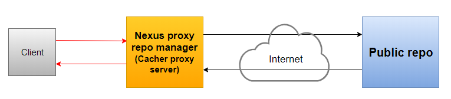

# 2.Cơ chế hoạt động của Nexus Repository Manager

## 2.1.Cơ chế hoạt động của Nexus Proxy Reposistory Manager

\- Khi **Client** yêu cầu tải package, **Client** sẽ gửi yêu cầu đến **Nexus proxy repo manager** (viết tắt là NXPRM), NXPRM sẽ kiểm tra xem trong nội dung cục bộ có package đó hay chưa?  
- Nếu có, **NXPRM** sẽ truyền package đó cho client.
- Nếu chưa có, **NXPRM** sẽ chuyển tiếp yêu cầu đến **remote repo**, package sẽ được lấy về **NXPRM** và lưu trữ cục bộ trong repo manager, tương tự như cache. Bất kỳ yêu cầu nào trong tương lai cho cùng một thành phần đều được đáp ứng từ bộ nhớ cục bộ.  

