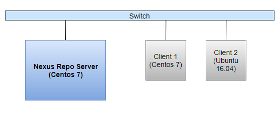
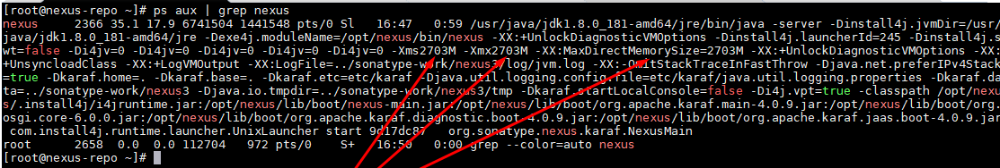
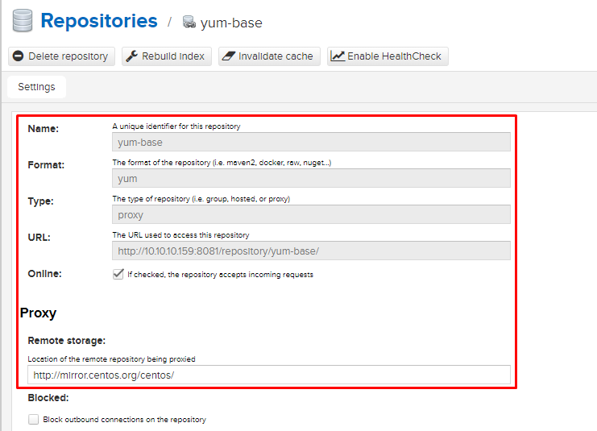
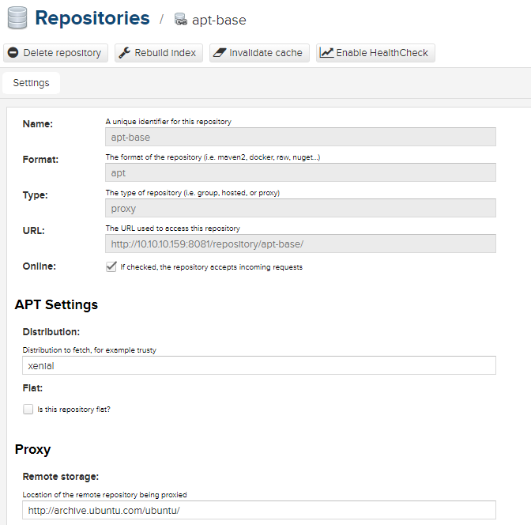

# 3.Cài đặt, cấu hình Nexus Repository Manager


# MỤC LỤC
  - [3.1.Mô hình](#31mô-hình)
  - [3.2.Yêu cầu hệ thống](#32yêu-cầu-hệ-thống)
    - [3.2.1.Yêu cầu CPU](#321yêu-cầu-cpu)
    - [3.2.2.Yêu cầu Memory](#322yêu-cầu-memory)
    - [3.2.3.Yêu cầu Disk](#323yêu-cầu-disk)
    - [3.2.4.yêu cầu File Handle Limits](#324yêu-cầu-file-handle-limits)
  - [3.3.Cài đặt Nexus Repo server](#33cài-đặt-nexus-repo-server)
    - [3.3.1.Cài đặt trước tiên](#331cài-đặt-trước-tiên)
    - [3.3.2.Cài đặt Java Runtime Environment](#332cài-đặt-java-runtime-environment)
    - [3.3.3.Cài đặt Nexus Repo 3.9](#333cài-đặt-nexus-repo-39)
    - [3.3.4.Chạy ứng dụng Nexus Repo như một Service](#334chạy-ứng-dụng-nexus-repo-như-một-service)
  - [3.4.Cấu hình Nexus Repo Manager](#34cấu-hình-nexus-repo-manager)
  - [3.5.Cài đặt plugin Nexus repository APT](#35cài-đặt-plugin-nexus-repository-apt)
  - [3.6.Cấu hình Client](#36cấu-hình-client)
    - [3.6.1.Cấu hình trên Centos 7](#361cấu-hình-trên-centos-7)
    - [3.6.2.Cấu hình trên Ubuntu 16.04](#362cấu-hình-trên-ubuntu-1604)


## 3.1.Mô hình


## 3.2.Yêu cầu hệ thống
\- Cài đặt Nexus Repo 3.9 trên Centos 7.5.1804.  
### 3.2.1.Yêu cầu CPU
Hiệu suất NXRM chủ yếu liên quan đến IO (ổ cứng và mạng) thay vì CPU. Vì vậy, bắt kỳ **CPU 4 lõi** (hoặc tốt hơn) sẽ đủ để sử dụng NXRM bình thường.  
### 3.2.2.Yêu cầu Memory
\- Mặc định JRE min và max heap size của NXRM 3 trước khi cấu hình là 1200MB, được coi là tối thiểu tuyệt đối. Các codebase sẽ tiêu thụ khoảng 1GB khác. Vì vậy, hệ thống yêu cầu ít nhất 4GB RAM trên máy chủ NXRM chuyên dụng (giả sử không có ứng dụng nào khác chạy trên máy).  
\- **Hướng dẫn chung về Memory**  
- thiết lập minimum heap luôn luôn bằng maximun heap
- minimum heap size 1200MB
- maximun heap size <= 4GB
- minimum MaxDirectMemory size 2GB
- physical memory chưa được phân bộ tối thiểu >= 1/3 tổng physical RAM để cho phép virtual memory swap.
- max heap + max direct memory <= host physical RAM * 2/3

\- **Thông tin về các trường hợp sử dụng**  

|Profile Use Case|Physical Memory RAM|
|---|---|
|nhỏ, dùng cho cá nhân; số repos < 20; kích cỡ blobstore < 20GB; chỉ duy nhất 1 định dạng repo|tối thiểu 4GB|
|trung bình, dùng cho nhóm, số repos < 50; kích thước blobstore < 200GB; một vài định dạng repo|8GB|
|lớn, dùng cho doanh nghiệp; số repos < 50; kích thước blobstore > 200GB; đa dạng các định dạng repo|16GB+|

\- **Ví dụ cấu hình Maximum Memory**  

|Physical Memory|Ví dụ cấu hình Maximum Memory|
|---|---|
|4GB|`-Xms1200M` và `-Xmx1200M` và `-XX:MaxDirectMemorySize=2G`|
|8GB|`-Xms2703M` và `-Xmx2703M` và `-XX:MaxDirectMemorySize=2703M`|
|12GB|`-Xms4G` và `-Xmx4G` và `-XX:MaxDirectMemorySize=4014M`|
|16GB|`-Xms4G` và `-Xmx4G` và `-XX:MaxDirectMemorySize=6717M`|
|32GB|`-Xms4G` và `-Xmx4G` và `-XX:MaxDirectMemorySize=17530M`|
|64GB|`-Xms4G` và `-Xmx4G` và `-XX:MaxDirectMemorySize=39158M`|

\- Cấu hình trong file `<nexus_dir>/nexus/bin/nexus.vmoptions`, sau đó restart lại dịch vụ nexus.  
Kiểm tra xem thông số đã thay đổi, thực hiện lệnh:  
```
ps aux | grep nexus
```



### 3.2.3.Yêu cầu Disk
\- **Nexus Repository Manager 3** được cài đặt tiêu thụ khoảng 500MB.  
Ổ cứng cần khoảng 100GB là đủ dùng. Tuy nhiên, các định dạng như Docker và Maven sử dụng dung lượng lớn (>= 500GB).  
\- Tránh sử dụng các loại File Systems sau:
- glusterfs
- FUSE based user space filesystems

Ngoài ra nên tránh sử dụng NFS và Amazon EFS, vì điều này làm giảm hiệu suất nghiêm trọng.  

### 3.2.4.yêu cầu File Handle Limits
\- NXRM3 rất có thể sẽ muốn tiêu thụ nhiều **file handles** hơn giá trị mặc định cho mỗi người dùng được hệ điều hành Linux của bạn cho phép.  
Việc chạy ra khỏi các bộ mô tả tập tin có thể là thảm họa và rất có thể sẽ dẫn đến mất dữ liệu. Đảm bảo tăng giới hạn về số lượng **open files descriptors** cho người dùng chạy Nexus Repository Manager vĩnh viễn đến 65.536 hoặc cao hơn trước khi bắt đầu.  
\- Trên Centos 7, ta sửa file `/etc/security/limits.conf`, thiết lập maximum number của open files cho soft và hard limits cho người dùng `nexus` đến 65536, thêm dòng sau vào file `/etc/security/limits.conf`, trong đó `nexus` tên người dùng được sử dụng để chạy repository manager:  
```
nexus - nofile 65536
```

Đăng nhập bằng người dùng `nexus` và dùng lệnh `ulimit  -a` để kiểm tra, kết quả đầu ra như sau:  
```
core file size          (blocks, -c) 0
data seg size           (kbytes, -d) unlimited
scheduling priority             (-e) 0
file size               (blocks, -f) unlimited
pending signals                 (-i) 31192
max locked memory       (kbytes, -l) 64
max memory size         (kbytes, -m) unlimited
open files                      (-n) 65536
pipe size            (512 bytes, -p) 8
POSIX message queues     (bytes, -q) 819200
real-time priority              (-r) 0
stack size              (kbytes, -s) 8192
cpu time               (seconds, -t) unlimited
max user processes              (-u) 4096
virtual memory          (kbytes, -v) unlimited
file locks                      (-x) unlimited
```

Ta thấy thông số `open files                      (-n) 65536` có nghĩa là đã cấu hình thành công.  

Sau đó restart lại NXRM (nếu đã cài đặt Nexus Repo Manager trước đó).  

## 3.3.Cài đặt Nexus Repo server
\- Cài đặt Nexus Repo 3.9 trên Centos 7.5.1804.  
\- Sau đây hướng dẫn cài **Nexus Repo Manager** và plugin **nexus-repository-apt**, bạn cũng có thể sử dụng script để cài từ động [Script cài Nexus](../scripts/nexus-install-on-centos7.5.1804.sh).  
### 3.3.1.Cài đặt trước tiên
\- Thực hiện update và cài đặt một số package cần thiết trước khi cài đặt, thực hiện lệnh:  
```
yum update -y
yum install wget -y
```

\- Stop dịch vụ `firewalld`:  
```
systemctl stop firewalld
systemctl disable firewalld
```

\- Disabled `SELINUX`, truy cập vào file `/etc/selinux/config`, thiết lập `SELINUX` thành `disabled`:  
```

# This file controls the state of SELinux on the system.
# SELINUX= can take one of these three values:
#     enforcing - SELinux security policy is enforced.
#     permissive - SELinux prints warnings instead of enforcing.
#     disabled - No SELinux policy is loaded.
SELINUX=disabled
# SELINUXTYPE= can take one of three two values:
#     targeted - Targeted processes are protected,
#     minimum - Modification of targeted policy. Only selected processes are protected.
#     mls - Multi Level Security protection.
SELINUXTYPE=targeted
```

Lưu lại và khởi động lại hệ thống Centos.  

### 3.3.2.Cài đặt Java Runtime Environment
\- Nexus Repo yêu cầu Java 8 Runtime Environment (JRE) từu Oracle. Các bản phân phối OSX và Windows bao gồm runtime environments cho hệ điều hành cụ thể, nhưng bản phân phối Unix không bao gồm runtime evironment.  
\- Bạn có thể cài đặt JDK đầy đủ hoặc chỉ JRE. Ở đây mình cài Oracle JDK 8.  
\- Download:  
```
wget --no-cookies --no-check-certificate --header "Cookie: gpw_e24=http%3A%2F%2Fwww.oracle.com%2F; oraclelicense=accept-securebackup-cookie" http://download.oracle.com/otn-pub/java/jdk/8u181-b13/96a7b8442fe848ef90c96a2fad6ed6d1/jdk-8u181-linux-x64.rpm
```

\- Cài đặt:
```
yum localinstall jdk-8u181-linux-x64.rpm
```

\- Kiểm tra phiên bản Jaca mặc định, thực hiện lệnh:  
```
java -version
```

\- Nếu hệ điều hành của bạn cài nhiều phiên bản Java JDK, ta phải thiết lập Java JDK 8 làm phiên bản mặc định, thực hiện lệnh:  
```
alternatives --config java
```

Sau đó chọn số tương ứng với Java JDK 8.  

### 3.3.3.Cài đặt Nexus Repo 3.9
\- Download:  
```
wget http://download.sonatype.com/nexus/3/nexus-3.9.0-01-unix.tar.gz
```

\- Copy file vừa download đến thư mục `/opt`:  
```
cp nexus-3.9.0-01-unix.tar.gz /opt
```

\- Giải nén:  
```
cd /opt
tar xvzf nexus-3.9.0-01-unix.tar.gz
```

Giải nén được 2 thư mục: `nexus-3.9.0-01` và `sonatype-work`.
   - Trong đó `nexus-3.9.0-01` là thư mục cài đặt: nó chứa tất cả các thành phần của ứng dụng như thư viện Java và các file cấu hình.
   - Thư mục `sonatype-work` là thư mục dữ liệu: nó chứa tất cả các repo, thành phần và một số dữ liệu khác được lưu trữ và quản lý bởi repository manager.

\- Thực hiện lệnh:  
```
mv nexus-3.9.0-01 nexus
```

\- Bắt đầu ứng dụng Nexus:  
```
cd /opt/nexus/bin
./nexus run
```

Bạn có thể sử dụng phím `CTRL-C` để tắt tiến trình.

> Chú ý:  
Ngoài lệnh `./nexus run`, ta có thể sử dụng lệnh `./nexus start` để bắt đầu ứng dụng Nexus repo. 2 lệnh này khác nhau ở chỗ lệnh `./nexus run` chạy ở dạng tiến trình thông thường, lệnh `./nexus start` chạy ở dạng tiến trình ẩn.

\- Truy cập giao diện web diện web của nexus repo, truy cập vào đường link sau:  
```
http://<host_IP_address>:8081
```

Tài khoản mặc định:
- username: `admin`
- password: `admin123`

### 3.3.4.Chạy ứng dụng Nexus Repo như một Service
\- Tạo người dùng `nexus`:  
```
adduser nexus
usermod -d /opt/nexus nexus
```

\- Thay đổi quyền sở hữu thư mục `/opt`:  
```
chown -R nexus:nexus /opt/nexus
chown -R nexus:nexus /opt/sonatype-work
```

\- Chỉ định người dùng chạy ứng dụng Nexus:  
```
echo -e "\nrun_as_user=\"nexus\"" >> /opt/nexus/bin/nexus.rc
```

\- Tạo link liên kết, thực hiện lệnh:  
```
ln -s /opt/nexus/bin/nexus /etc/init.d/nexus
```

\- Thiết lập dịch vụ với lệnh `chkconfig`, thực hiện các lệnh sau:  
```
cd /etc/init.d
chkconfig --add nexus
chkconfig --levels 345 nexus on
service nexus start
```

## 3.4.Cấu hình Nexus Repo Manager
### 3.4.1.Cấu hình địa chỉ IP và HTTP port lắng nghe
\- Cấu hình trong file `sonatype-work/nexus3/etc/nexus.properties`, bỏ comment và cấu hình 2 tùy chọn sau:  
```
application-port=8081
application-host=0.0.0.0
```

Trong đó:  
- `application-port` : port NXRM lắng nghe
- `application-host` : địa chỉ IP mà NXRM lắng nghe, nếu chỉ định `0.0.0.0` có nghĩa là lắng nghe trên tất cả các IP của Nexus Server.


## 3.5.Cài đặt plugin Nexus repository APT
\- Cài đặt git:  
```
yum install git -y
```

\- Clone project `nexus-repository-apt` :  
```
git clone https://github.com/sonatype-nexus-community/nexus-repository-apt
```

\- Thực hiện các lệnh sau:  
```
cd nexus-repository-apt
git tag -l
git checkout 1.0.5
git branch -D master
git checkout -b master
```

\- Cài đặt Apache Maven:  
- Tải file apache-maven:  
```
cd /usr/local/src
wget http://www-us.apache.org/dist/maven/maven-3/3.5.4/binaries/apache-maven-3.5.4-bin.tar.gz
```

- Sau khi tải về, giải nén và đổi tên thư mục:   
```
tar -xf apache-maven-3.5.4-bin.tar.gz
mv apache-maven-3.5.4/ apache-maven/ 
```

- Cấu hình biến môi trường cho Apache Maven:  
```
cd /etc/profile.d/
vi maven.sh
```

Thêm nội dung sau vào file `maven.sh`:  
```
# Apache Maven Environment Variables
# MAVEN_HOME for Maven 1 - M2_HOME for Maven 2
export M2_HOME=/usr/local/src/apache-maven
export PATH=${M2_HOME}/bin:${PATH}
```

- Thêm quyền thực thi cho file `maven.sh` và load cấu hình:  
```
chmod +x maven.sh
source /etc/profile.d/maven.sh
```

- Kiểm tra phiên bản Apache Maven:  
```
mvn --version
```

Nội dung đầu ra tương tự như sau:  
```
Apache Maven 3.5.4 (1edded0938998edf8bf061f1ceb3cfdeccf443fe; 2018-06-18T01:33:14+07:00)
Maven home: /usr/local/src/apache-maven
Java version: 1.8.0_181, vendor: Oracle Corporation, runtime: /usr/java/jdk1.8.0_181-amd64/jre
Default locale: en_US, platform encoding: UTF-8
OS name: "linux", version: "3.10.0-862.14.4.el7.x86_64", arch: "amd64", family: "unix"
```

\- Xây dựng plugin, thực hiện lệnh:  
```
cd nexus-repository-apt
mvn
```

Quá trình thực hiện khá lâu, khoảng 10' - 20'.  
Một thư mục mới được tạo ra có tên `target`, trong thư mục chứa file `nexus-repository-apt-1.0.4.jar`.  

\- Cài đặt:  
- Stop dịch vụ Nexus:  
```
service nexus stop
```

- Tạo thư mục `/opt/nexus/system/net/staticsnow/nexus-repository-apt/1.0.4`:  
```
mkdir -p /opt/nexus/system/net/staticsnow/nexus-repository-apt/1.0.4
```

- Copy file `nexus-repository-apt-1.0.4.jar` đến thư mục vừa tạo:  
```
cp nexus-repository-apt-1.0.4.jar /opt/nexus/system/net/staticsnow/nexus-repository-apt/1.0.4
```

\- Sửa file `/opt/nexus/system/com/sonatype/nexus/assemblies/nexus-oss-feature/3.9.0-01/nexus-oss-feature-3.9.0-01-features.xml`:  
```
        <feature version="3.9.0.01" prerequisite="false" dependency="false">nexus-repository-yum</feature>
+       <feature prerequisite="false" dependency="false">nexus-repository-apt</feature>
        <feature version="3.9.0.01" prerequisite="false" dependency="false">nexus-repository-gitlfs</feature>
    </feature>
```

và  
```
+ <feature name="nexus-repository-apt" description="net.staticsnow:nexus-repository-apt" version="1.0.4">
+     <details>net.staticsnow:nexus-repository-apt</details>
+     <bundle>mvn:net.staticsnow/nexus-repository-apt/1.0.4</bundle>
+ </feature>
 </features>
```

> Chú ý:  
Dòng có dấu + ở đầu là nội dung cần được thêm.  

\- Start dịch vụ Nexus:  
```
service nexus start
```

## 3.6.Cấu hình Client
\- Ta cần cấu hình Client để chúng sử dụng Nexus repo.  
\- Giả sử, trên Nexus Repo Server, ta tạo 2 repo như sau:  
- Repo proxy yum:  



- Repo proxy apt:  


### 3.6.1.Cấu hình trên Centos 7
\- VD: Cấu hình trong file `/etc/yum.repos.d/CentOS-Base.repo` như sau:  
```
[base]
name=CentOS-$releasever - Base
#mirrorlist=http://mirrorlist.centos.org/?release=$releasever&arch=$basearch&repo=os&infra=$infra
baseurl=http://10.10.10.159:8081/repository/yum-base/$releasever/os/$basearch/
gpgcheck=1
gpgkey=file:///etc/pki/rpm-gpg/RPM-GPG-KEY-CentOS-7
```

với `http://10.10.10.159:8081/repository/yum-base/` là địa chỉ **Repo proxy yum** trên **Nexus Repo Server**.  

### 3.6.2.Cấu hình trên Ubuntu 16.04
\- VD: Cấu hình trong file `/etc/apt/sources.list` như sau:  
```
deb http://10.10.10.159:8081/repository/apt-base/ xenial main restricted
deb http://10.10.10.159:8081/repository/apt-base/ xenial-updates main restricted
```

với `http://10.10.10.159:8081/repository/apt-base/` là địa chỉ **Repo proxy apt** trên **Nexus Repo Server**.  

