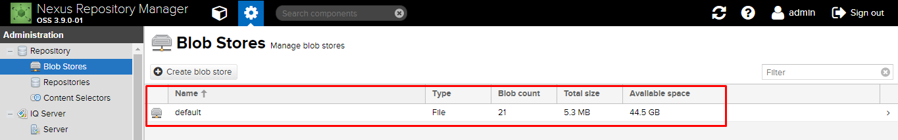

# 4.Các khái niệm cơ bản

# MỤC LỤC

## 4.1.Blob Stores
\- **Blob store** là cơ chế lưu trữ nội bộ cho các tệp nhị phân của các thành phần của chúng. Mỗi blob store có thể được sử dụng bởi một hoặc nhiều repo và repo group.  
\- Một blob store tên `default` dựa trên lưu trữ file system được tạo mặc định.  

Trong đó:  
- Name: tên blob store
- Type: loại backend của blob store. `File` có sẵn đại diện cho bộ nhớ dựa trên file system và `S3` cho phép các blobs được lưu trữ trong AWS S3 cloud storage.  
- Blob count: số lượng các blobs được lưu trữ
- Total size: dung lượng của blob store hiện tại
- Available space: không gian có trống để lưu trữ cho blob store

\- NXRM hỗ trợ 2 loại blob store:
- File blob store: lưu trữ các blob trên filesystem. Đây là loại blob store mặc định.
- S3 blob store: lưu trữ blobs trong AWS S3 bucket. Điều này chỉ được đề xuất cho các cài đặt **Nexus Repository Manager**  được triển khai cho AWS.

\- Thư mục chứa blob store mặc định là `sonatype-work/nexus3/blobs`.  

