# 5.Giao diện người dùng Nexus

# MỤC LỤC
  - [5.1.Giao diện người dùng ẩn danh](#51giao-diện-người-dùng-ẩn-danh)
  - [5.2.Giao diện người quản trị](#52giao-diện-người-quản-trị)
    - [5.2.1.Các thao tác với Repository](#521các-thao-tác-với-repository)
      - [a.Blob store](#ablob-store)
      - [b.Repositories](#brepositories)
    - [5.2.2.Các thao tác với Security](#522các-thao-tác-với-security)
      - [a.User](#auser)
      - [b.Anonymous](#banonymous)
      - [c.Role](#crole)
    - [5.2.3.Support](#523support)
      - [a.Logging](#alogging)
      - [b.Metrics](#bmetrics)
      - [c.Support ZIP](#csupport-zip)
      - [d.System infomation](#dsystem-infomation)
    - [5.2.4.System](#524system)
    - [5.2.5.Thay đổi thông tin cá nhân và đổi mật khẩu](#525thay-đổi-thông-tin-cá-nhân-và-đổi-mật-khẩu)

## 5.1.Giao diện người dùng ẩn danh
\- Giao diện ban đầu (khi chưa đăng nhập hay giao diện cho người dùng ẩn danh)  
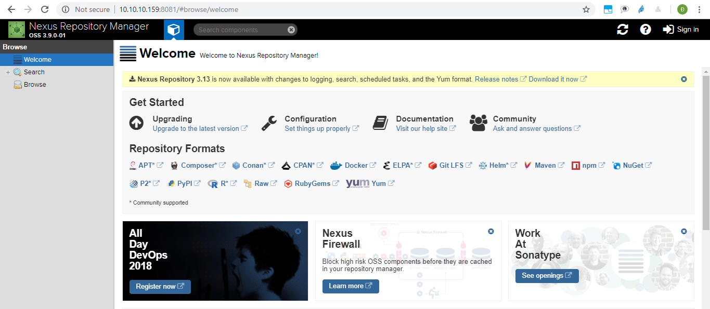

Người dùng ẩn danh chỉ xem được các repos, packages trong các repo  
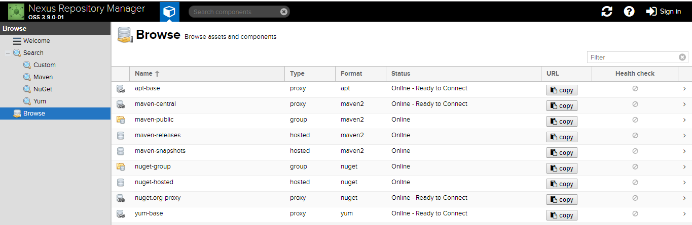

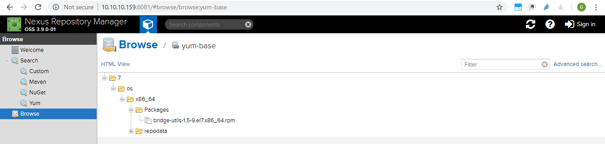

## 5.2.Giao diện người quản trị
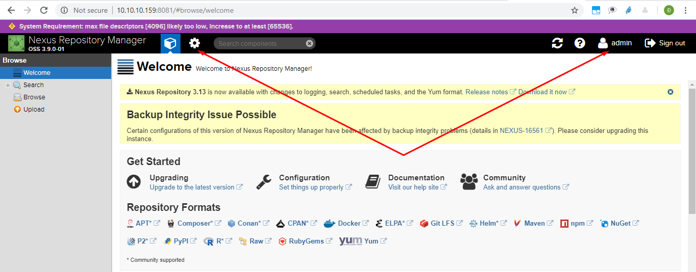

Ngoài xem được các repos, packages trong các repo, người dùng còn có thể:
- Tạo Block Stores, Repo.
- Cài đặt bảo mật như tạo roles, users,...
- Xem log, metrics,...
- Cài đặt API, email,...

### 5.2.1.Các thao tác với Repository
#### a.Blob store
\- **Blob Stores** là nơi chứa các repo.  
Có 1 blob store mặc định là `default`.  
Thư mục chứa blob store mặc định là `sonatype-work/nexus3/blobs`.  
Dung lượng của các blob store là bằng nhau và gần bằng dung lượng phân vùng ổ cứng chứa Nexus.  
\- Tạo **Blob Stores**  
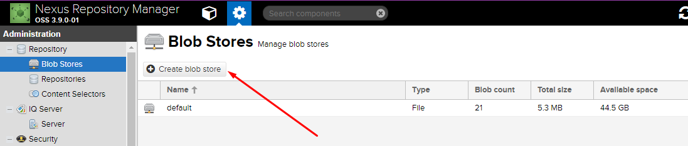

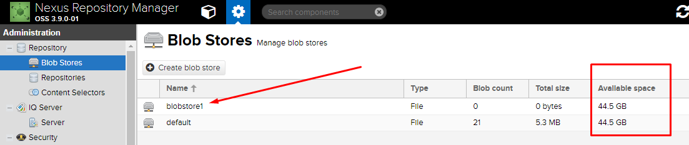

#### b.Repositories
\- **Repository** là kho chứa các package được lưu trữ.  
\- Có 7 repo được tạo mặc định.  
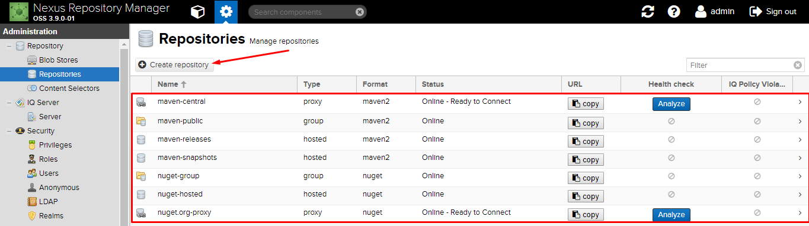

\- Tạo **Repo**  
- Tạo repo **apt proxy**  

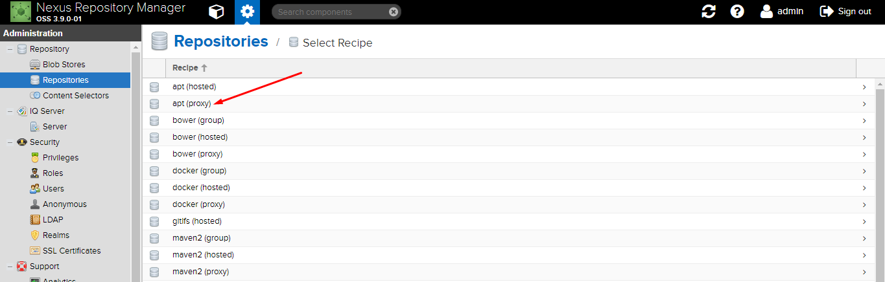

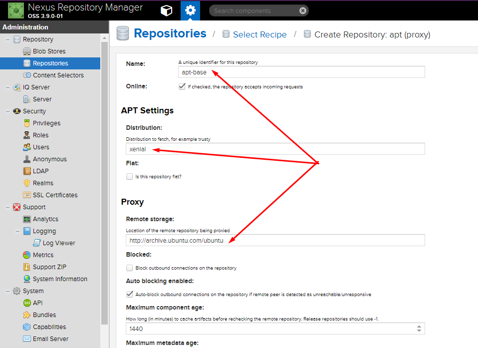

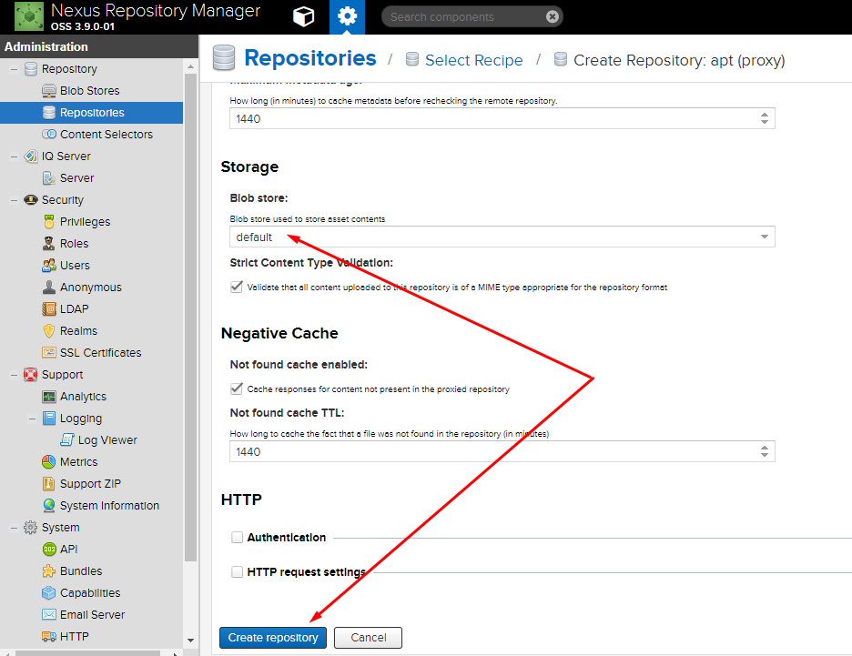 

- Tạo repo **yum proxy**  

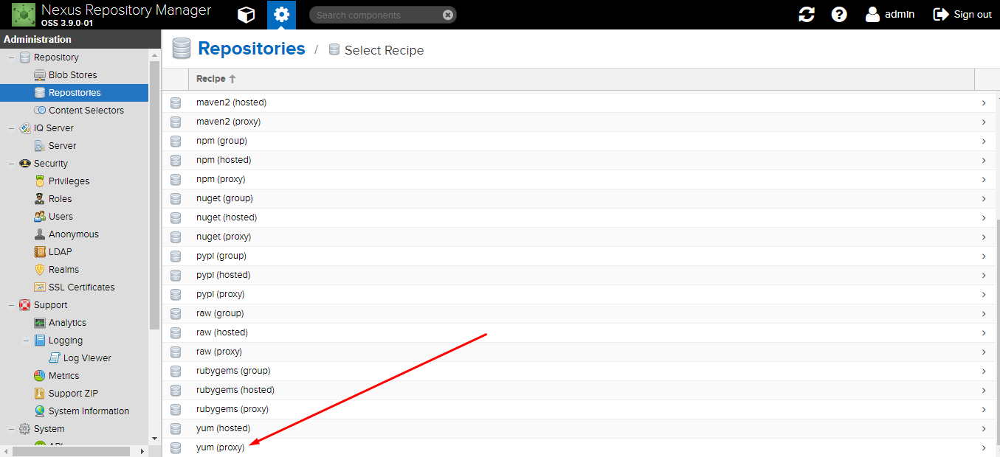

### 5.2.2.Các thao tác với Security
#### a.User
\- Ban đầu, có 2 người dùng được tạo sẵn là `admin` và `anonymous`. `admin` với role `nx-admin` và `anonymous` với role `nx-anonymous`.  
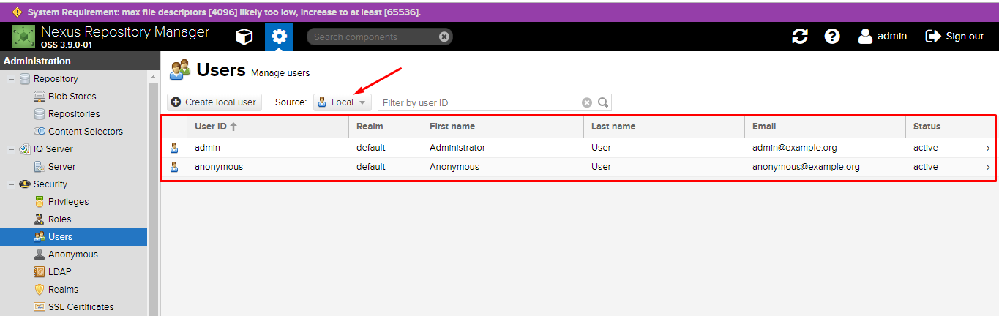

\- **Tạo local user**  
VD: Tạo người dùng `sondx` với quyền `nx-admin`:  
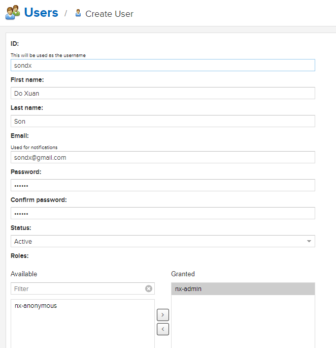

#### b.Anonymous
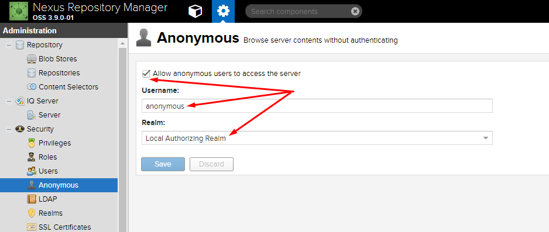

Cho phép người dùng ẩn danh (người dùng không đăng nhập) truy cập với tài khoản là `anonymous` (người dùng mặc định được tạo).  

#### c.Role
\- Ban đầu, có 2 roles mặc định là `nx-admin` và `nx-anonymous`.  
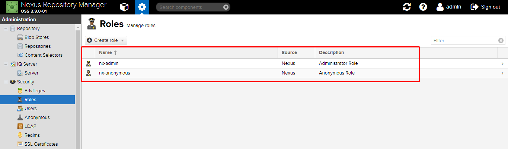

\- Role `nx-admin` có những quyền:  
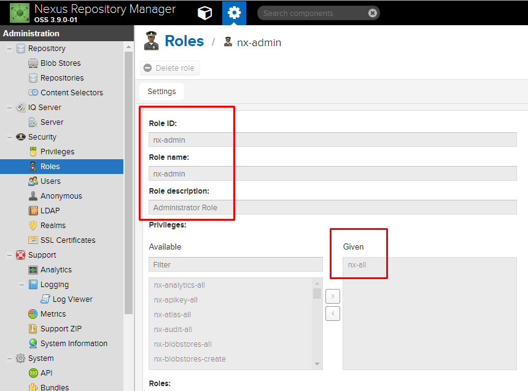

\- Role `nx-anonymous` có những quyền:  
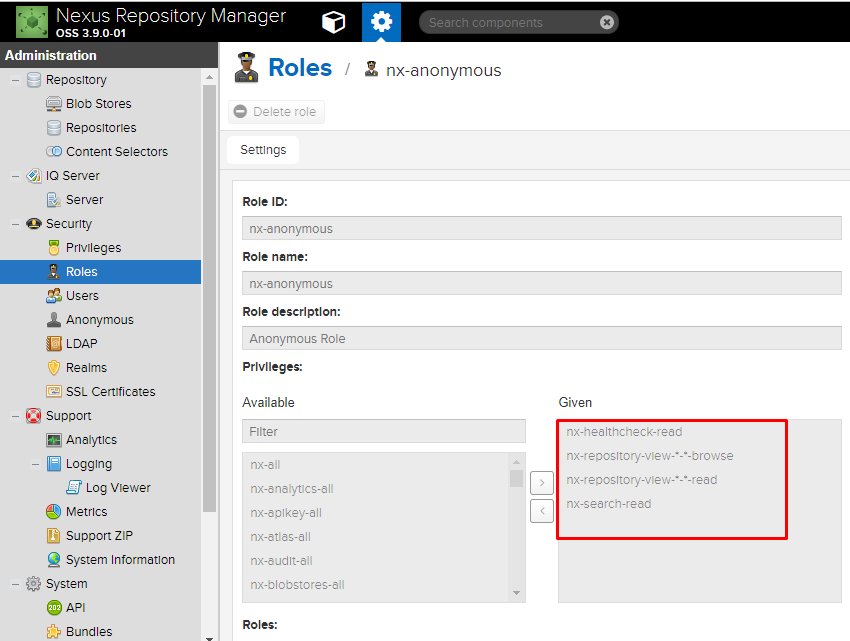

### 5.2.3.Support
#### a.Logging
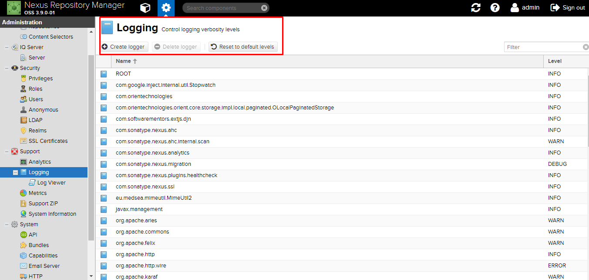

#### b.Metrics
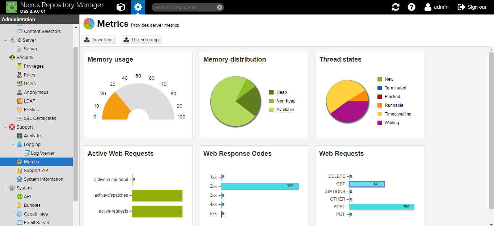

#### c.Support ZIP
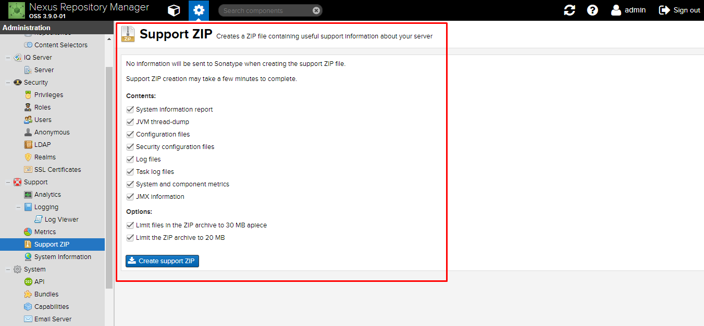

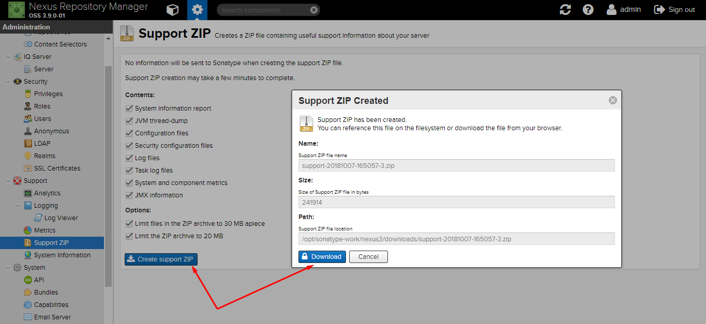

Tạo file `.zip` chứa các thông tin như:  
- System information report
- JVM thread-dump
- Configuration files
- Security configuration files
- Log files
- Task log files
- System and component metrics
- JMX information

#### d.System infomation
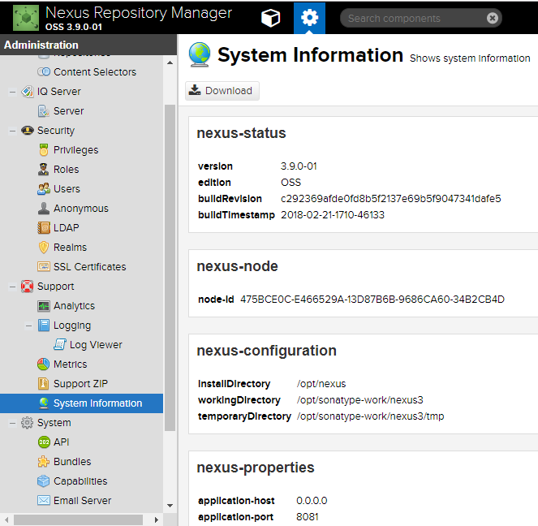

### 5.2.4.System
\- Kiểm tra các kết nối  
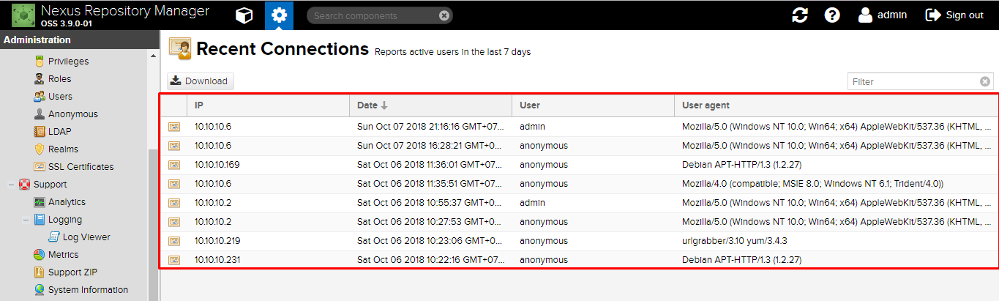

### 5.2.5.Thay đổi thông tin cá nhân và đổi mật khẩu
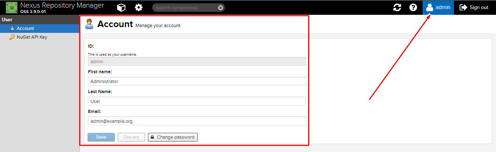

