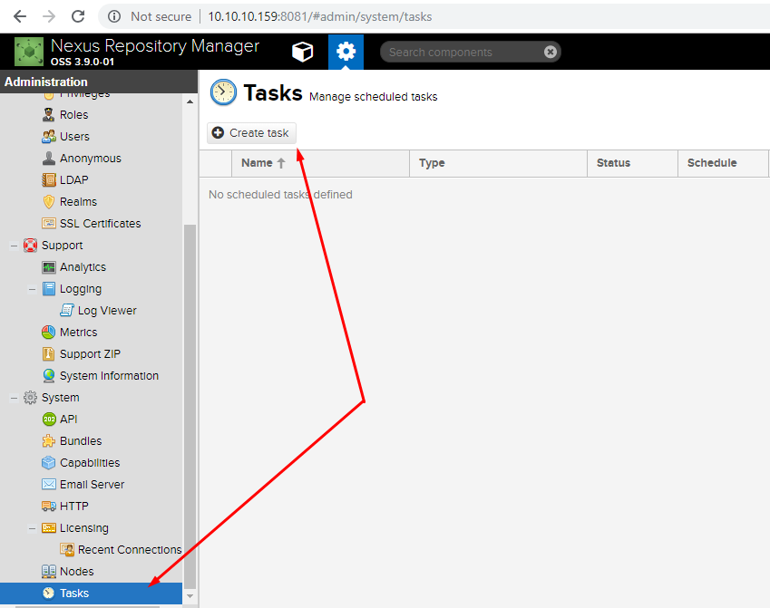
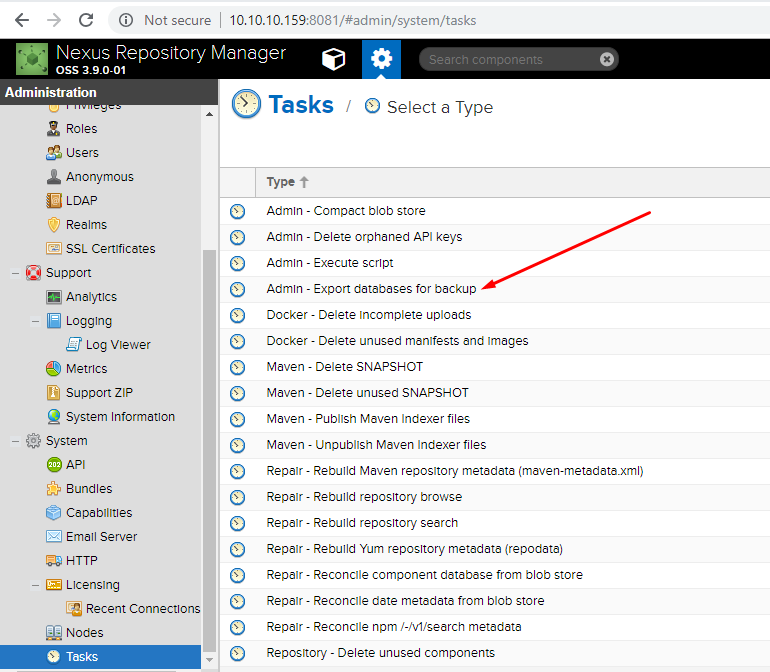
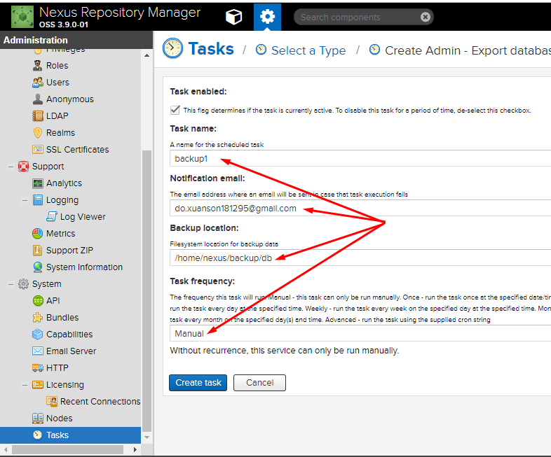
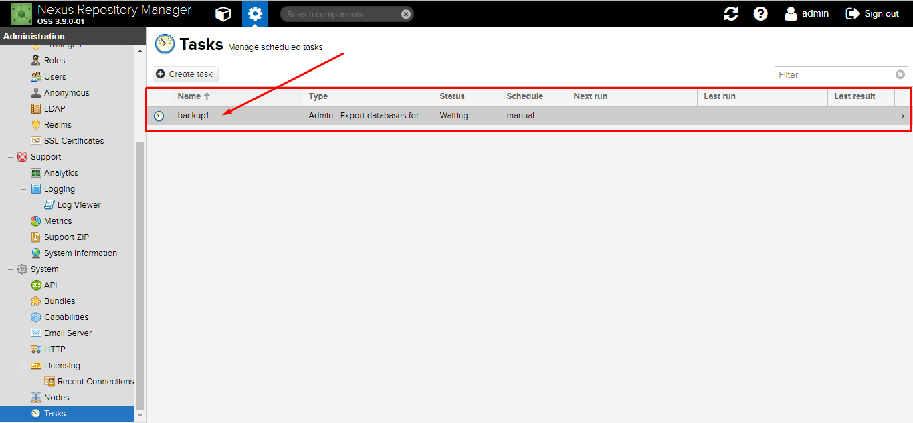
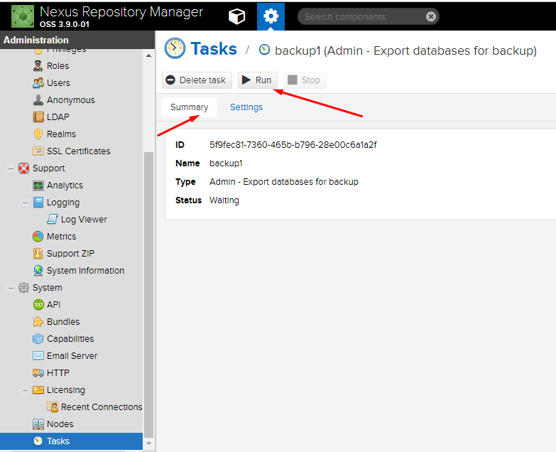
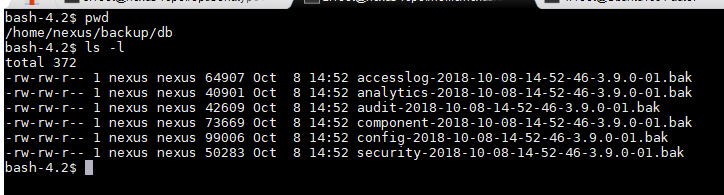

# 6.Backup và Restore

# MỤC LỤC
  - [6.1.Giới thiệu](#61giới-thiệu)
    - [Blob Store Backup](#blob-store-backup)
    - [Database Backup](#database-backup)
  - [6.2.Tạo bản backup](#62tạo-bản-backup)
    - [6.2.1.Tạo bản backup Blob Store](#621tạo-bản-backup-blob-store)
    - [6.2.2.Cấu hình và chạy Backup Task](#622cấu-hình-và-chạy-backup-task)
  - [6.3.Thực hiện khôi phục dữ liệu](#63thực-hiện-khôi-phục-dữ-liệu)


## 6.1.Giới thiệu
\- **Nexus Repository Manager** cho phép bạn sử dụng tác vụ được lập lịch để hỗ trợ sao lưu repo manager của bạn. CÙng với thủ tục sao lưu của bạn, bạn có thể cấu hình repo manager của bạn để lưu các cơ sỡ dữ liệu **OrientDB** mà lưu trữ thành phần metadata và cấu hình hệ thống.  
\- NXRM lưu trữ dữ liệu trong **blob store**. Metadata và thông tin cấu hình được lưu trữ riêng trong cơ sỡ dữ liệu. **Blob store** và **cơ sở dữ liệu metadata** phải được backup cùng nhau.  
\- Hỗ trợ trên cả 2 phiên bản **Nexus Repository OSS** và **Nexus Repository Pro**.  

### Blob Store Backup
\- Filesystem hoặc object phải được back up bên ngoài NXRM.  
- Lưu trữ dạng **File** blob, thư mục lưu trữ blob nên được back up.  
Thư mục blob trên Nexus được cấu hình là `$data-dir/blobs`.
- Lưu trữ dạng **S3** blob, phiên bản bucket có thể được sử dụng như một thay thế cho backup hoặc bucket có thể được mirrored đến một S3 bucket khác.

### Database Backup
\- Lập lịch cho việc export cơ sở dữ liệu.  

> Quyền viết vào cơ sở liệu phải tạm ngừng cho đến khi sao lưu hoàn tất.

## 6.2.Tạo bản backup
\- Trên Nexus Server, ta tạo thư mục `/home/nexus/backup` để chứa dữ liệu backup. Trong thư mục này, tạo 2 thư mục:
- /home/nexus/backup/blob
- /home/nexus/backup/db

\- Khi thực hiện backup, ngừng các thao tác tương tác với **Blob Store** và **Database**.  

### 6.2.1.Tạo bản backup Blob Store
\- Sao chép các file trong thư mục `$data-dir/blobs` đến thư mục `/home/nexus/backup/blob`.  

### 6.2.2.Cấu hình và chạy Backup Task
\- Truy cập vào giao diện web của Nexus và thực hiện tạo tasks như hướng dẫn sau:  






> Chú ý:  
Vị trí backup, vd `/home/nexus/backup/db`, người dùng `nexus` phải có quyền viết vào thư mục đó.  

\- Sau khi tạo task backup  


\- Thực hiện export cơ sở dữ liệu  


Kiểm tra thư mục lưu cơ dỡ dữ liệu được export, trong vd này là `/home/nexus/backup/db`.  


`accesslog-2018-10-08-14-52-46-3.9.0-01.bak`, trong đó:  
- `2018-10-08` là năm-tháng-ngày tạo backup
- `14-52-46` là giờ-phút-giây tạo backup
- `3.9.0-01` là phiên bản Nexus đang sử dụng

\- Thông tin về các file được backup:  
- Access log: thông tin đăng nhập và sử dụng giữa những người quản lý repo.
- Analytics: dữ liệu sự kiện và việc sử dụng repo manager
- Auditing: bản ghi thay đổi cấu hình repo manager cũng như bổ sung và xóa nội dung hoặc thành phần
- Component: tất cả các dữ liệu liên quan tạo các thành phần trong repo manager
- Configuration: cấu hình quản trị chung chẳng hạn như scheduled tasks, email server configuration
- Securiry: tất cả nội dung quản lý quyền truy cập và người dùng

## 6.3.Thực hiện khôi phục dữ liệu
\- Dừng dịch vụ `nexus`, thực hiện lệnh:  
```
service nexus stop
```

\- Xóa hết dữ liệu  thư mục `$data-dir/blobs` và `$data-dir/db`. Thực hiện lệnh:  
```
rm -rf $data-dir/blobs/*
rm -rf $data-dir/db/*
```

\- Sao chép dữ liệu trong thư mục `/home/nexus/backup/blob` đến thư mục `$data-dir/blobs`, thực hiện lệnh:  
```
cp -r /home/nexus/backup/blob/* $data-dir/blobs
```

\- Sao chép dữ liệu trong thư mục `/home/nexus/backup/db` đến thư mục `$data-dir/db`, thực hiện lệnh:  
```
cp -r /home/nexus/backup/db/* $data-dir/db
```

\- Khởi động lại **Nexus Repository Manager**  
```
service nexus restart
```

Sử dụng lệnh `ss -atln` để kiểm tra xem **Nexus Server** đã lắng nghe trên port `8081` hay chưa, nếu rồi có nghĩa là `nexus` đã khởi động lại hoàn tất.  

\- Sau khi khởi động lại hoàn tất, xóa bỏ các file trong thư mục `$data-dir/backup`, thực hiện lệnh:  
```
rm -rf $data-dir/backup/*
```

\- Khôi phục dữ liệu hoàn tất!  


