Hướng dẫn cài đặt Ubuntu 16.04.5 server 64-bit trên vmware workstation.
# 1.Chuẩn bị 
- VMWare Workstation 12.0 và cài đặt.
- Download file .iso Ubuntu Server 16.04 -64 bit link: http://old-releases.ubuntu.com/releases/xenial/
# 2.Cài đặt.
- Mở chương trình VMWare Workstation 12.0.

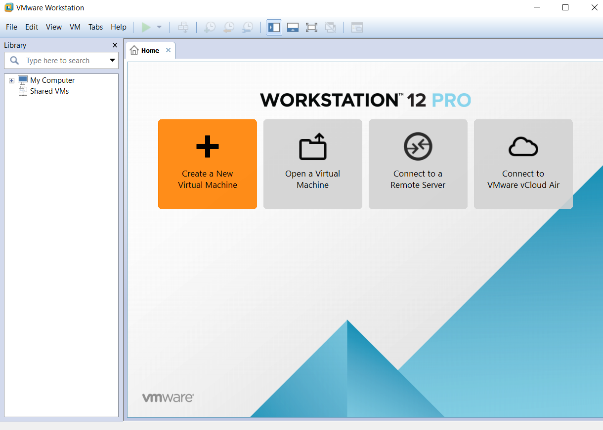

- Click “Create a New Virtual Machine” hoặc chọn “File New Virtual Machine” hoặc ấn tổ hợp phím “Ctrl + N” để khởi tạo môi trường tạo máy ảo.

•	Tại đây có 2 lựa chọn:  
- Typical (recommended): tạo máy ảo  một cách dễ dàng.
- Custom(advanced): tạo máy ảo và cấu hình cho máy ảo đó.Tại đây nên xử dụng Typical.

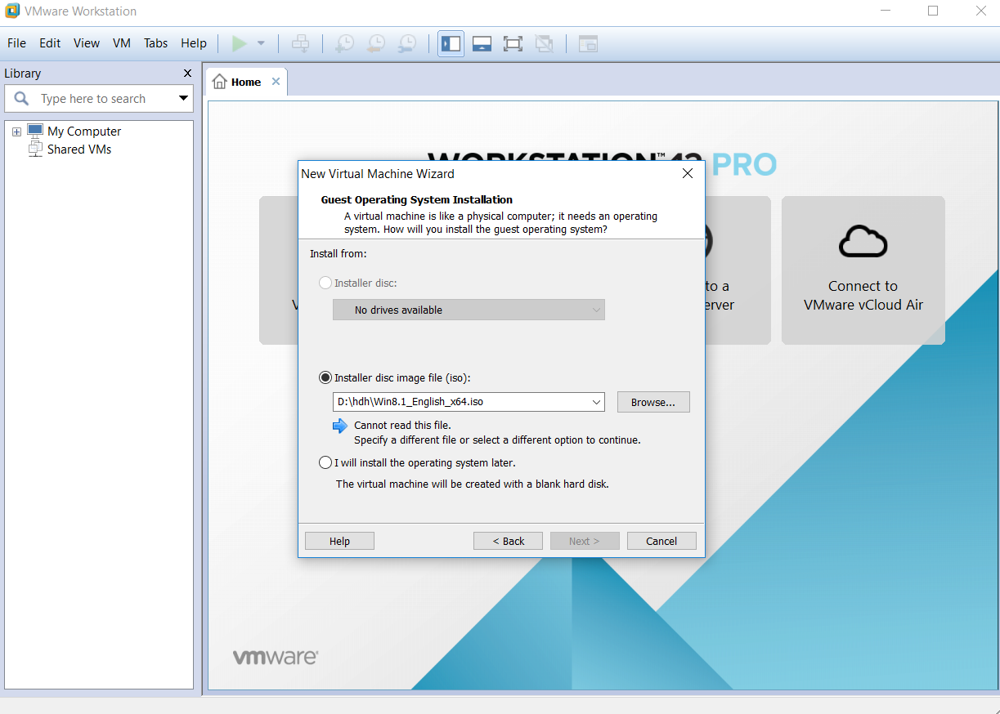
Tại đây chọn “ Installer disc image file(iso)” và Browe đến thư mục bạn lưu file ubuntu-16.04.6-server-amd64.iso bạn vừa tải về. 
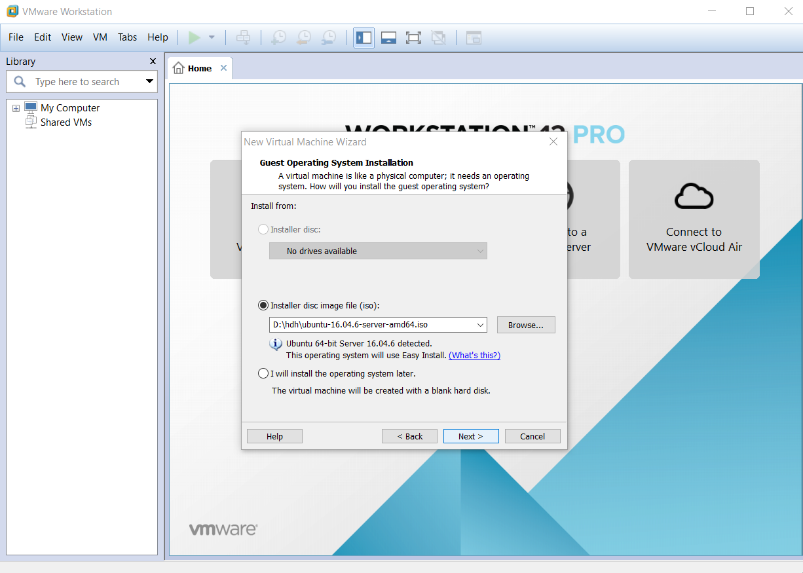
Tại đây ta bấm Next.
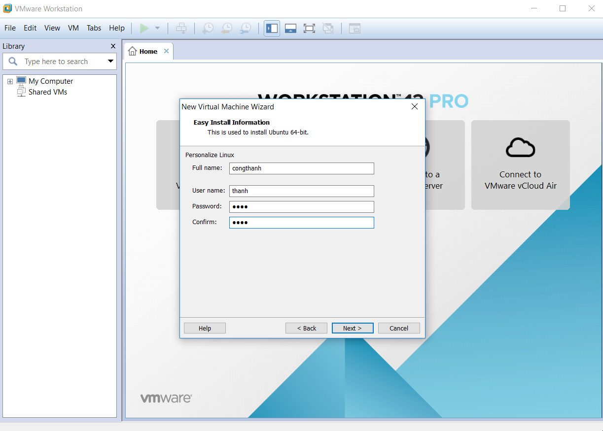
Tại đây ta nhập vào các ô trống:  
- Full name:   
- User name: tên tài khoản để bạn đăng nhập và Ubuntu server 16.04 (phải nhớ)
- Password: mật khẩu để bạn đăng nhập vào Ubuntu server 16.04 (phải nhớ)
- Confirm: nhập lại mật khẩu trên.Rồi click “Next” để tiếp tục.  

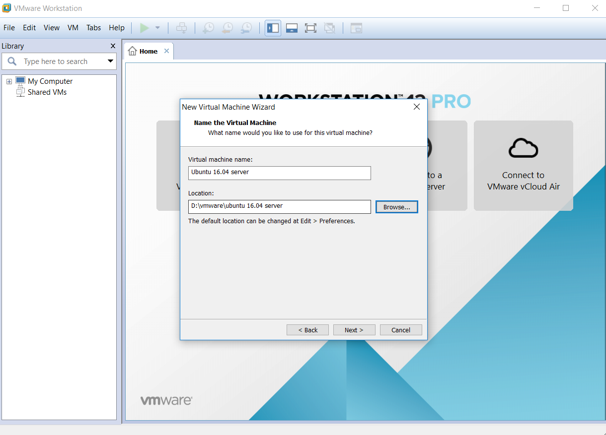
Tại đây ta điền vào ô trống:
-	Virtual machine name: tên máy ảo của bạn.
-	Location là nơi bạn lưu tất cả file của máy ảo này, click“Browse” để chọn thư mục phù hợp.Ta click “Next” để tiếp tục.

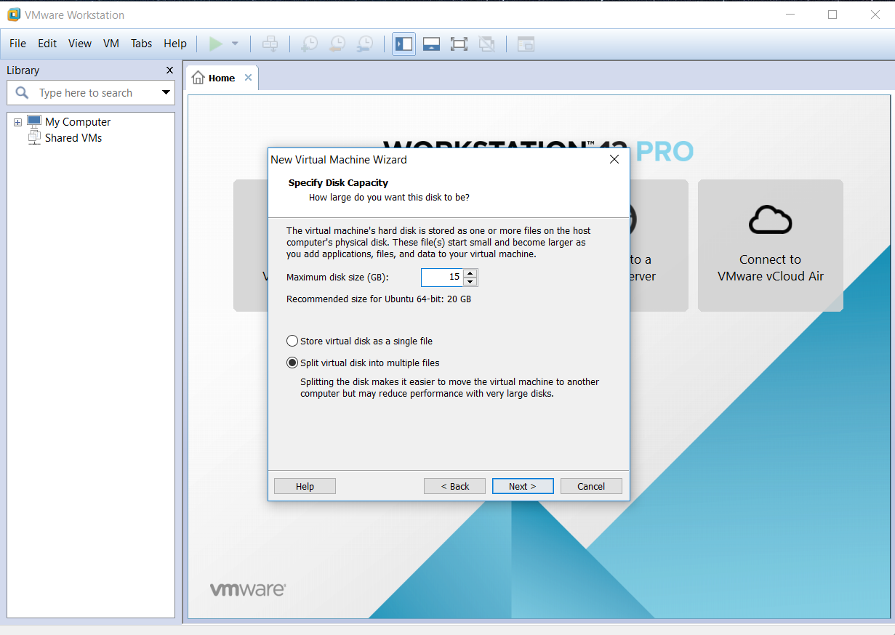  
Tại đây ta nhập dung lượng tổng bộ nhớ cho máy ảo, tại đây tôi để 15 GB.
Store virtual disk as a single file: lưu tất cả file của máy ảo trong 1 file.
Split virtual disk into multifile files: lưu các file của máy ảo trong 1 thư mục và chia thành nhiều file.
Ta click “Next” để tiếp tục.

Tại đây ta click “Customize Hardware” để cài đặt thông sô phần cứng cho máy ảo.
- Memory : kích thước RAM cung cấp cho máy ảo.
- Processors: CPU cung cấp cho máy ảo.
- New CD/DVD: cung cấp file ubuntu-16.04.6-server-amd64.iso để cài đặt máy ảo.
- Network Adapter : kiểu kết nối mạng mà máy thật cung cấp cho máy ảo. ở đây tôi sử dụng kiểu bridge.
- Usb controller: cung cấp cổng usb cho máy ảo.
- Sound card: cung cấp thiết bị phát âm thanh cho máy ảo.
- Printer: máy in.
- Display : cung cấp màn hình để hiện  thị máy ảo.Chọn “Close” để tiếp tục. 

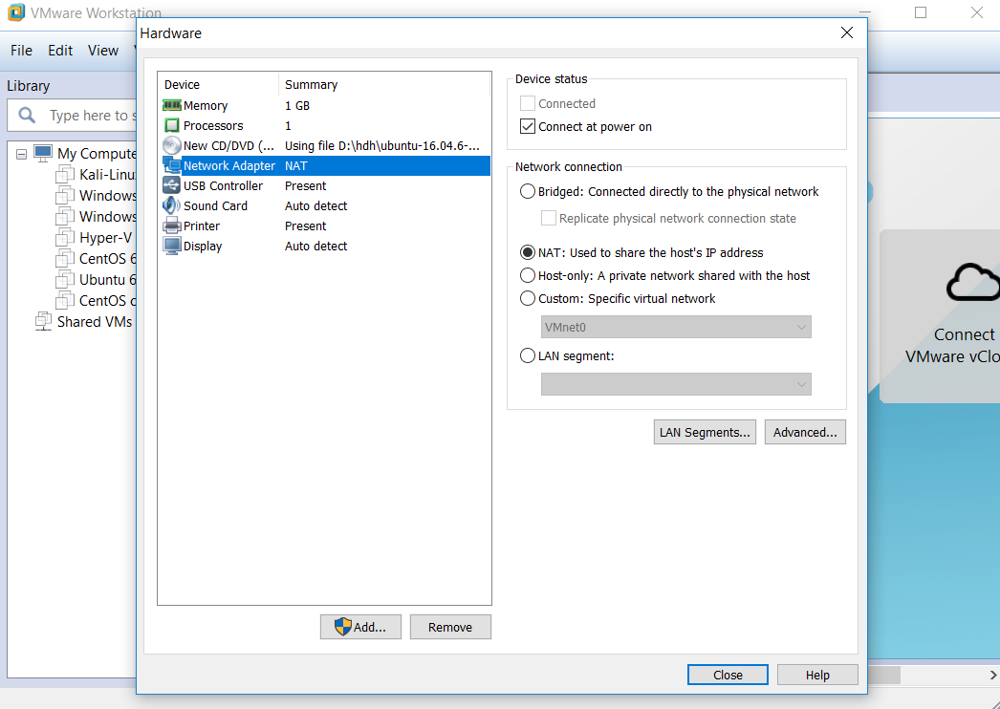
Click “Finish” để bắt đầu quá trình chạy máy ảo.
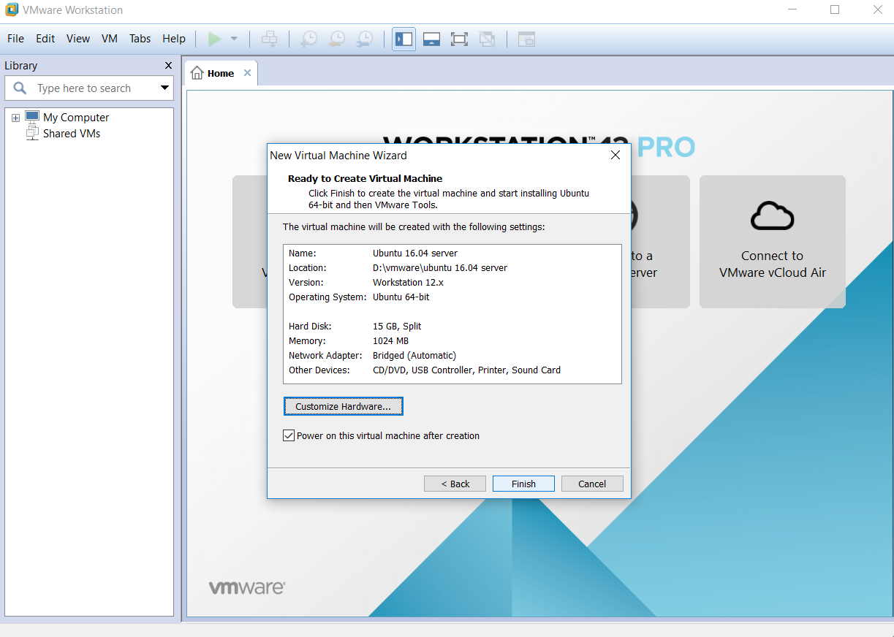
Máy ảo đang bắt đầu chạy.
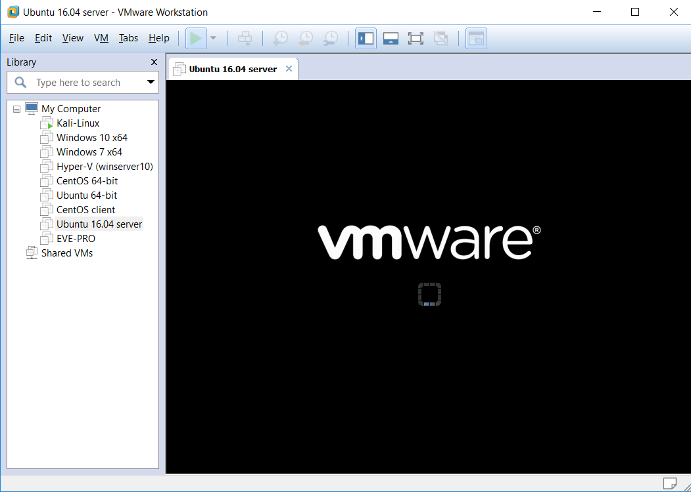
Đợi cho khi tiến trình chạy xong. 
Vậy là gần xong rồi.
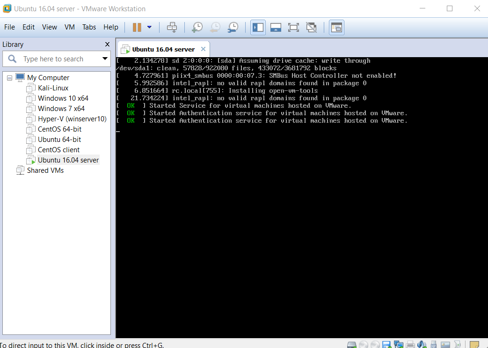
Bạn sử dụng user name và password cấu hình ở bước trên để đăng nhập vào. 
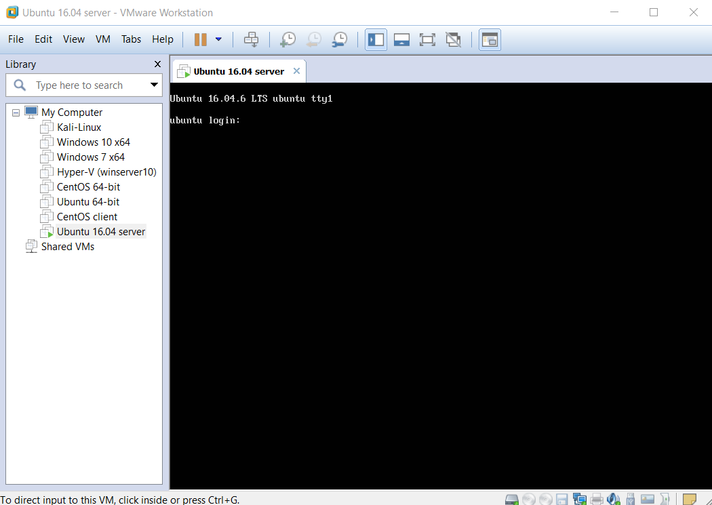
Như vậy là bạn đã cài đặt thành công máy ảo Ubuntu 16.04 server 64-bit với kết nối mạng là NAT.