# Linux command
## Mục Lục

[1 .man command](#1)

[2. pwd command ](#2)

[3. cd command ](#3)

[4. ls command ](#4)

[5. mkdir command ](#5)

[6. rmdir command ](#6)

[7. cat command ](#7)

[8. file command ](#8)

[9. touch command ](#9)

[10. rm command](#10)

[11. cp command](#11)

[12. mv command](#12)

---
<a name="1"></a>
## 1. man command

man - manual pages. 
Lệnh man trong Linux được sử dụng để hiển thị hướng dẫn sử dụng các lệnh chúng ta có thể chạy trên thiết bị.

### 1.1 Cú pháp
```
man [option]...[tên lệnh]
```

Sử dụng ``man`` không kèm option thì nó sẽ hiện thị toàn bộ tùy chọn và cách sử dụng của lệnh đó.
```
man git 
```
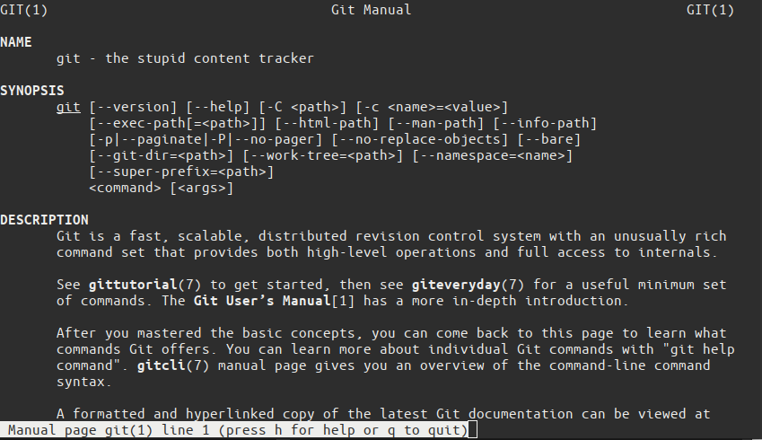

### 1.2 Man -f

Man -f [command]: Hiển thị một mô tả ngắn các trang hướng dẫn, nếu có và hiện thị có bao nhiêu trang hướng dẫn kèm số.
```
man -f git
```

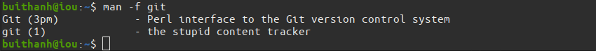

### 1.3 Man number
Man [number] [command]: Hiện thị trang hướng dẫn cần xem theo số.
```
man 3pm git 
```
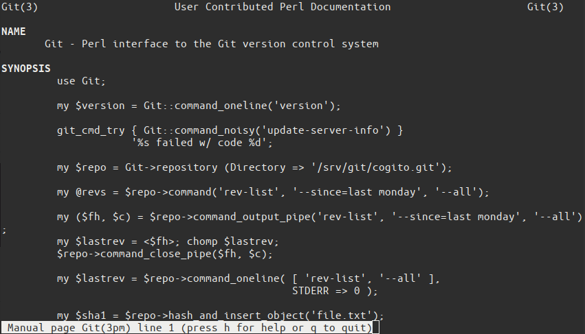
```
man 1 git
```
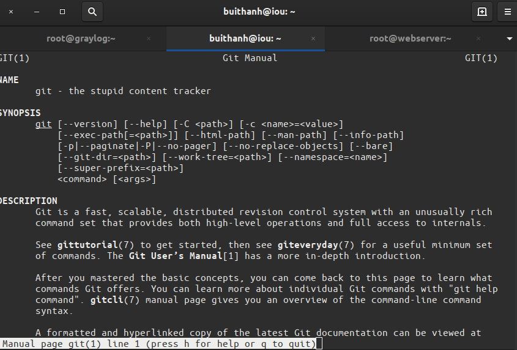

### 1.4 Man $configfile

**Man [file config]** : hiển thị trang hướng dẫn  file config của dịch vụ đó.

```
man rsyslog.conf
```
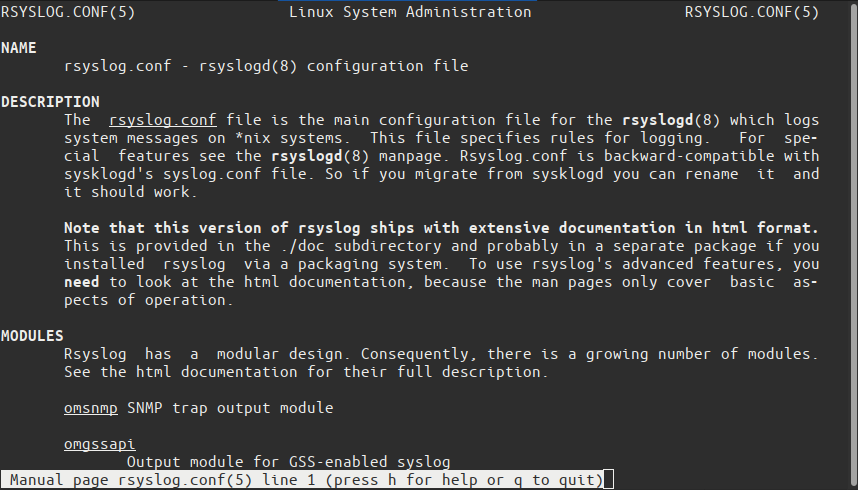

### 1.5 Man $daemon

**Man [tiến trình]**: Hiệnr thị trang hướng dẫn trong tiến trình đó  ví dụ như:  mô tả về file config đó, các modules, action, ...


### 1.6 man -k

**Man -k [string]**: man -k (apropos) sẽ show ra danh sách các man page có chứa chuỗi tương ứng

```
man -k git
```
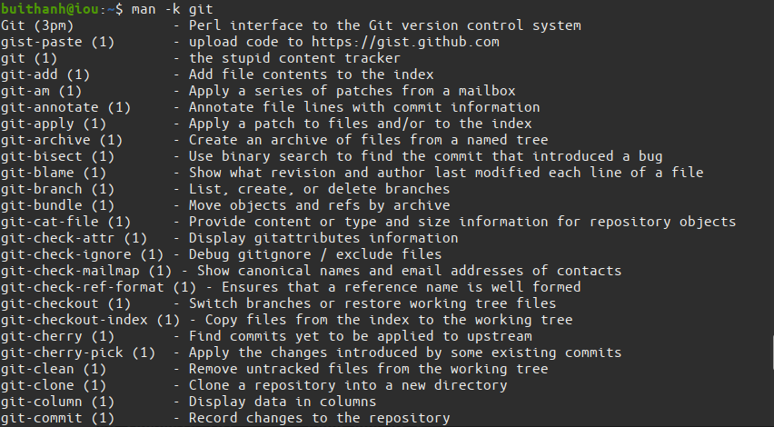

### 1.7 man -w

Man -w [command] : Hiển thị vị trí tệp tin lưu command đó.

```
man -w git
```
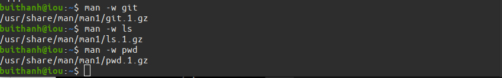

<a name="2"></a>
## 2. pwd command

Pwd được viết tắt bởi từ Print Working Directory. Nó hiển thị đường đẫn đến thư mục hiện tại 

```
buithanh@iou:~$ pwd
/home/buithanh
```
<a name="3"></a>
## 3. cd command

cd là viết tắt của từ Change directory
Lệnh này sử dụng để chuyển qua lại giữa các thưc mục.

cú pháp:

cd [directory_name].
### 3.1 cd /

cd / : chuyển về thư mục root dù đang ở bất kỳ thư mục nào.


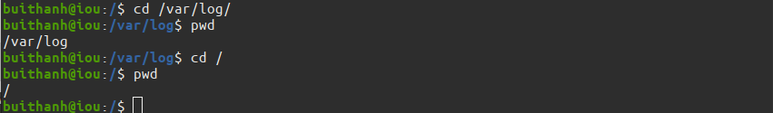

### 3.2 cd vào các thư mục nằm trong thư mục.

cd /dir_1/dir_2/dir_3 : thư mục dir_3 nằm trong thư mục dir_2 và nằm trong thư mục dir_1 và nằm trong thu mục root.


### 3.3 cd ~
cd ~ , cd - : lênh di chuyển về thư mục home ngay lập tức dù đang ở thư mục nào đi nữa.

```
cd ~
cd -
```
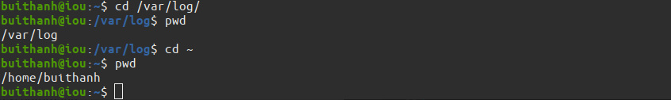

### 3.4 cd ..

cd .. : Sử dụng Để trở về thư mục cha của thư mục hiện tại .

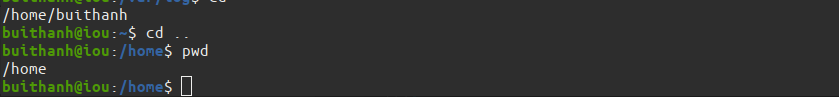

<a name="4"></a>
## 4. ls command
ls là viết tắt của list.

ls sử dụng để liệt kê thông của tệp và thư mục như: tên, kích thước, quyền, use, group,...

cú pháp: ls [option] [tệp tin]

### 4.1 ls -a

**ls -a**: hiện thị tất cả các tệp có bắt đầu bằng dấu "."

```
ls -a
```
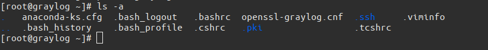

## 4.2 ls -x và ls -t

ls -x : là sẵp xếp tập tin theo thư tự bắt đầu theo bảng chữ cái.

ls -t : xắp xếp tập tin theo thú thự thời gian sửa đổi.

```
ls -x
```
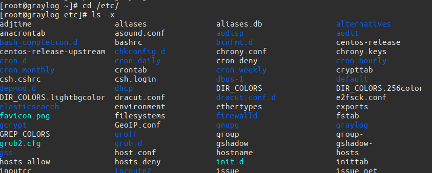

```
ls -t -l
```

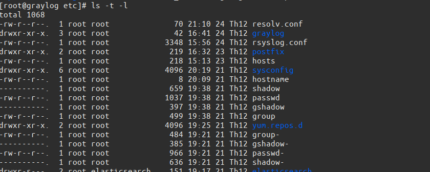

### 4.3 ls -l

**ls -l** : hiển thi tập tin và thư mục đầy đủ theo tên, phân quyền, kích thước, thời gian, link, ... sắp xếp theo thư tự bảng chữ cái.

```
ls -l
```

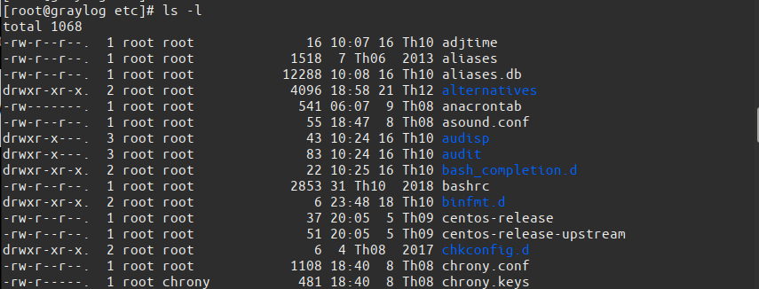

### 4.4 ls -F
**ls -F**: hiện thị ra các loại tệp

- @ : là 1 symbol link
- (*) : là 1 thực thi
- | : chỉ ra 1 đường ống được đặt tên
- / : là 1 thư mục 

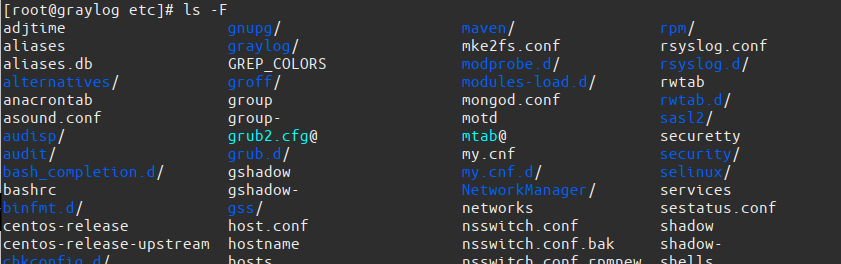

### 4.5 ls -lh

**ls -lh**: Hiển thị danh sach ở dạng kích thích thước là kilobyte, megabyte, ...

```
ls -lh
```
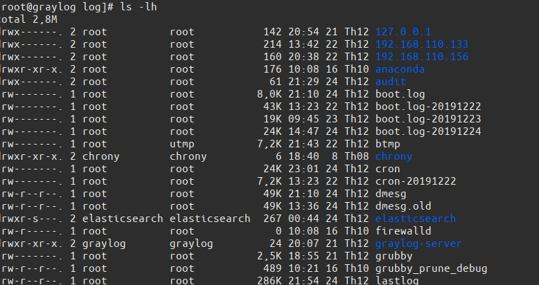

### 4.6 ls string*

ls string* : hiện thị các thư mục có bắt đầu băng string đó.
```
ls se*
```
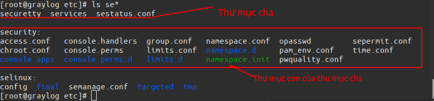

## 4.7 ls -lS

**ls -lS**: hiện thi các tệp trong thư mục và sắp xếp theo kích thước từ lớn đến bé.

```
ls -lS
```
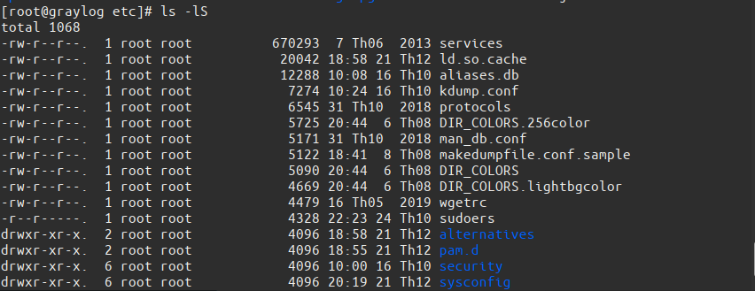

### 4.8 ls -l/dir

**ls -l/dir** : hiện thị các tập tin có trong thư mục dỉ chọn.

```
ls -l /var/log
```
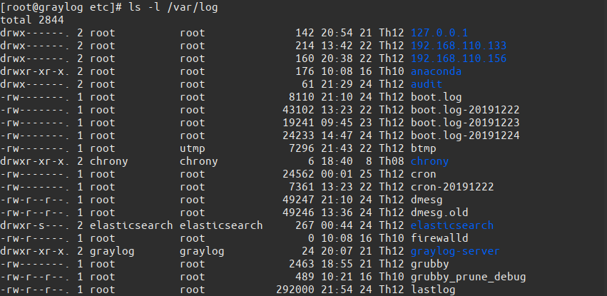

### 4.9 ls -i

**ls -i** : hiện thi tập tin kèm theo các inode của nó.

```
ls -i
```
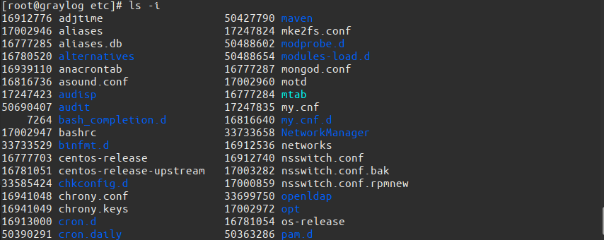

## 4.10 ls -R
**ls -R** hiện thị các thư mục theo dangj cây thư mục và chỉ ra các đường đẫn.

```
ls -R 
```
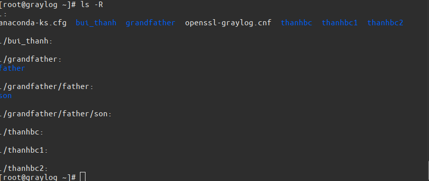

<a name="5"></a>
## 5 Mkdir command

**mkdir** : sử dung để tạo một thư mục.

cú pháp: mkdir [option] [directory]

### 5.1 mkdir -v dir

**mkdir** khi không có option gì thì chỉ tạo được 1 thư mục.

```
mkdir thanhbc
```

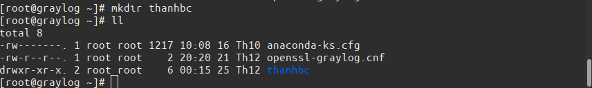

**mkdir -v**: có thể tạo nhiều thư mục cùng 1 lúc.

```
mkdir -v thanhbc1 thanhbc2 bui_thanh
```
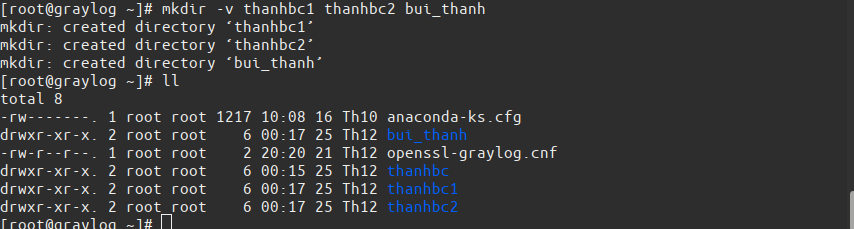

### 5.2 mkdir -p
**mkdir -P** : tạo  thư mục con nằm trong cac thưc mục cha.

```
mkdir -p grandfather/father/son
```

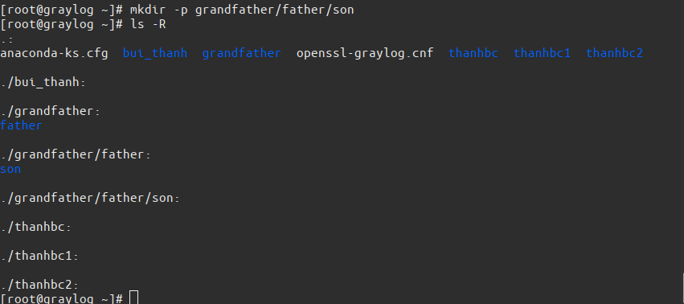

Ta thấy thư mục son là con của thư mục father, và thư muc father là con của thư muc grandfather.

### 5.3 mkdir -m a=rwx
Tạo 1 thư mục và đồng thời cấp quyền cho thư mục đó.
**mkdir -m a=mwx [directory]** 
trong đó:
- a= rwx là quyền cáp cho thư mục
- directory là tên thư mục
 
```
mkdir -m a=rwx quyen
```


<a name="6"></a>
## 6. rmdir command

rmdir viết tắt remove directory. sử dụng để xóa  thư mục.

**rmdir [option] [directory]**

### 6.1 rmdir --help
**rmdir --help**: Hiển thị các trợ giúp cho việc sử dụng lệnh này.

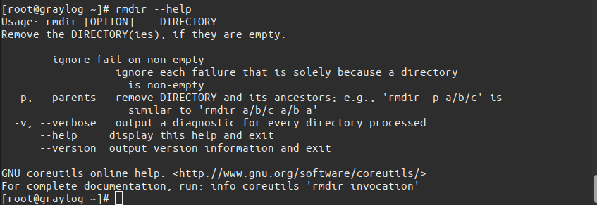

### 6.2 rmdir 
**rmdir [directory]**: nếu không có opition gì thì nó sẽ xóa 1 thư mục đó.

```
rmdir thanhbc
```

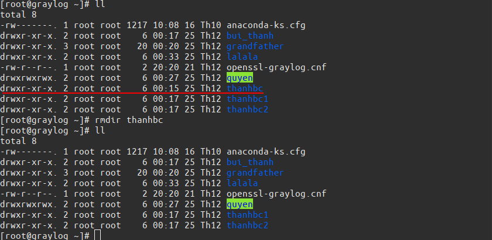

### 6.3 rmdir -p
**rmdir -p** : có cả thư mục con và thư mục cha
```
rmdir -p father/son
```
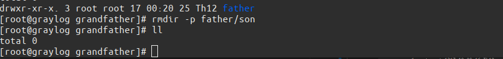

Vấỵ là đã xóa cả 2 thư mục son và thư mục father.

### 6.4 rmdir dir1 dir2 dir3
**rmdir dir1 dir2 dir3** : xóa nhiều thư mục cùng 1 lúc.

```
rmdir thanhbc1 thanhbc2 bui_thanh
```

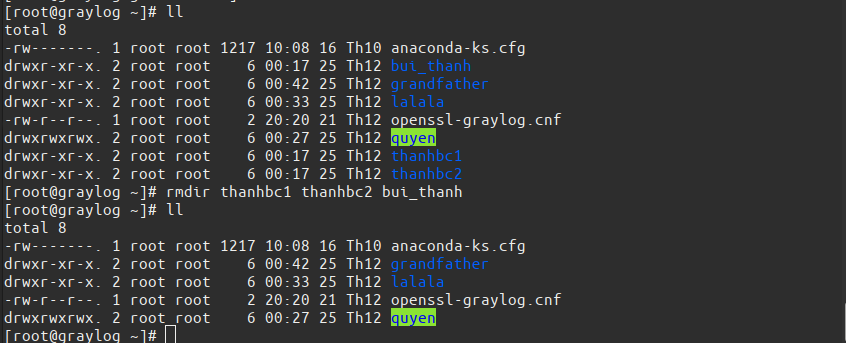

<a name="7"></a>
## 7. cat command
**Cat** là viết ngắn gọn của từ "concatenate" nó là một lệnh được sử dụng nhiều trong  linux.

Nó đươc sử dụng cho:
- Hiển thị text lên màn hình.
- Tạo một file mới.
- Đọc file.
- Chỉnh sửa file.

Cú pháp
**cat [directory]**

### 7.1 cat file_name

**cat_filename** : Đọc thông tin trong file.

```
cat file1.txt
cat file2.txt
```
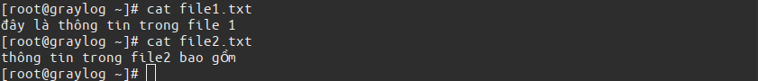

### 7.2 cat > file

**cat > file** : viết thông tin vào trong file và xóa dữ liệu cũ trong file đi, cũng có thể dùng cho viết một file mới.

```
cat > file1.txt
```
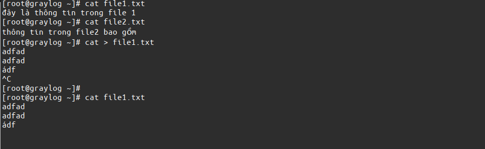

### 7.3 cat file1.txt file2.txt > file3.txt

**cat file1.txt file2.txt > file3.txt** : tổng hợp dữ liệu 2 file và viết vào file 3 đồng thời nếu file 3 có dữ liệu sẽ bị xóa.

```
cat file1.txt file2.txt > file3.txt
```

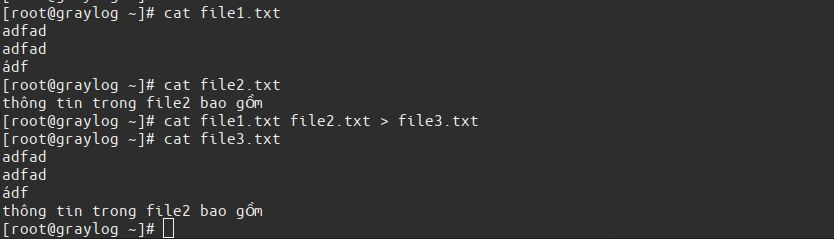


## 7.4 cat *.txt

**cat \*.txt** : đọc thông tin từ tất cả file có chứa đuôi txt.

```
cat *.txt
```
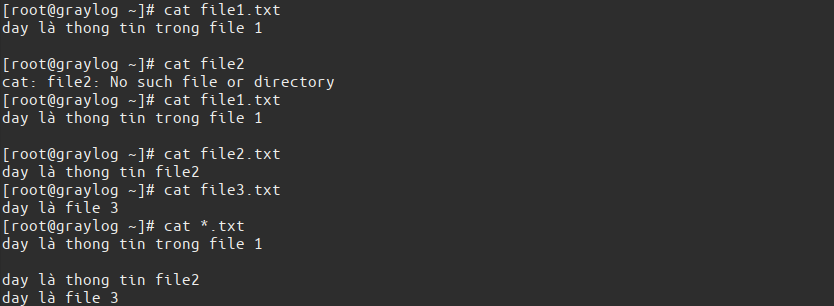

### 7.5 Cat file1.txt file3.txt

**Cat file1.txt file3.txt** : có thể đọc nhiều file cùng 1 lúc.

```
Cat file1.txt file3.txt
```
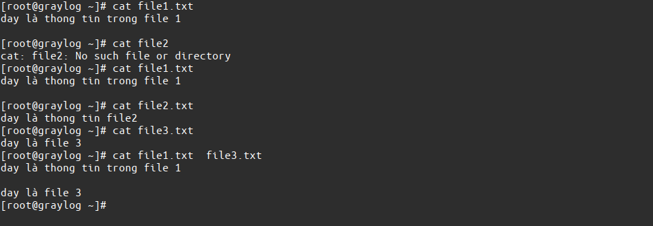

### 7.6 cat file1.txt >> file.txt 
**cat file1.txt >> file.txt** : ghi thêm thông tin của file 1 vào cuối file 2.

```
cat file1.txt >> file2.txt 
```
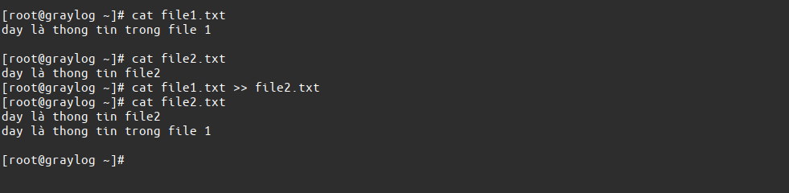
### 7.6 Cat -n file

**Cat -n file** : đọc file kèm hiển thị số dòng.

```
cat -n file2.txt
```

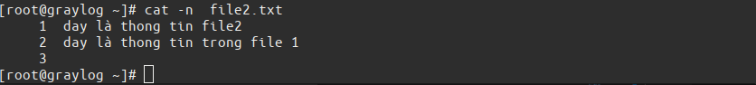


<a name="8"></a>

# List command working with files
## 8. file command

**file** : sử dụng để xác định loại tệp

```
file file1.txt
file openssl-graylog.cnf 
```

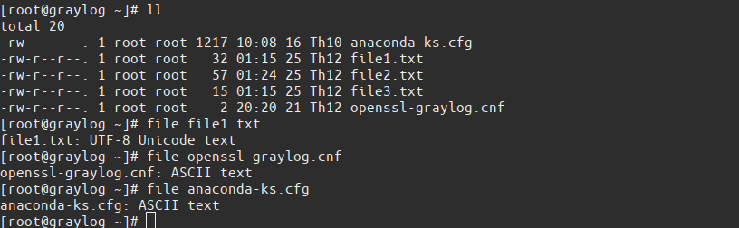

```
file /proc/cpuinfo 
file /var/log
```
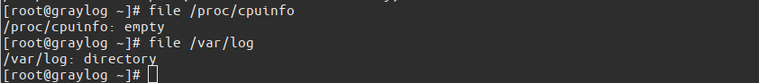

<a name="9"></a>
## 9 Touch command

**Touch**: là lệnh để tạo ra file mới và trống.

Cú pháp: **touch [option] [file_name]**

Nếu sử dụng touch mà không có option gì thì nó sẽ tạo ta 1 file mới tại thời điểm nó dc tạo.

```
touch file1.txt
```
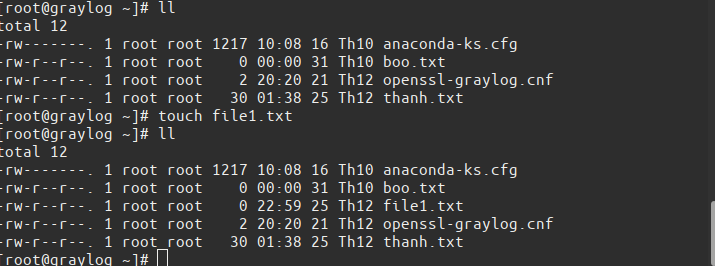

### 9.1 touch file file file

**touch file file file** : có thể tạo nhiều file cùng 1 lúc.

```
touch file1.txt file2.txt file3.txt
```
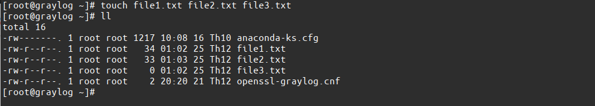

### 9.2 touch -c -d

**touch -c -d [file_name]**: đặt thời gian tạo file và  truy cập.

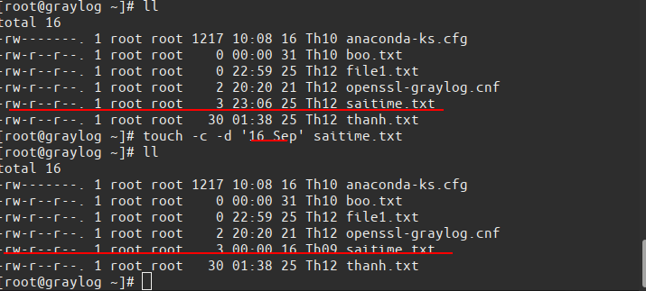

Như ta thấy đầu tiên file **saitime.txt** là có thời gian là 25 tháng 12. Sau khi sửa dụng lệnh thì ta thấy thời gian thay đổi  thành 16 tháng 9.

### 9.3 touch -m 

**touch -m [file]** : cập nhật thời gian của file  về thời gian thực.

```
touch -m saitime.txt
```
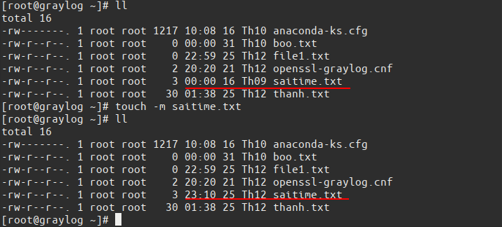

Như ta thấy đầu tiên file **saitime.txt** là có thời gian là 16 tháng 9. Sau khi sửa dụng lệnh thì ta thấy thời gian thay đổi  thành 25 tháng 12.

## 9.4 touch -t 
**touch -t [YYMMDDHHMM] [file_name]** : tạo file kèm thòi gian.

```
touch -t 200112140005 dattime.txt
```
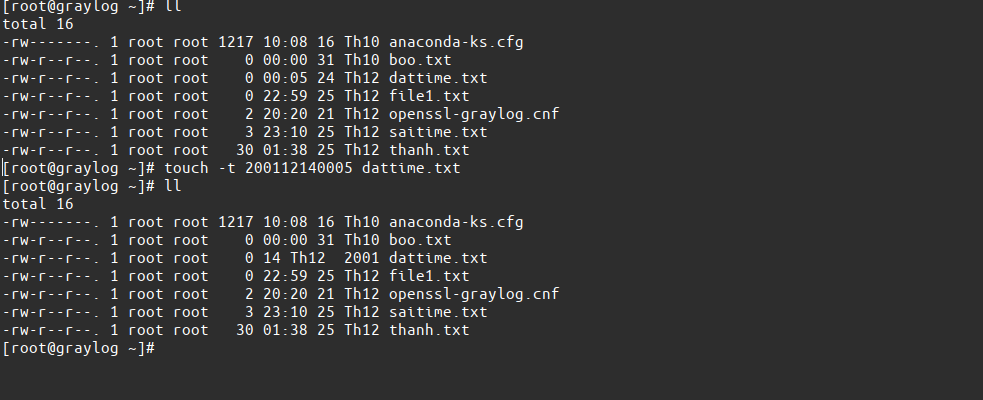


<a name="10"></a>
## 10. rm command

**rm** là viêt tắt từ remove : sử dụng để xóa file lệnh xóa này không thể khôi phục.
Cú pháp: **rm [option] [file_name]**

## 10.1 rm
**rm** không đi kèm với option thì nó sẽ xóa file đó đi và có hỏi có muốn xóa không.

**y** là có và **n** là không muốn xóa.

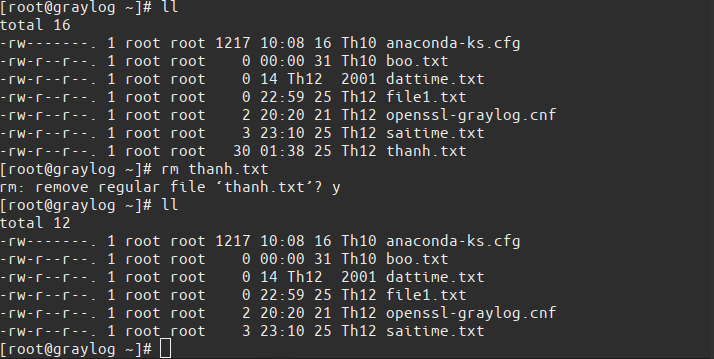

### 10.2 rm file file
**rm file file** : xóa nhiều file cùng lúc. mỗi file có 1 lần hỏi xác nhận xóa.
```
rm dattime.txt saitime.txt
```

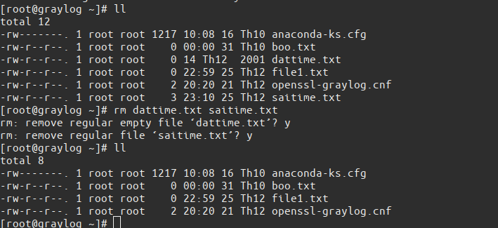

### 10.3 rm *

**rm \***: xóa toàn bộ file trong thư mục đó và có hỏi xác nhận có muốn xóa không.

```
rm *
```
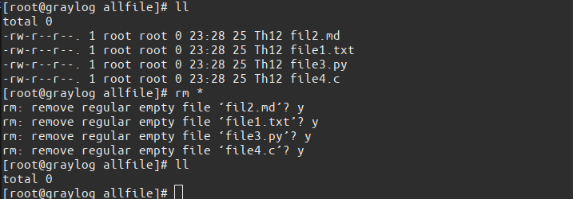

### 10.4 rm -rf

**rm -rf [dir]** là xóa thư mục và toàn bộ file có trong thư mục đó và không cần hỏi xác nhận xóa.
```
rm -rf allfile
```
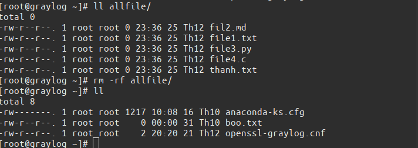

### 10.5 rm -rf string*

**rm -rf string\*** : xóa toàn bộ file bắt đầu bằng string đó.

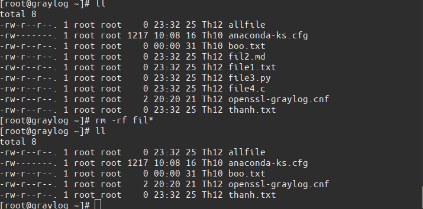

Như ta thấy ở đáy t xóa toàn bộ file bắt đầu bằng *fil*.

<a name="11"></a>
## 11. cp command
**cp** viết tắt Copy: sử dụng để copy nội dung file này sang file khác.

cú pháp: **cp [option][source_file][dest_file]**

### 11.1 cp src_file des_file

**cp src_file des_file** : Nếu không có opion gì thì lệnh trên thực hiện ghi đè lên des_file với có xác nhận cho phép hay không.
```
cp file1.txt file3.txt
```
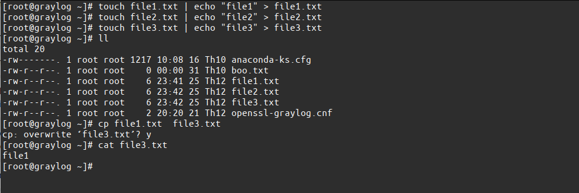

### 11.2 cp -b src_file des_file

**cp -b src_file des_file**: copy file từ src_file sang des_file  và ghi đè lên file đó đồng thời tạo ra des_file~ có chứa dữ liệu file des_file cũ trước đó.

```
cp -b src_file des_file
```
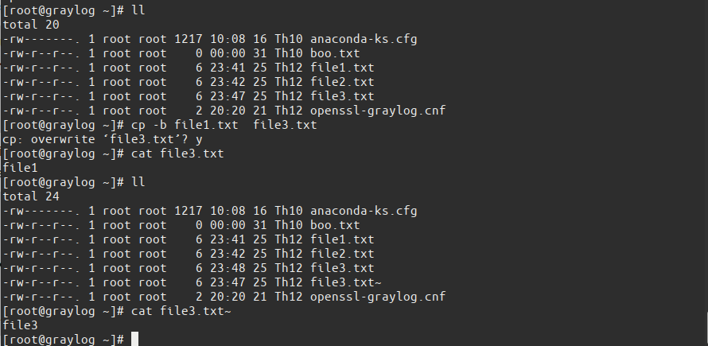

### 11.3 cp -r 

**cp -r**: copy thư mực sang 1 thư mục mới và giữ nguyên các file có trong thu mục đó.

```
cp -r muc1/ muc2
```
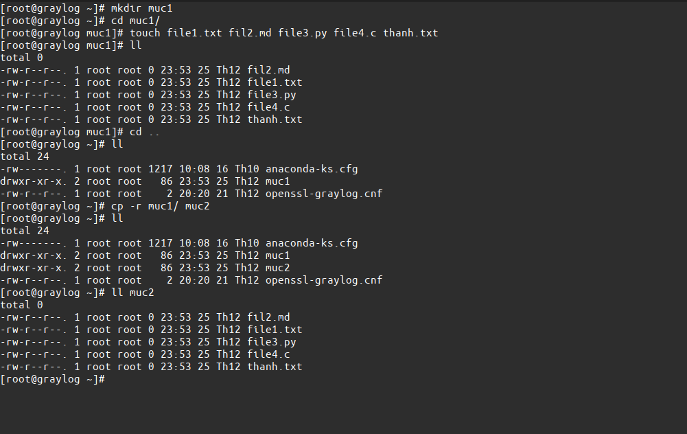

### 11.4 cp file file dir/
**cp file file dir/** : copy nhiều file vào 1 thư mục.
Ta có thể dùng

```
cp file1.txt file2.txt file3.txt file3.txt~ muc3/
```
hoặc có thể sử dụng
```
cp fil* muc3/
```
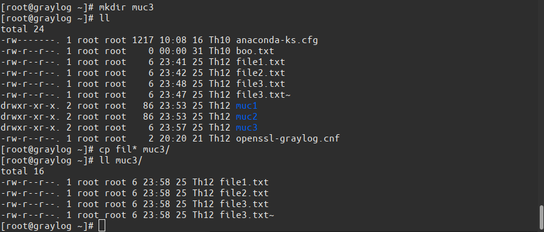


<a name="12"></a>
## 12. mv command

**mv** là viết tắt từ move:sử dung để  đổi tên file hoặc thư mục

cú pháp:**mv old_name new_name**

**mv old_name new_name**: đổi tên file hay thư muc đều được..

```
mv file1.txt doiten.txt
mv muc3/  thumuc3/
```
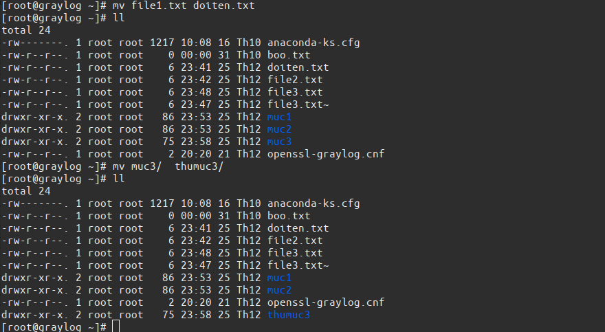


