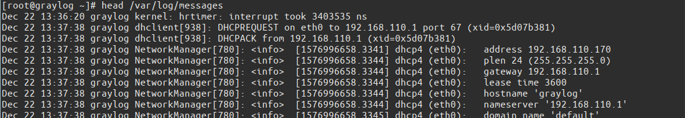
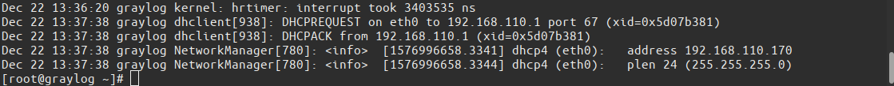

# Linux command

## Mục lục

[1. Head command](#1).

---

## 1. Head command

**Head**: là lênh để hiển thị lên màn hình các dòng thông tin trong file.

Cú pháp: **Head -[number] [link_file]**

### 1.1 Head 
Nếu chỉ sử dụng Head thì nó sẽ in ra mạn hình mặc định 10 dòng đầu tiên của file đó.

```
head /var/log/messages
```



### 1.2 Head -number

**Head -number** : Hiện thị số dòng được chỉ định hiện lên trên màn hình tính từ đầu file.

```
head -5 /var/log/messages
```


### 1.3 Head -c

**Head -c** là lệnh hiển thị chính xác số ký tự đã đước chọn tính từ đầu file.

```
head -c20 /var/log/messages
```

Kết quả là.

```
[root@graylog ~]# head -c20 /var/log/messages
Dec 22 13:36:20 gray[root@graylog ~]# ^C
```

## 2. Tail command

