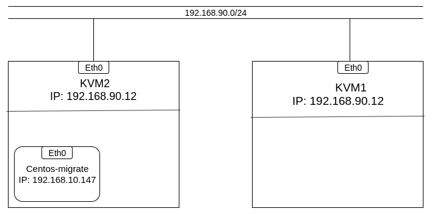

# Sử dụng live migration

## 1. Live migrte với NAT.
Mô hình.



#### IP planning.
|  Tên máy ảo  | Hệ điều hành    |IP address | Subnet mask |Default gateway|
|------|------|-------|-----|-------|
|KVM1| Centos7|192.168.90.11| /24| 192.168.90.1|
|KVM2| Centos7| 192.168.90.12| /24|192.168.90.1|

<a name ="4.2"></a>
### 4.2 Cài đặt trên KVM2.

Cài đặt NFS-server.

 ```
yum install nfs-utils -y
 ```
Tạo thư mục chia sẻ file.
```
mkdir -p /home/haha
```

Sửa file /etc/exports để tạo mountpoint export.
```
echo "/home/haha 192.168.90.0/24 (rw,sync,no_root_squash)" >> /etc/exports
```
Khởi động NFS server.
```
systemctl start rpcbind nfs-server
```

Khởi động NFS cùng server khi bật máy.
```
systemctl enable rpcbind nfs-server
```

Tiếp đến ta cấu hình firewall để NFS client được phép truy cập và live migrate thông qua.

```
firewall-cmd --permanent --add-service=nfs
firewall-cmd --permanent --add-service=mountd
firewall-cmd --permanent --add-service=rpc-bind
firewall-cmd --permanent --add-port=16509/tcp
firewall-cmd --permanent --add-port=49152/tcp
firewall-cmd --permanent --add-port=2049/tcp
firewall-cmd --permanent --add-port=2049/udp
firewall-cmd --reload
```
Kiểm tra mountpoint trên server. 
```
showmount -e localhost
```
Khi cài đặt VM ta cần lưu file disk của VM vào thư mục đã mount với thư mục được share của NFS server. Lưu ý file disk phải để ở định dang raw hoặc img nếu đê định dạng qcow khi migrate sẽ bị lỗi.

Chuyển đổi từ qcow2 sang raw ta dùng lệnh.
```
qemu-img convert centos7-migrate.qcow2 migrate.raw
```


 Khi cài máy ảo xong ta cần sửa thông tin trong file xml của VM bằng cách dùng lệnh.
```
virsh edit tên-VM
```


Cập nhật lại thay đổi vừa sửa ta sử dụng lệnh.
```
virsh define centos7-migrate
```

Cấu hình cho phép giao thức TCP trong dịch vụ libvirt.

Sửa file **/etc/libvirt/libvirtd.conf**.
```
listen_tls = 0  
listen_tcp = 1
tcp_port = "16509"
listen_addr = "0.0.0.0"
auth_tcp = "none"
mdns_adv = 0
```
Giải thích :
- listen_tls: tắt TLS, mặc định được mở.
- listen_tcp: bật chức năng kiểm duyệt TCP
- tcp_port: cấu hình cổng TCP, mặc định là 16509
- auth_tcp: bật hoặc tắt việc kiểm duyệt bằng mật khẩu

Khởi động lại dịch vụ libvirtd:
```
systemctl restart libvirtd 
```

Tiến hành live migrate.

Kiểm tra VM trên KVM1 và KVM2.