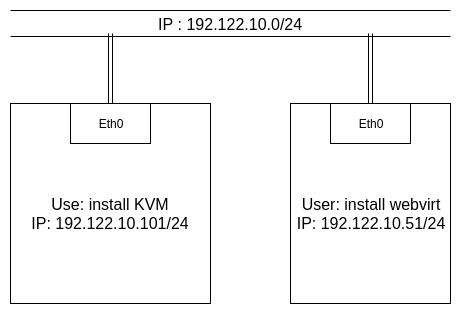
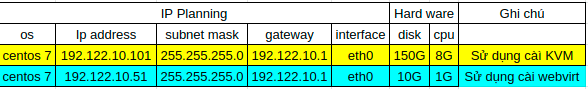

# Hướng dẫn cài đặt và sử dụng webvirtmgr trên centos7

Mục lục.

[1.Tông quan về webvirtmgr](#1)

---
<a name="1"></a>
## 1. Tổng quan.

Webvirtmgr là một trong những công cụ quản lý máy ảo KVM. Nó có chức năng gần giống với virt-manager khi có thể kết nối đến nhiều host KVM để có thể quản lý tập trung các VM trên các máy đó. Nhưng nó có một ưu điểm đặc biệt hơn so với virt-manager đó là với virt-manager đó là ta chỉ có thể làm việc tại máy cài virt-manager. Còn với Webvirtmgr ta có thể làm việc với các VM ở bất kỳ đâu có internet.

Hiện nay có 3 cách để triển khai webvirt:

- Cài đặt KVM và webvirt trên một máy
- Cài đặt KVM và webvirt trên hai máy khác nhau
- Cài đặt webvirt ngay trên máy ảo của KVM

Bài viết này tôi sử dụng cách triển khai thứ 2.

### 1.1 Mô hình.


### 1.2 IP planning


## 2. Cài đặt Webvirtmgr 
Tắt tường lửa và SElinux.
```
systemctl stop firewalld
setenforce 0
```
### 2.1 Cài các gói cần thiết.
```
yum install epel-release

yum -y install git python-pip libvirt-python libxml2-python python-websockify supervisor nginx cyrus-sasl-md5

yum -y install gcc python-devel

pip install --upgrade pip

pip install numpy
```
### 2.2 Clone Webvirtmgr từ Github và cài đặt.
```
git clone git://github.com/retspen/webvirtmgr.git

cd webvirtmgr

pip install -r requirements.txt
```

Cấu hình webvirsh.

```
./manage.py syncdb
```
Thiết lập môi trường Django và tạo ra một tài khoản để đăng nhập Webvirtmgr
```
You just installed Django's auth system, which means you don't have any superusers defined.

Would you like to create one now? (yes/no): yes (chọn yes)

Username (Leave blank to use 'root'): (Đặt tên username để login, để rông tự động đặt là root)

E-mail address: username@domain.local (Điền địa chỉ email))

Password: xxxxxx (Đặt mật khẩu))

Password (again): xxxxxx (Nhập lại mật khẩu)

Superuser created successfully.
```

Tiếp tục chạy lênh.
```
./manage.py collectstatic
```
Sẽ hiển thị ra.
```
You have requested to collect static files at the destination
location as specified in your settings.

This will overwrite existing files!
Are you sure you want to do this?

Type 'yes' to continue, or 'no' to cancel: yes (chọn yes.)
```

Di chuyển filw **webvirtmgr** đên thư mục **/var/www/**
```
mv webvirtmgr /var/www/
```
nếu chưa có thư mục **/var/www/** thì tạo bằng lệnh 
```
cd /var/
mkdir www
```

## 2.3 Cài đặt nginx.
Thêm file **webvirtmgr.conf** vào trong **/etc/nginx/conf.d**:

```
$ vim /etc/nginx/conf.d/webvirtmgr.conf

server {
    listen 80 default_server;

    server_name $hostname;
    #access_log /var/log/nginx/webvirtmgr_access_log; 

    location /static/ {
        root /var/www/webvirtmgr/webvirtmgr; # or /srv instead of /var
        expires max;
    }

    location / {
        proxy_pass http://127.0.0.1:8000;
        proxy_set_header X-Real-IP $remote_addr;
        proxy_set_header X-Forwarded-for $proxy_add_x_forwarded_for;
        proxy_set_header Host $host:$server_port;
        proxy_set_header X-Forwarded-Proto $scheme;
        proxy_connect_timeout 600;
        proxy_read_timeout 600;
        proxy_send_timeout 600;
        client_max_body_size 1024M; # Set higher depending on your needs 
    }
}
```

Vào file ```/etc/nginx/nginx.conf``` comment toàn bộ section Server lại. Để nhanh bạn có thể sử dụng lệnh sau trong trường hợp session server ở từ dòng 38 dến dòng 57(sử dụng trong chế độ normal của vi/vim)

```
:38,57s/^/#/g
```
sau khi gõ xong sẽ giống như duới đây:
```
#    server {
#        listen       80 default_server;
#        listen       [::]:80 default_server;
#        server_name  _;
#        root         /usr/share/nginx/html;
#
#        # Load configuration files for the default server block.
#        include /etc/nginx/default.d/*.conf;
#
#        location / {
#        }
#
#        error_page 404 /404.html;
#            location = /40x.html {
#        }
#
#        error_page 500 502 503 504 /50x.html;
#            location = /50x.html {
#        }
#    }

```
Khỏi đông lại và cho nginx khỏi động cùng hệ thống.
```
service nginx restart
systemctl enable nginx
```

## 2.4 Cài đặt supervisor.

Sự dung câu lệnh.
```
/usr/sbin/setsebool httpd_can_network_connect true

chkconfig supervisord on
```

Cấp quyền cho người dùng.
```
chown -R nginx:nginx /var/www/webvirtmgr
```

Thêm file cấu hình supervisor ```webvirtmgr.ini``` vào thư lục ```/etc/supervisord.d/```

```
vim /etc/supervisord.d/webvirtmgr.ini
```
Thêm các dòng sau vào file.
```
[program:webvirtmgr]
command=/usr/bin/python /var/www/webvirtmgr/manage.py run_gunicorn -c /var/www/webvirtmgr/conf/gunicorn.conf.py
directory=/var/www/webvirtmgr
autostart=true
autorestart=true
logfile=/var/log/supervisor/webvirtmgr.log
log_stderr=true
user=nginx
 
[program:webvirtmgr-console]
command=/usr/bin/python /var/www/webvirtmgr/console/webvirtmgr-console
directory=/var/www/webvirtmgr
autostart=true
autorestart=true
stdout_logfile=/var/log/supervisor/webvirtmgr-console.log
redirect_stderr=true
user=nginx
```

Khởi động lại supervisor.
```
systemctl restart supervisor
```
Như vậy đã cài đặt xong webvirtmgr. Mở trình duyệt và truy cập vào địa chỉ của server cài webvirtmgr. Kết quả như sau:


# 3. Cài đặt trên host KVM.

Để Webvirtmgr có thể kết nối đến Host KVM và quản lý được các VM trong host KVM ta cần cấu hình một số thông tin sau trên host KVM

Tắt firewalld
```
systemctl stop firewalld
```
Sử dụng lệnh để chỉnh sửa file ```/etc/libvirt/libvirtd.conf```

```
sed -i 's/#listen_tls = 0/listen_tls = 0/g' /etc/libvirt/libvirtd.conf 
sed -i 's/#listen_tcp = 1/listen_tcp = 1/g' /etc/libvirt/libvirtd.conf
sed -i 's/#tcp_port = "16509"/tcp_port = "16509"/g' /etc/libvirt/libvirtd.conf
sed -i 's/#listen_addr = "192.168.0.1"/listen_addr = "0.0.0.0"/g' /etc/libvirt/libvirtd.conf
```

Sử dụng lệnh để chỉnh sửa trong file ```/etc/libvirt/qemu.conf```
```
sed -i 's/#user = "root"/user = "root"/g' /etc/libvirt/qemu.conf 
sed -i 's/#group = "root"/group = "root"/g' /etc/libvirt/qemu.conf
```

Sử dụng lệnh để chỉnh sửa trong file ```/etc/sysconfig/libvirtd```
```
sed -i 's/#LIBVIRTD_ARGS="--listen"/LIBVIRTD_ARGS="--listen"/g' /etc/sysconfig/libvirtd
```

Sử dụng lệnh để chỉnh sửa trong file  ```/etc/sasl2/libvirt.conf``` 
```
sed -i 's/mech_list: gssapi/#mech_list: gssapi/g' /etc/sasl2/libvirt.conf
sed -i 's/#sasldb_path: /etc/libvirt/passwd.db/sasldb_path: /etc/libvirt/passwd.db/g' /etc/sasl2/libvirt.conf
```

Khởi động lại libvirtd
```
systemctl restart libvirtd
```

Tạo user cho kết nối qemu+tcp.

Tạo user.
```
saslpasswd2 -a libvirt username
```
Show các user
```
sasldblistusers2 -f /etc/libvirt/passwd.db
```

Vậy là đã cài đặt xong bây giờ t có thể sử dụng.