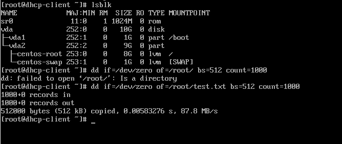
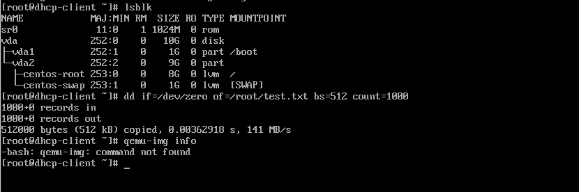
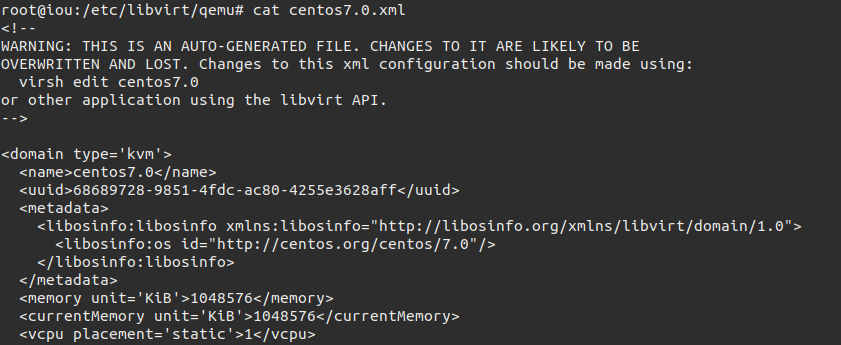
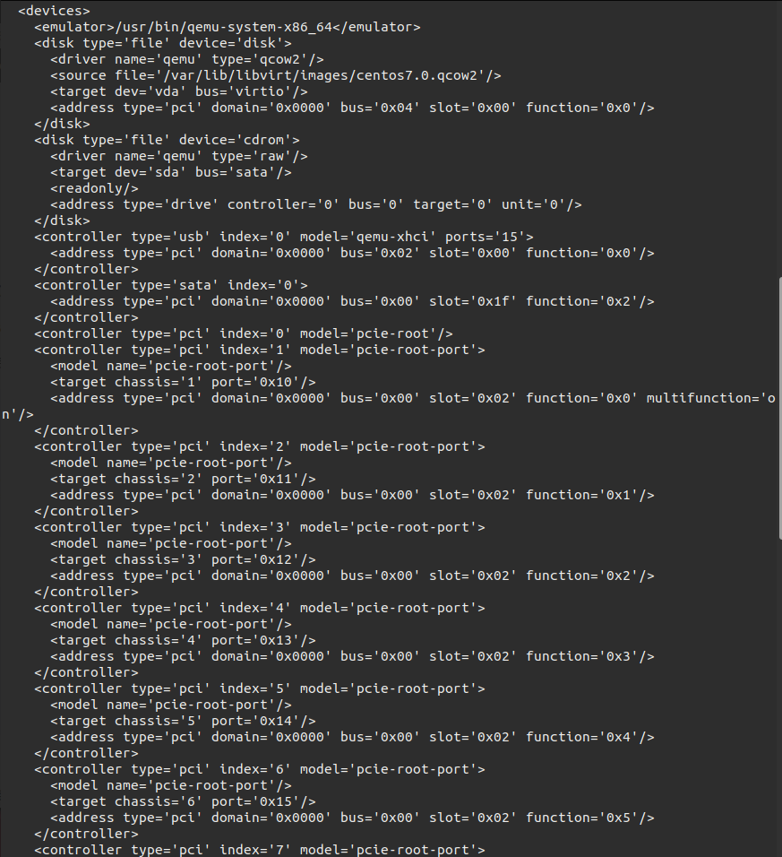
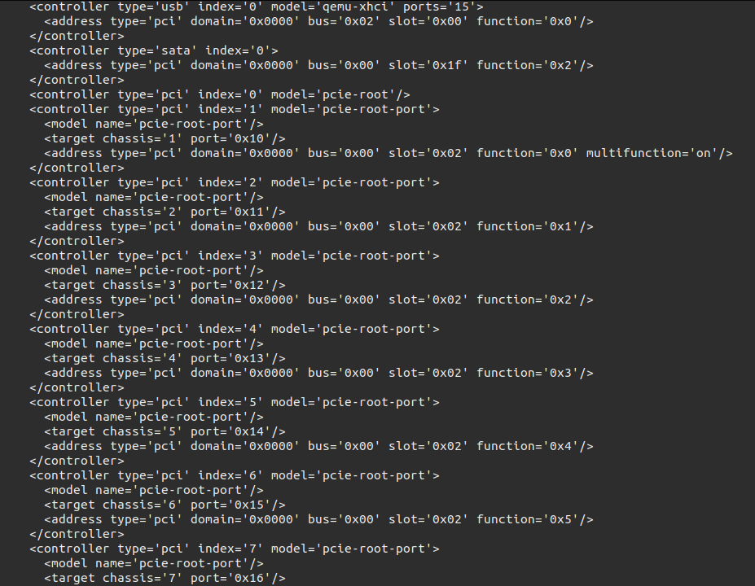
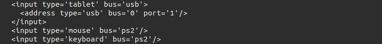
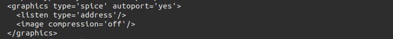

# KVM Storage.

Mục lục.

[1. Tổng quan về lưu trữ trong KVM](#1).

[2. Tìm hiểu 2 định dạng file images là raw và Qcow2.](#2)

- [2.1. File định dạng raw.](#2.1)

- [2.2 File định dang Qcow2.](#2.2)

- [2.3  So sánh Qcow2 và Raw.](#2.3)

- [2.4 Chuyển đổi định dạng Qcow2 và raw](#2.4)

[3. Tìm hiểu file XML trong KVM.](#3)

- [3.1 File XML là file gì ?](#3.1)

- [3.2 Các thành phần củ file XML.](#3.2)

- [3.3. Phân tích tác dụng của các thẻ.](#3.3)

  - [3.3.1. Khối domain.](#3.3.1)

  - [3.3.2 Khối OS.](#3.3.2)

  - [3.3.3 Khối device.](#3.3.3)

---


<a name="1"></a>
## 1. Tổng quan về lưu trữ trong KVM.
Máy ảo trong KVM có 2 thành phần là VM definition được lưu dưới dạng file XML mặc định lưu trong thư mục **/etc/libvirt/qemu** và VM storage lưu dưới dạng file image mặc định được lưu trong **/var/lib/libvirt/images/**

<a name="2"></a>
## 2. Tìm hiểu 2 định dạng file images là raw và Qcow2.
<a name="2.1"></a>
### 2.1. File định dạng raw.

Raw có ưu điểm là đơn giản, có thể sử dụng linh hoạt giữa các trình giả lập khác nhau.

Là định dạng file image phi cấu trúc.

Khi người dùng tạo mới một máy ảo có disk format là raw thì dung lượng của file disk sẽ đúng bằng dung lượng của ổ đĩa máy ảo bạn đã tạo.

Định dạng raw là hình ảnh theo dạng nhị phân (bit by bit) của ổ đĩa.

Mặc định khi tạo máy ảo với virt-manager hoặc không khai báo khi tạo VM bằng virt-install thì định dạng ổ đĩa sẽ là raw. Hay nói cách khác, raw chính là định dạng mặc định của QEMU.

<a name="2.2"></a>
### 2.2. File định dang Qcow2.

Copy-on-write ( COW ) đôi khi được gọi là chia sẻ tiềm ẩn, là một kỹ thuật quản lý tài nguyên được sử dụng trong lập trình máy tính để thực hiện có hiệu quả thao tác “nhân bản” hoặc “sao chép” trên các tài nguyên có thể thay đổi. Nếu một tài nguyên được nhân đôi nhưng không bị sửa đổi, không cần thiết phải tạo một tài nguyên mới. Tài nguyên có thể được chia sẻ giữa bản sao và bản gốc. Sửa đổi vẫn phải tạo ra một bản sao, do đó kỹ thuật các hoạt động sao chép được hoãn đến việc viết đầu tiên. Bằng cách chia sẻ tài nguyên theo cách này, có thể làm giảm đáng kể lượng tiêu thụ tài nguyên của các bản sao chưa sửa đổi.

qcow là một định dạng tập tin cho đĩa hình ảnh các tập tin được sử dụng bởi QEMU , một hypervisor. Nó viết tắt của “QEMU Copy On Write ” và sử dụng một chiến lược tối ưu hóa lưu trữ đĩa để trì hoãn phân bổ dung lượng lưu trữ cho đến khi nó thực sự cần thiết.

Qcow2 là một phiên bản cập nhật của định dạng qcow, nhằm để thay thế nó. Khác biệt với bản gốc là Qcow2 hỗ trợ nhiều snapshots thông qua một mô hình mới, linh hoạt để lưu trữ ảnh chụp nhanh. Khi khởi tạo máy ảo mới sẽ dựa vào disk này rồi snapshot thành một máy mới.

Qcow2 hỗ trợ copy-on-write với những tính năng đặc biệt như snapshot, mã hóa ,nén dữ liệu.

Qcow2 hỗ trợ việc tăng bộ nhớ bằng cơ chế Thin Provisioning (Máy ảo dùng bao nhiêu file có dung lượng bấy nhiêu.
<a name="2.3"></a>
### 2.3. So sánh Qcow2 và Raw.
|   |  Raw  | Qcow2|
|------|-------|------|
|Cách ghi dữ liệu| Ghi trực tiếp vào bộ nhớ|Ghi vào bộ nhớ thông qua các lệnh tham chiếu|
| Tốc độ| Nhanh hơn| Chậm hơn|
|Không gian lưu trữ | Nhiều hơn| Ít hơn|
| Ưu điểm| Nhanh, dễ cài đặt, sử dụng, migration| Hỗ trợ nén, mã hóa, snapshot, có cơ chế thin, hỗ trợ cow, migration . . . . |


Hiệu năng là khả năng hoạt động của 2 định dạng trên các môi trường khác nhau như ssh hay hdd. (chưa kiểm chứng trên thực tế.)

HIệu suất là khả năng tránh lãng phí tài nguyên phần cứng, thời gian sử lý. Ở đây Raw chiếm nhiều không gian phần cứng hơn nên có hiệu suất thấp hơn sơ vơi qcow2 thì sử dụng dữ liệu đến đâu thì sẽ ghi đến đó tiết kiệm không gian hơn nên hiệu suất thấp hơn.

Tốc độ ở  đây được hiềủ là tốc độ đọc ghi dữ liệu của 2 định dạng raw và qcow2 trên cùng 1 phần cứng. Trên lý thuyết thí đing dang Raw sẽ nhanh hơn qcow2 nhưng trong thực tế thì chưa chắc raw dã nhanh hơn qcow2.
Sử dụng lệnh ```dd if=/dev/zero of=root/test.txt bs=512 count=1000```
ta thù được kết quả trên máy có định dạng Raw.



Trên máy VM được lưu định dạng Qcow2.



### 2.4. Chuyển đổi định dạng qcow2 và raw

Chuyển đổi giữa qcow2 thành raw. Ta sử dụng lệnh.
```
qemu-img convert -f qcow2 -O raw <file qcow2> <tên file mới raw>
```
Ở vs này là chuyển đổi file qcow2.qcow2 thành qcow2.raw.


Chuyển đổi giữa raw thành qcow2. Ta sử dụng lệnh.
```
qemu-img  convert -f raw -O qcow2 <file raw> <tên file mơi qcow2>
```
Sau khi chuyển đổi ta cần phải chỉnh sửa thông số trong file XML tương ứng.
Sau đó define lại VM rồi mới bật VM lên sử dụng.
<a name="3"></a>
## 3. Tìm hiểu file XML trong KVM.
<a name="3.1"></a>
### 3.1 File XML là file gì ?

XML (viết tắt từ tiếng Anh: eXtensible Markup Language, tức “Ngôn ngữ đánh dấu mở rộng”) là ngôn ngữ đánh dấu với mục đích chung do W3C đề nghị, để tạo ra các ngôn ngữ đánh dấu khác. Đây là một tập con đơn giản của SGML, có khả năng mô tả nhiều loại dữ liệu khác nhau. 

Mục đích chính của XML là đơn giản hóa việc chia sẻ dữ liệu giữa các hệ thống khác nhau, đặc biệt là các hệ thống được kết nối với Internet.

File XML chứa những thông tin về thành phần của máy ảo như CPU, RAM. các thiết lập I/O devices, network và storage .

Libvirt dùng những thông số này đẻ khởi chạy tiến trình QEMU/KVM tạo ra máy ảo.


Ta sử dụng câu lệnh để xem trong file xml ghi những thốngz tin gì.
```
cat /etc/libvirt/qemu/<tên máy ảo>
```
<a name="3.2"></a>
### 3.2. Các thành phần củ file XML.
Khi mở file XML ta thấy cấu trúc của file được lưu theo các khối lệnh. Có nhiều khối lệnh trong cùng 1 khối lệnh tổng quan.

Cú pháp giống với HTML có các thẻ đóng và thẻ mở.

Thẻ domain là thẻ chính tròng file. Trong thẻ domain có chứa các thẻ khác như os, cpu, device, ...

<a name="3.3"></a>
### 3.3. Phân tích tác dụng của các thẻ.


<a name="3.3.1"></a>
#### 3.3.1. Khối domain.
Khối này bao quát tổng thể toàn bộ hệ thống lưu trữ các thẻ trong XML.

- Tham số **type** cho biết hypervisor được sử dụng của VM trong vd này là KVM.
  ```
  <domain type='kvm'>
  ```
- Thẻ **name** là tên của VM.
  ```
  <name>centos7.0</name>
  ```

- Thẻ **uuid** là mã nhận dạng quốc tế của máy ảo mỗi máy ảo chỉ có 1 cái, khi thẻ không có mã này thì nó sẽ tư động generate mã mới.
  ```
  <uuid>68689728-9851-4fdc-ac80-4255e3628aff</uuid>
  ```

- Thẻ **metadata** chứa thông tin về file XML.
  ```
  <metadata>
      <libosinfo:libosinfo xmlns:libosinfo="http://libosinfo.org/xmlns/libvirt/domain/1.0">
        <libosinfo:os id="http://centos.org/centos/7.0"/>
      </libosinfo:libosinfo>
    </metadata>
  ```

- Thẻ **memmory** là dung lượng RAM được cấp khi tạo máy ảo. có thể tính băng nhiêu đơn vị khác nhau như kiB, MB, GB, hay TB.
  ```
  <memory unit='KiB'>1048576</memory>
  ```
- Thẻ **curentMemory** là dung lượng RAM đang được sử dụng tại thời điểm ta xem file xml.
  ```
  <currentMemory unit='KiB'>1048576</currentMemory>
  ```
- Thẻ **vcpu** là tổng só virtual cpu được cấp khi khởi tạo.
  ```
  <vcpu placement='static'>1</vcpu>
  ```
  - vcpu có một số option khác:
    - cpuset: danh sách các cpu vật lí mà máy ảo sử dụng

    - current : chỉ định cho phéo kích hoặt nhiều hơn số cpu đang sử dụng

    - placement : vị trí của cpu, giá trị bao gồm static và dynamic, trong đó static là giá trị mặc định.

<a name="3.3.2"></a>
#### 3.3.2. Khối OS.

Khối os nằm trong khối domain. Nó khai báo các thành phần của OS guest.


- Thẻ **type** có chứa *arch* là hệ điều hành thuộc kiên trúc 32 hay 64 bit và *machine* là thông tin về kernel hệ điều hành.
  ```
  <os>
      <type arch='x86_64' machine='pc-q35-3.1'>hvm</type>
      <boot dev='hd'/>
    </os>
  ```
- Thẻ **features** là hypervisor cho phép 1 số option tự động bật /tắt.
  ```
  <features>
      <acpi/>
      <apic/>
      <vmport state='off'/>
    </features>
  ```

- Một só hành đông xảy ra sự kiến của guest os.
  ```
  <on_poweroff>destroy</on_poweroff>
  <on_reboot>restart</on_reboot>
  <on_crash>destroy</on_crash>
  ```
    - on_poweroff : Hành động được thực hiện khi người dùng yêu cầu tắt máy.
    - on_reboot : Hành động được thực hiện khi người dùng yêu cầu reset máy.
    - on_crash : Hành động được thực hiện khi có sự cố.
    - on_crash hỗ trợ 2 hành động:
        - coredump-destroy: domain bị lỗi sẽ được dump trước khi bị chấm dứt và giải phóng tài nguyên
        - coredump-restart: domain bị lỗi sẽ được dump trước khi được khởi động lại với cấu hình cũ
- Những hành động được phép thực thi:
    - destroy : Chấm dứt và giải phóng tài nguyên
    - restart : Chấm dứt rồi khởi động lại giữ nguyên cấu hình
    - preserve : Chấm dứt nhưng dữ liệu vẫn được lưu lại
    - rename-restart : Khởi động lại với tên mới
    - destroy và restart được hỗ trợ trong cả on_poweroff và on_reboot. preserve dùng trong on_reboot, rename-restart dùng trong on_poweroff


- Thẻ **cpu** mô tả các yêu câu của guest host về  CPU.
  ```
  <cpu mode='host-model' check='partial'>
      <model fallback='allow'/>
    </cpu>
  ```

- Thẻ **clock** thiết lập thời gian cho guest host.
  ```
    <clock offset='utc'>
      <timer name='rtc' tickpolicy='catchup'/>
      <timer name='pit' tickpolicy='delay'/>
      <timer name='hpet' present='no'/>
    </clock>
  ```
<a name="3.3.3"></a>
#### 3.3.3. Khối device.
Khối device nằm trong khối domain. Nó hai bao thông tin vè thành phàn của guest host như như disk, network,  I/O . . .



- Thẻ **emulator** Khai báo đường đãn tới thu viện ảo hóa các device.
  ```
  <emulator>/usr/bin/qemu-system-x86_64</emulator>
  ```

- Thẻ **disk** Khai báo thông tin về disk của máy ảo.
  ```
  <disk type='file' device='disk'>                            //Thông tin ổ disk.
        <driver name='qemu' type='qcow2'/>                    //định dạng của máy ảo
        <source file='/var/lib/libvirt/images/centos7.0.qcow2'/>  //đường dẫn chứa disk
        <target dev='vda' bus='virtio'/>                      // tên ổ và kiểu ảo hóa
        <address type='pci' domain='0x0000' bus='0x04' slot='0x00' function='0x0'/>
      </disk>

  <disk type='file' device='cdrom'>           //thông tin ổ đĩa CDROM
        <driver name='qemu' type='raw'/>      //định dạng của máy ảo.
        <target dev='sda' bus='sata'/>        //tên ổ CDROM và kiểu.
        <readonly/>                           //Chế độ chỉ đọc.
        <address type='drive' controller='0' bus='0' target='0' unit='0'/>
      </disk>
  ```
- Thẻ **Controler**


  - Tùy thuộc vào cấu trúc của máy ảo mà nó có thể có các thiết bị ảo đi kèm, mỗi cái lại đi theo một bộ điều khiển. Thường thì libvirt sẽ tự động chỉ ra mà không cần khai báo qua file xml.
  - Mỗi bộ điều khiển có một tham số bắt buộc là type và index, các giá trị có thể chọn của type là: ‘ide’, ‘fdc’, ‘scsi’, ‘sata’, ‘usb’, ‘ccid’, ‘virtio-serial’ hoặc ‘pci’. Trong khi đó index sẽ chỉ ra thứ tự ưu tiên.

- Thẻ **interface** Khai báo thông tin về networkcủa guest os.
  ```
  <interface type='direct'>
        <mac address='52:54:00:0d:1c:93'/>
        <source dev='tap2' mode='bridge'/>
        <model type='virtio'/>
        <link state='up'/>
        <address type='pci' domain='0x0000' bus='0x01' slot='0x00' function='0x0'/>
      </interface>
  ```
  - Các thông số trong thẻ.
      - Mac address: địa chỉ MAC của máy ảo
      - Source: sử dụng kiểu kết nối nào ở đây là sủ dụng linux bridge và có interface là tap2.
      - mode type: kiểu card mạng sử dụng là virtio.
      - link state : trạng thái.
      - address type: kiểu địa chỉ.


- Thẻ **input**


  - Chỉ có 1 tham số bắt buộc đó là type, các giá trị có thể chọn là ‘mouse’, ‘tablet’, ‘keyboard’ hoặc ‘passthrough’. Tham số bus để xác định chính xác thiết bị, các giá trị có thể chọn là “xen” (paravirtualized), “ps2”, “usb” và “virtio”.

- Thẻ **graphic**


  - Thuộc tính bắc buộc là type, các giá trị có thể chọn : “sdl”, “vnc”, “spice”, “rdp” và “desktop”. Đối với mỗi loại sẽ có thêm những tham số được thêm vào.

## 4. Tài liệu tham khảo.

1. https://github.com/domanhduy/ghichep/blob/master/DuyDM/KVM/docs/Phan-biet-raw-qcow-iso-cua-image.md
2. https://github.com/domanhduy/ghichep/blob/master/DuyDM/KVM/docs/T%C3%ACm%20hi%E1%BB%83u%20v%E1%BB%81%20file%20XML.md
3. https://github.com/nhanhoadocs/thuctapsinh/blob/master/NiemDT/KVM/docs/File-xml.md

